# R12 三问图件说明 v2

共32张编号图：24张数据/日志证据图，8张结构/机制说明图。重构8张说明图、改善4张证据图，其余20张逐字节沿用。算法步骤与判断分支流程图已被结构图取代。

- 先看 重点优化12图.pdf，再看 R12_figures_v2.pdf 全套；从 figures/ 取单张文件。
- 每张图均有矢量PDF、600dpi PNG与SVG；插入论文优先PDF。
- 统一166 mm宽；普通标签至少7.8 pt，数学上下标单独检查。不要缩到不可读。
- CSV为真实作图输入或明确的示意对象/关系；原始路径绑定不随包发送。
- 改动说明见 优化说明.md，GitHub参考见 SKILL_REFERENCES.md。
- 这是单会话作者自检，不代表独立科学验收或正式提交批准。

## 按论文板块选图

共用F01—F04；Q1 F05—F12；Q2 F13—F21；Q3 F22—F30；综合F31—F32。

## F01　计算资源、私有缓存与共享带宽池

**类别：**机制说明（非实测）；**板块：**共用。

**读图问题：**哪些资源按核心独立，哪些由全部核心共享？

**可写结论：**三种场景共用固定DDR与私有缓存；只有Q3增加独立只读L2。画出的核心仅为代表，不表示固定只有三个核心。

**口径与限定：**硬件约束示意；连线表示资源可达，不是算法步骤。

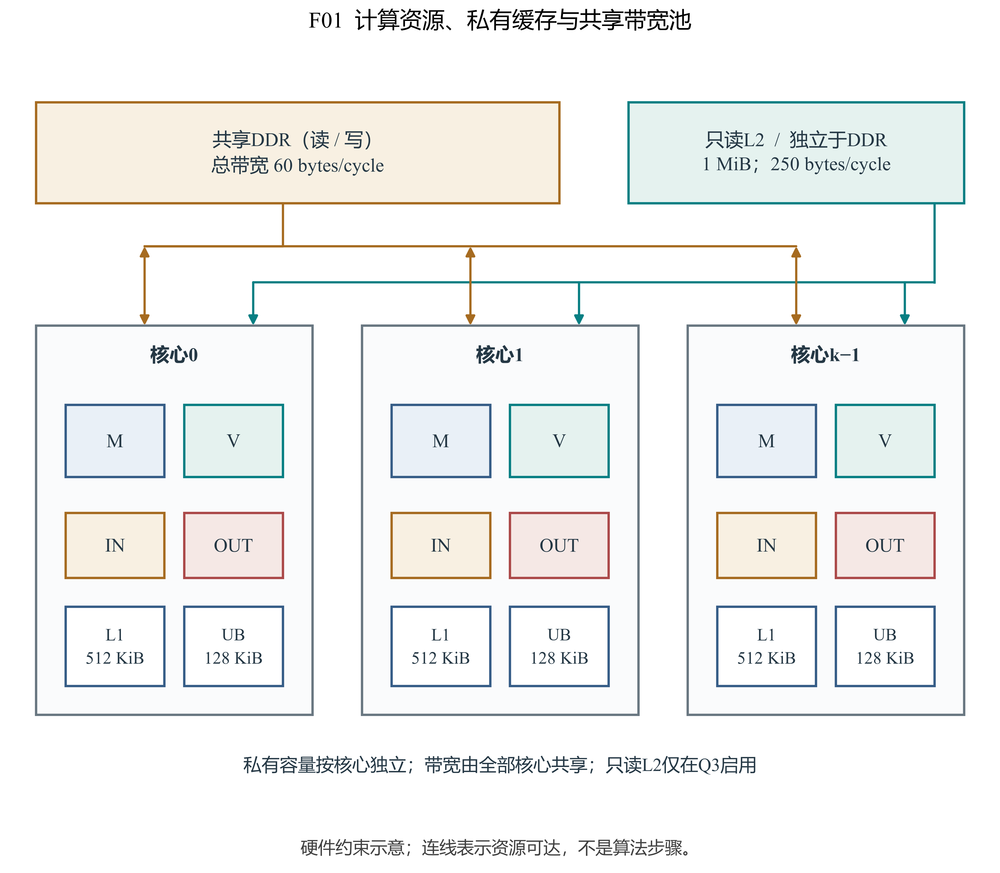

[矢量PDF](figures/F01.pdf) · [SVG](figures/F01.svg) · [作图数据](data/F01.csv)

## F02　调度模型：操作划分、核心映射与核序

**类别：**机制说明（非实测）；**板块：**共用。

**读图问题：**P=(g,a,π)中的三个决策如何对应同一计算图？

**可写结论：**同一概念DAG在操作—张量、子图划分和核心队列视图中保持对象对应，分别解释g、a、π；输出不含自由指定的开始时刻。

**口径与限定：**同一概念例的三种视图；不是实际选解，不含自由开始时刻决策。

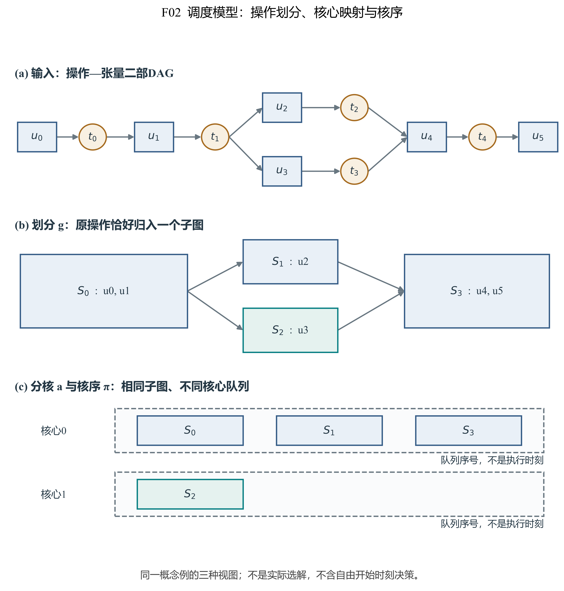

[矢量PDF](figures/F02.pdf) · [SVG](figures/F02.svg) · [作图数据](data/F02.csv)

## F03　100张计算图的规模与计算组成

**类别：**真实数据/日志证据；**板块：**共用。

**读图问题：**输入规模与M/V计算组成有何差异？

**可写结论：**100张图的非COPY操作数范围为552至35705；M/V计算组成有明显差异。

**口径与限定：**每点/每列对应一张图；非COPY工作量按max(1,cycles)。

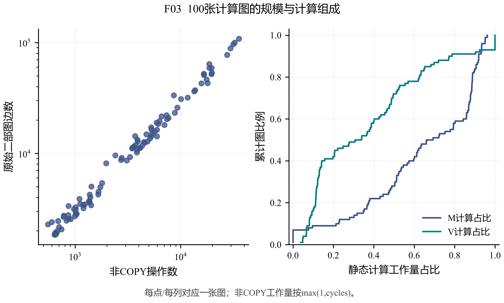

[矢量PDF](figures/F03.pdf) · [SVG](figures/F03.svg) · [作图数据](data/F03.csv)

## F04　单张量大小与私有缓存容量

**类别：**真实数据/日志证据；**板块：**共用。

**读图问题：**单张量尺度距L1/UB容量多远？

**可写结论：**单张量相对容量的大小仅描述输入尺度；多个张量生命周期重叠仍可能引起Spill，不能从本图推断运行时峰值。

**口径与限定：**最大单张量不是运行时驻留峰值；零值保留。

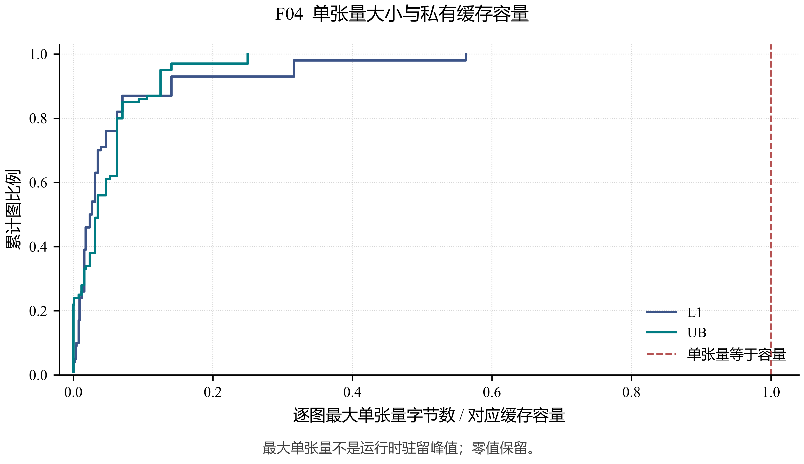

[矢量PDF](figures/F04.pdf) · [SVG](figures/F04.svg) · [作图数据](data/F04.csv)

## F05　相同计算片段下的A/B Task边界

**类别：**机制说明（非实测）；**板块：**Q1。

**读图问题：**相同的同核张量依赖为何产生不同边界搬运？

**可写结论：**单生产者、单消费者且非最终输出的b字节张量，在A的同核Task边界需写出和读入共2b；B中同核合并Task且无Spill时可省去该边界量。

**口径与限定：**单生产者、单消费者、非最终输出的示意；不含Spill。

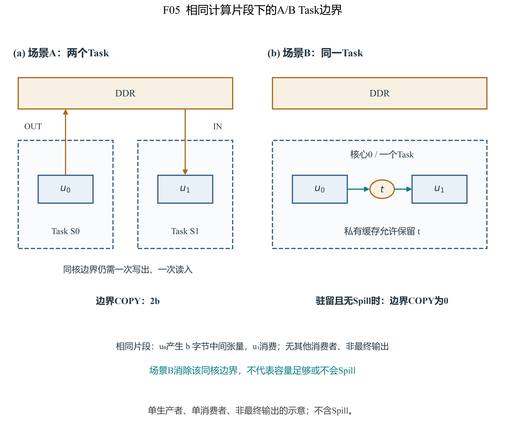

[矢量PDF](figures/F05.pdf) · [SVG](figures/F05.svg) · [作图数据](data/F05.csv)

## F06　数据依赖与核心队列的联合无环约束

**类别：**机制说明（非实测）；**板块：**Q1。

**读图问题：**原图无环是否足以保证任意核序都可行？

**可写结论：**原DAG无环不够：核心队列增加的顺序边也必须参与检查。反例S3先于S0使S0→S1→S3→S0成环。

**口径与限定：**合法例与反例仅解释联合无环；不代替容量和带宽可行性检查。

[矢量PDF](figures/F06.pdf) · [SVG](figures/F06.svg) · [作图数据](data/F06.csv)

## F07　场景A：核数扩展与参考性能

**类别：**真实数据/日志证据；**板块：**Q1。

**读图问题：**平均执行性能随核数如何变化？

**可写结论：**A五核平均REF加速比为3.743282，对照为2.036883。这是不同搜索成本的最终方案比较。

**口径与限定：**100图逐例比值算术平均；C3并非等搜索预算。

[矢量PDF](figures/F07.pdf) · [SVG](figures/F07.svg) · [作图数据](data/F07.csv)

## F08　场景A：全量性能变化与退化定位

**类别：**真实数据/日志证据；**板块：**Q1。

**读图问题：**改善与退化集中在哪些图和核数？

**可写结论：**全部400格同时显示；负色保留较C3更慢的配置，平均优势不代表逐例必胜。色标使用对称log2比值且未截断观测。

**口径与限定：**保留全部400格和完整色标；退化单列，不以平均优势掩盖负例。

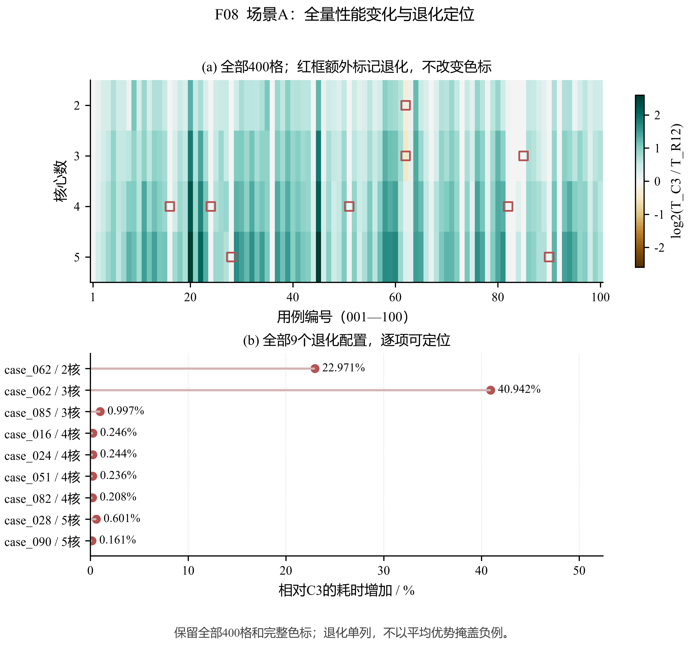

[矢量PDF](figures/F08.pdf) · [SVG](figures/F08.svg) · [作图数据](data/F08.csv)

## F09　场景A：最终Task粒度分布

**类别：**真实数据/日志证据；**板块：**Q1。

**读图问题：**实际Task数量与组内操作粒度如何变化？

**可写结论：**Task数量和每Task粒度在用例间差异较大，算法并非固定把图均分成k块；箱体只描述样本分布。

**口径与限定：**每核数组100图；箱体为四分位范围，不是置信区间。

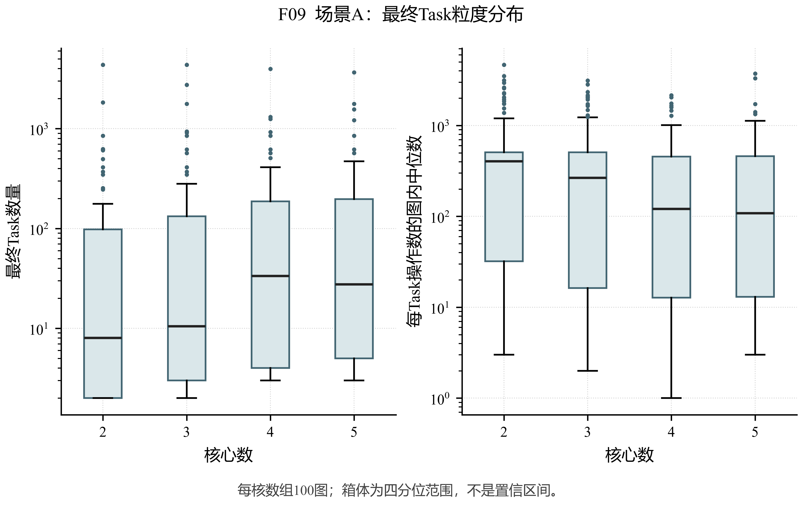

[矢量PDF](figures/F09.pdf) · [SVG](figures/F09.svg) · [作图数据](data/F09.csv)

## F10　场景A：新增COPY的来源

**类别：**真实数据/日志证据；**板块：**Q1。

**读图问题：**边界搬运与Spill分别贡献多少字节？

**可写结论：**边界新增与Spill新增合计为官方added_copy_bytes；右侧统计有Spill的图数，避免把少数大值误解为全部用例的典型情况。

**口径与限定：**MiB=1048576 bytes；算术均值，不是每图都同向变化。

[矢量PDF](figures/F10.pdf) · [SVG](figures/F10.svg) · [作图数据](data/F10.csv)

## F11　场景A：静态计算负载均衡

**类别：**真实数据/日志证据；**板块：**Q1。

**读图问题：**最终分核是否平均分配必做计算工作？

**可写结论：**不平衡度为最大核心M+V工作量除以核心均值，1表示静态完全均衡；此量忽略通信、双Pipe重叠和等待，不是实际利用率。

**口径与限定：**静态M+V工作量，不等于实际Pipe利用率或Makespan。

[矢量PDF](figures/F11.pdf) · [SVG](figures/F11.svg) · [作图数据](data/F11.csv)

## F12　困难案例case_087：五核执行时间线

**类别：**真实数据/日志证据；**板块：**Q1。

**读图问题：**1800秒补跑所得方案如何占用各Pipe？

**可写结论：**这是case_087的A五核补跑结果，Makespan为1038529 cycles；画面中的空白保留真实空闲，不自动解释其唯一原因。

**口径与限定：**原始官方时间线；仅合并相接忙区间，保留空闲。

[矢量PDF](figures/F12.pdf) · [SVG](figures/F12.svg) · [作图数据](data/F12.csv)

## F13　逻辑活跃、物理驻留与容量冲突

**类别：**机制说明（非实测）；**板块：**Q2。

**读图问题：**单张量可容纳为何不保证多个张量可同时驻留？

**可写结论：**概念例的320 KiB与256 KiB张量均可单独放入512 KiB L1，但不能同时常驻。逻辑活期重叠不能直接当作实测占用或Spill量。

**口径与限定：**概念例，非实测活期或Spill量；逻辑活跃不等于物理驻留。

[矢量PDF](figures/F13.pdf) · [SVG](figures/F13.svg) · [作图数据](data/F13.csv)

## F14　局部微批：依赖不变，共享输入成组使用

**类别：**机制说明（非实测）；**板块：**Q2。

**读图问题：**局部顺序变化如何改变大型输入的连续使用？

**可写结论：**四条A_i→B_i依赖和所有原操作核心归属不变；共享大型输入可从交替使用改成成组使用。中间张量活期及完整执行代价仍可能增加，不能单凭此图认定收益。

**口径与限定：**示意前提为A_i→B_i，无跨链依赖；不保证实际Spill或Makespan改善。

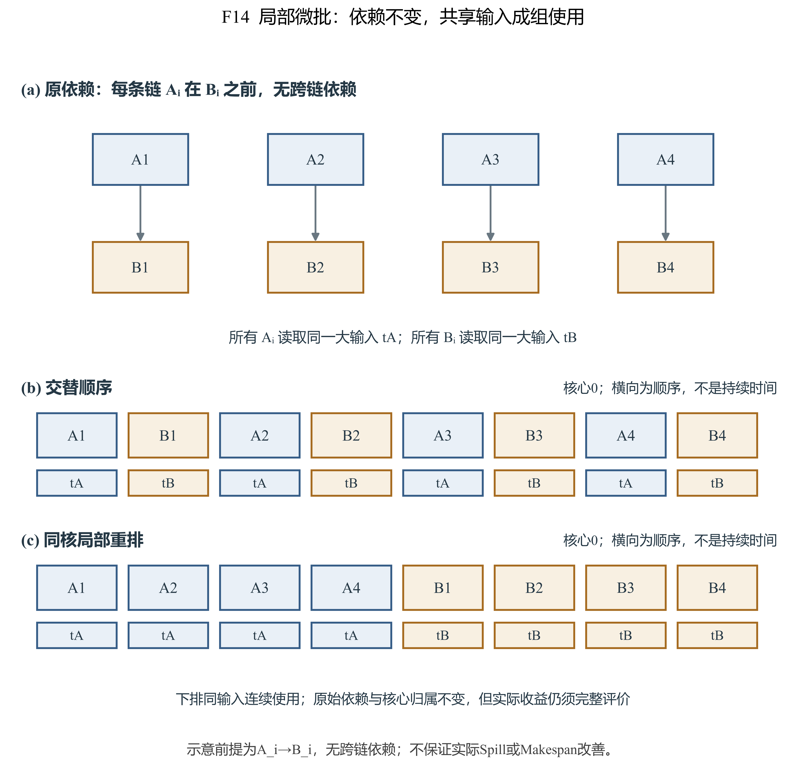

[矢量PDF](figures/F14.pdf) · [SVG](figures/F14.svg) · [作图数据](data/F14.csv)

## F15　场景B：核数扩展与参考性能

**类别：**真实数据/日志证据；**板块：**Q2。

**读图问题：**B的总体性能与C3基线差异多大？

**可写结论：**B五核平均REF加速比为4.131077；一核参考点按定义取1，不混入优化后B1。

**口径与限定：**标准一核点为1；实际优化B1另列；非等搜索预算。

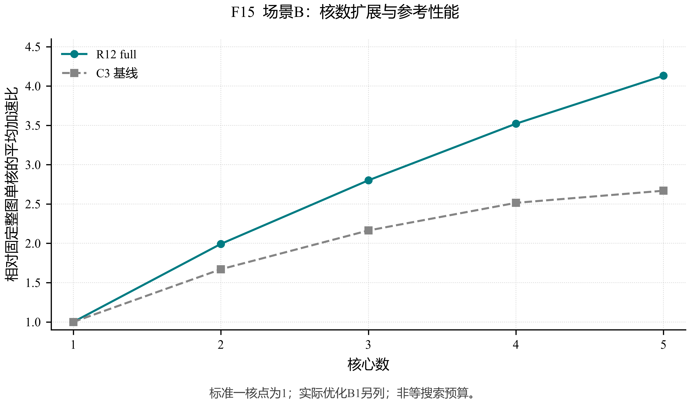

[矢量PDF](figures/F15.pdf) · [SVG](figures/F15.svg) · [作图数据](data/F15.csv)

## F16　优化B1：相对固定单核的逐图变化

**类别：**真实数据/日志证据；**板块：**Q2。

**读图问题：**优化一核与定义为1的参考点是否相同？

**可写结论：**优化B1平均REF加速比为1.061366；55图改善、45图相同。纵轴是加速比超出1的幅度，不是耗时降低率。

**口径与限定：**按收益排序展示全部100图；不是标准曲线的一核点。

[矢量PDF](figures/F16.pdf) · [SVG](figures/F16.svg) · [作图数据](data/F16.csv)

## F17　场景B：边界COPY与Spill分解

**类别：**真实数据/日志证据；**板块：**Q2。

**读图问题：**增加核心数如何改变两类额外搬运？

**可写结论：**B的跨核边界开销与核内Spill可随核数呈不同变化；按字节分开报告，不用单个总量掩盖机制差异。

**口径与限定：**官方模拟前COPY计账；每个核数100图。

[矢量PDF](figures/F17.pdf) · [SVG](figures/F17.svg) · [作图数据](data/F17.csv)

## F18　五核B：非零Spill细节与全量集中度

**类别：**真实数据/日志证据；**板块：**Q2。

**读图问题：**平均Spill是否被少数困难用例主导？

**可写结论：**按Spill降序的前10图贡献五核B总Spill字节的93.84%；这是一种集中度描述，不是统计推断。

**口径与限定：**左侧log10轴仅显示非零值并披露零值数；右侧保留全部100图。

[矢量PDF](figures/F18.pdf) · [SVG](figures/F18.svg) · [作图数据](data/F18.csv)

## F19　五核B：同次请求的阶段增量

**类别：**真实数据/日志证据；**板块：**Q2。

**读图问题：**控制、快速插入和微批各保留了什么收益？

**可写结论：**控制、插入后、微批后的平均REF加速比分别为4.073198、4.111995、4.131077。同次请求阶段共享预算，不冒称独立等预算消融。

**口径与限定：**100个同次请求阶段配对；不是等预算独立消融。

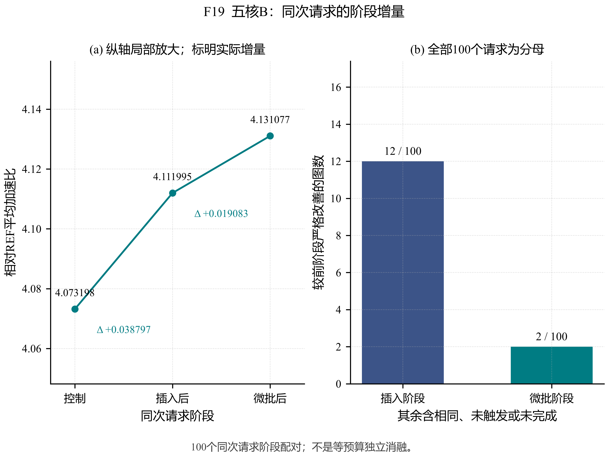

[矢量PDF](figures/F19.pdf) · [SVG](figures/F19.svg) · [作图数据](data/F19.csv)

## F20　五核B：执行时间与COPY的权衡

**类别：**真实数据/日志证据；**板块：**Q2。

**读图问题：**更快的最终方案是否一定搬运更少？

**可写结论：**五核B有4图比C3更快但新增COPY更高；主次目标确有权衡，不是每例双目标支配。

**口径与限定：**相对C3的逐例变化；非等搜索预算；不称全局Pareto前沿。

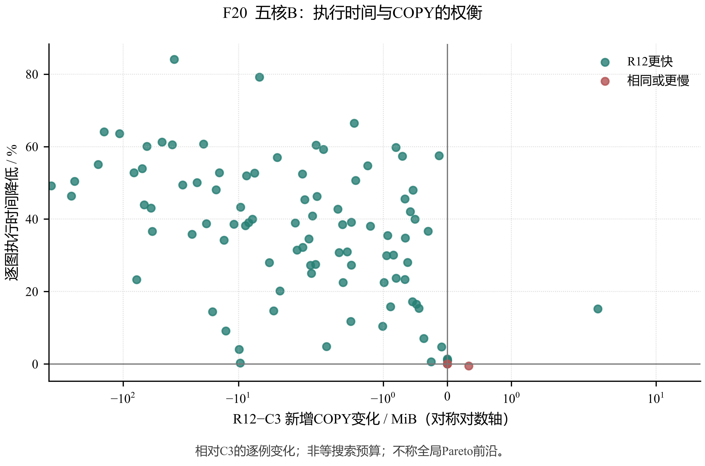

[矢量PDF](figures/F20.pdf) · [SVG](figures/F20.svg) · [作图数据](data/F20.csv)

## F21　case_073：B最终方案的Pipe活动

**类别：**真实数据/日志证据；**板块：**Q2。

**读图问题：**微批后最终方案如何分布计算与搬运？

**可写结论：**case_073最终B方案Makespan为2034983 cycles。时间线展示结果，不单独证明某个新模块的因果贡献。

**口径与限定：**单个开发案例的最终时间线，不单独证明微批因果收益。

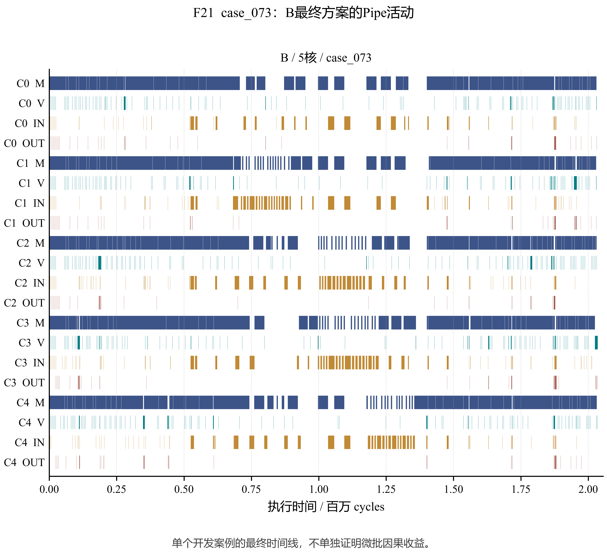

[矢量PDF](figures/F21.pdf) · [SVG](figures/F21.svg) · [作图数据](data/F21.csv)

## F22　FIFO状态快照与在途读取

**类别：**机制说明（非实测）；**板块：**Q3。

**读图问题：**命中读取完成时为何仍可能重新插入？

**可写结论：**命中在发射时决定带宽池，插入在完成时发生；命中读取完成时若键已被逐出，也可能重新插入。无键或超容量不插入。

**口径与限定：**按官方语义构造的概念例；不是缓存实测时间线。

[矢量PDF](figures/F22.pdf) · [SVG](figures/F22.svg) · [作图数据](data/F22.csv)

## F23　方案×配置：两种比较的实验结构

**类别：**机制说明（非实测）；**板块：**Q3。

**读图问题：**哪些比较能描述配置效应，哪些含方案变化？

**可写结论：**同方案PB在B/L2下比较描述配置效应；PB与PL分别评分的比值包含选解变化，二者不能互换。

**口径与限定：**仅使用三项已有评分；空白对照不补值，先逐图求比再汇总。

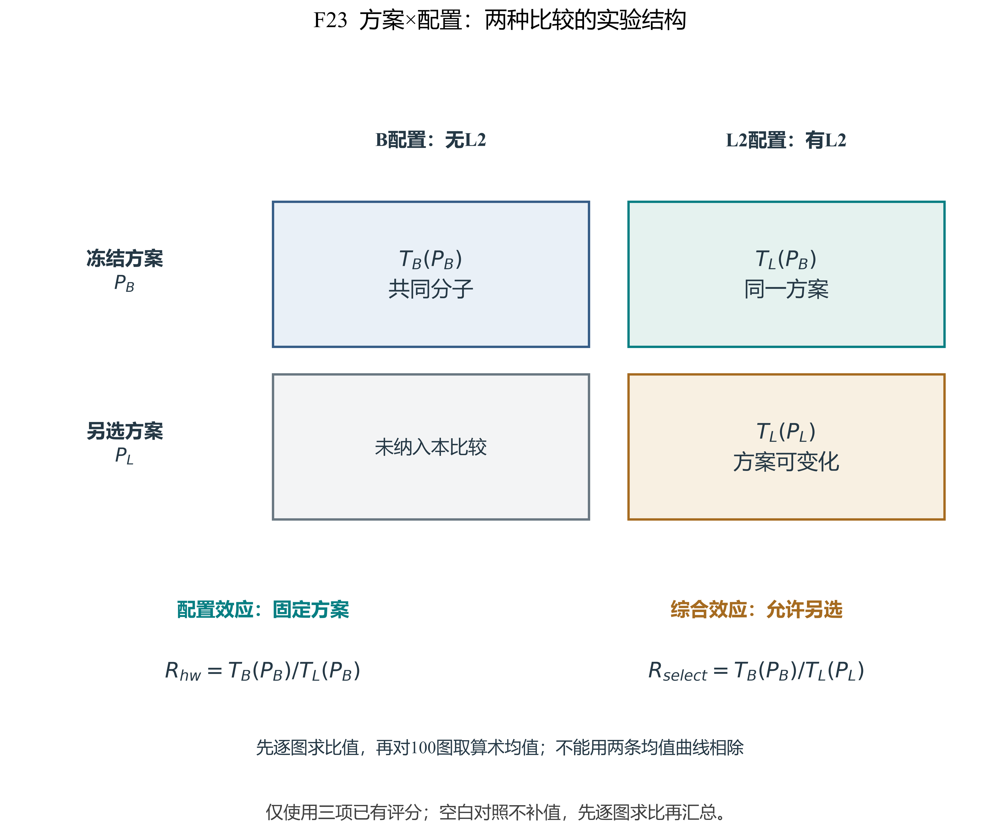

[矢量PDF](figures/F23.pdf) · [SVG](figures/F23.svg) · [作图数据](data/F23.csv)

## F24　L2：同方案配置效应与分别选优

**类别：**真实数据/日志证据；**板块：**Q3。

**读图问题：**两类平均收益能否混为纯硬件收益？

**可写结论：**五核同方案配置比均值1.016766，分别选优比均值1.027400。两者均先逐例求比值。

**口径与限定：**每点100对；右轴放大；不得用两条均值曲线相除。

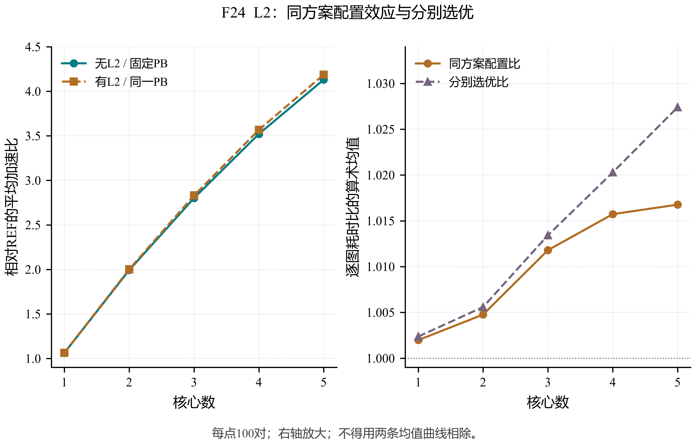

[矢量PDF](figures/F24.pdf) · [SVG](figures/F24.svg) · [作图数据](data/F24.csv)

## F25　L2配置收益的逐图分布

**类别：**真实数据/日志证据；**板块：**Q3。

**读图问题：**均值能否代表每张图都获得相同收益？

**可写结论：**分布中保留长尾和小幅退化，典型值与均值可能不同；箱线图不等于置信区间或跨总体显著性检验。

**口径与限定：**每组100对，全部500对；箱体不是置信区间。

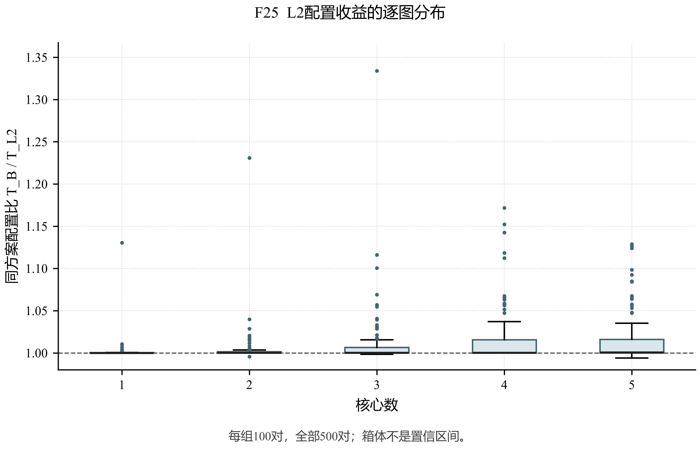

[矢量PDF](figures/F25.pdf) · [SVG](figures/F25.svg) · [作图数据](data/F25.csv)

## F26　五核：命中字节率与配置收益

**类别：**真实数据/日志证据；**板块：**Q3。

**读图问题：**命中率是否必然对应整体加速？

**可写结论：**命中字节率与整体配置收益并非一一对应；计算、等待和搬运竞争共同影响Makespan。本散点不能分别识别容量与带宽的因果贡献。

**口径与限定：**100个观测配对；散点关系不是容量或带宽的因果分解。

[矢量PDF](figures/F26.pdf) · [SVG](figures/F26.svg) · [作图数据](data/F26.csv)

## F27　case_073：FIFO占用与累计命中

**类别：**真实数据/日志证据；**板块：**Q3。

**读图问题：**缓存占用与读取完成怎样沿事件时间轴演化？

**可写结论：**完整4252条缓存事件按原始先后读取，末累计字节命中率为63.4171%；缓存使用量不超过1 MiB。

**口径与限定：**同一B方案在L2下的真实缓存事件；不是重新选优方案。

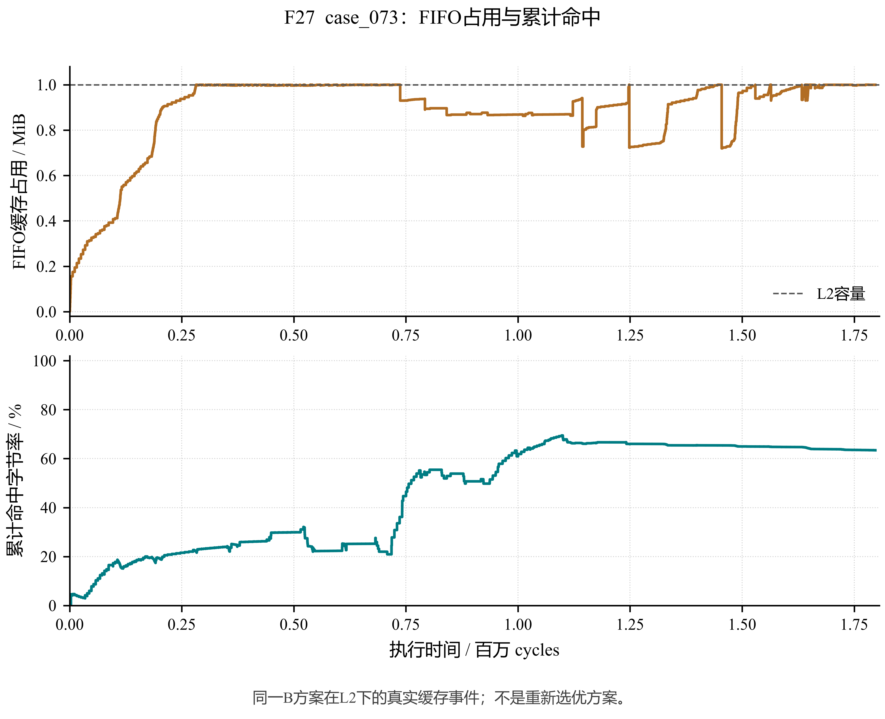

[矢量PDF](figures/F27.pdf) · [SVG](figures/F27.svg) · [作图数据](data/F27.csv)

## F28　case_073：同方案全局时间线与共同窗口

**类别：**真实数据/日志证据；**板块：**Q3。

**读图问题：**保持方案不变后，流水线占用如何变化？

**可写结论：**固定同一PB，B与L2的Makespan为2034983和1806253 cycles。横轴共用绝对时间，避免归一化隐藏差异。

**口径与限定：**共用绝对时间；阴影为0.90—1.20百万cycles，局部仅显示核心0。

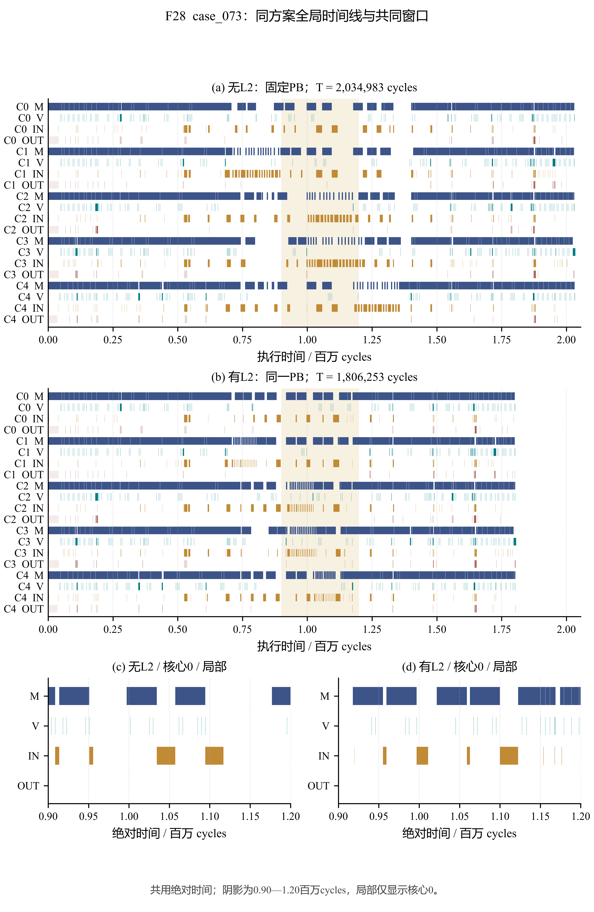

[矢量PDF](figures/F28.pdf) · [SVG](figures/F28.svg) · [作图数据](data/F28.csv)

## F29　五核：不同最终方案的选解效应

**类别：**真实数据/日志证据；**板块：**Q3。

**读图问题：**L2下改变方案还带来多少变化？

**可写结论：**五核共有28对方案不同；在同一L2配置中，另选方案较PB有26例更快、1例相同、1例更慢，不能默认为全部改善。

**口径与限定：**仅列28对方案哈希不同的实例；其余72对方案相同。

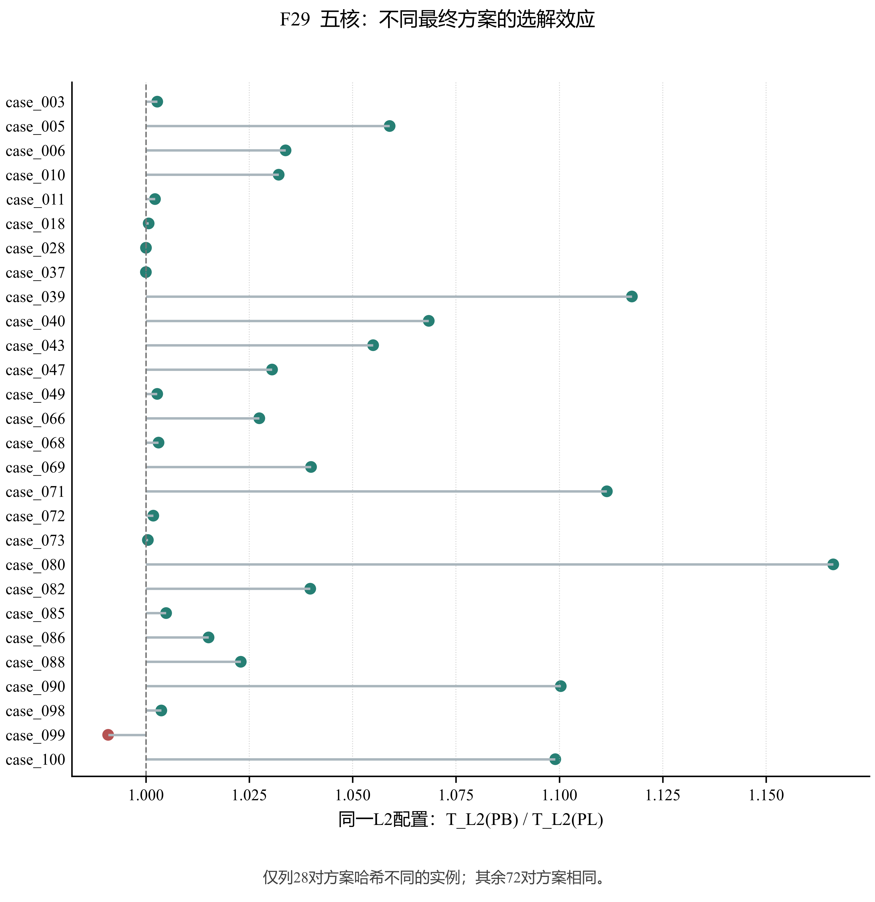

[矢量PDF](figures/F29.pdf) · [SVG](figures/F29.svg) · [作图数据](data/F29.csv)

## F30　全部同方案L2退化记录

**类别：**真实数据/日志证据；**板块：**Q3。

**读图问题：**哪些图在开启L2后反而略慢？

**可写结论：**8条配置比小于1的记录完整保留；最小值对应case_026五核。图只确认退化事实，不把未经核实的机制写成原因。

**口径与限定：**完整8对；横轴放大；低于1表示退化。

[矢量PDF](figures/F30.pdf) · [SVG](figures/F30.svg) · [作图数据](data/F30.csv)

## F31　跨场景：相对C3的逐例胜平负

**类别：**真实数据/日志证据；**板块：**综合。

**读图问题：**平均优势是否覆盖多数实际用例？

**可写结论：**在14个配置组中保留全部胜平负。相同评估配置下的最终解比较并不等于同运行时间、同搜索次数的算法效率比较。

**口径与限定：**14组各100图；非等搜索预算，仅描述终点解质量。

[矢量PDF](figures/F31.pdf) · [SVG](figures/F31.svg) · [作图数据](data/F31.csv)

## F32　求解墙钟与预算长尾

**类别：**真实数据/日志证据；**板块：**综合。

**读图问题：**生成方案的成本与补跑例外是什么？

**可写结论：**箱体为四分位范围，须线为1.5IQR，圆点为离群观测，红色菱形标记1800秒补跑。各批次并发负载不同，只报告真实成本，不据此作跨场景算法耗时优劣证明。

**口径与限定：**含构造、评价和I/O；非模拟cycles；保留4个1800秒补跑。

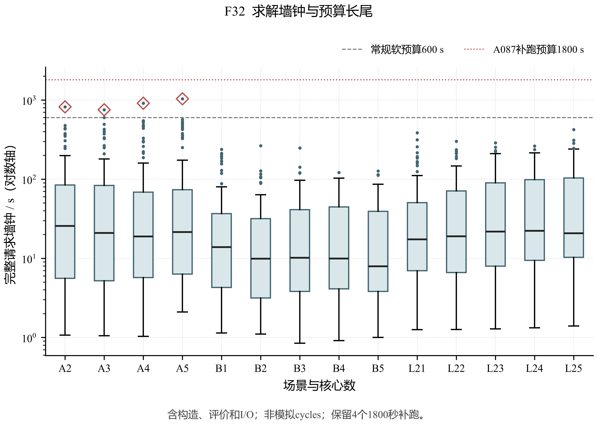

[矢量PDF](figures/F32.pdf) · [SVG](figures/F32.svg) · [作图数据](data/F32.csv)

## 使用与披露

数据来源为本队已完成的R12 full实验、官方原图与冻结时间线。C3对照不是等搜索预算消融；同方案L2配置比与分别选优比分开；COPY计账不等于命中后物理DDR净流量。

图件由AI辅助整理，团队需理解、核查并按比赛规定披露。正式嵌入整篇论文后仍需检查字号、图号、题注和跨页排版。
