# 摘要

多核NPU调度要同时决定切图、分核与核内子图次序；操作的开始时刻、核内顺序与Spill插入都由官方评价程序决定，Makespan没有闭式表达式。本文据此建立以官方评价器为目标、以（Makespan，新增搬运量）为字典序的统一优化模型，证明问题在忽略搬运的特例下已是NP难的，并给出与方案无关的计算下界；在此基础上设计“结构化候选生成—下界剪枝—整机评价—字典序择优”的求解框架R12，在100张计算图、三个场景共1400个配置格上完成全量实验。

**针对问题一**，场景A每个子图独立成Task，代价集中在边界搬运与启动等待。模型以 $P=(g,a,\pi)$ 为决策，约束含联合无环、Task释放规则与活跃集合容量。算法收缩两端独占的安全链，按依赖深度分带（宽度4、8、2、16）取带内弱连通分量得到候选粒度，以尾长优先的追加式分核放置，用官方时间线做划分不变的反馈重排，以Treap区间索引加速插入式候选；当前解不超过下界1.03倍即判定近优并停止。2至5核平均加速比为1.855、2.561、3.197、3.743，400格无一慢于整图单核；相对固定构造基线C3，逐图耗时平均降低25.01%至43.48%。

**针对问题二**，同核子图合并为一个Task后，代价转向核内驻留与容量溢出。在问题一框架上增加活动核数与驻留组织候选、沿官方关键链的局部移动，以及只在确有Spill时启动的局部微批，并证明微批保持核归属不变、因而Spill前的边界搬运严格不变。2至5核平均加速比为1.993、2.801、3.521、4.131，五核最小1.812，相对C3降低34.49%；五核仅22张图发生Spill，前10张占全部Spill字节的93.84%。

**针对问题三**，按官方实现建立“发射时命中、完成时插入”的FIFO只读缓存与两个独立带宽池模型，提出同方案配置比与分别选优比及逐例分解恒等式，把硬件配置效应与选解效应分开。L2下独立选优的五核平均加速比为4.219；同方案配置比随核数由1.001978升至1.016766，五核中位数仅1.000546，分别选优比为1.027400。命中率与收益不单调对应，500对同方案对照中8对开启L2后反而更慢，计划新增搬运由8.217 MiB升至9.403 MiB。

**模型检验**表明，相对C3的优势在14个场景-核数组的配对检验中均显著（$p<10^{-22}$）；1400个配置格无一慢于整图单核，并行效率随核数平稳下降；图规模与加速比几乎不相关，结果对核数与规模稳健。

**关键词：** 多核NPU调度；计算图切分；字典序优化；可证下界；Spill触发微批；只读缓存；配置效应分解


# 1 问题重述

## 1.1 问题背景

神经网络模型的规模仍在快速增长，单个AI核心受制造成本、功耗和散热的约束，难以独立提供所需算力，多核NPU因此成为提升并行能力与能效的主流架构。深度神经网络加速器的研究早已表明，片上缓存的数据复用与片外存储的访问次数在很大程度上决定了执行效率和能耗[1,2]。多核化以后，这一问题又多了一层：一张完整的计算图需要被划分为若干子图，分配到不同核心上执行，核内要尽量复用私有缓存中的数据，核间依赖则要经过共享主存或同步机制传递。

多核调度的关键，是在多核并行度、核内缓存容量和共享主存带宽三者之间取得平衡。切得越细，可并行的机会越多，但跨子图的数据要反复经主存中转；切得越粗，搬运越少，但并行度下降、单个子图的缓存压力上升。好的调度方案要在给定硬件和给定计算图上同时照顾这三方面，缩短总体执行时间，并控制额外的数据搬运。

## 1.2 平台、计算图与方案形式

**硬件平台。** 平台由 $k$ 个同构AI核心和共享的核外主存DDR组成。每个核心有Cube矩阵计算单元（PIPE_M）、Vector向量计算单元（PIPE_V）、两类数据搬运单元（PIPE_MTE2负责搬入，PIPE_MTE3负责搬出）以及私有的L1与UB缓存。四条Pipe各自串行、彼此可以并行；全部核心对DDR的读写共同竞争固定的总带宽。固定配置下，L1为524288 bytes，UB为131072 bytes，DDR总带宽为60 bytes/cycle。

**计算图。** 待调度对象是一张操作—张量二部有向无环图 $G=(V,E)$，$V=V_T\cup V_O$。张量节点带有逻辑位置（DDR、L1或UB）与字节数；操作节点带有操作类型、执行Pipe与周期数，其中COPY_IN、COPY_OUT负责DDR与核内缓存之间的搬运，其余为核内计算。边只连接张量与操作，本身不携带通信量：依赖跨越子图或Task时，搬运字节数由对应张量的大小决定。题目给出的100张正式计算图保证每个DDR输入只搬入一次、每个最终结果只搬出一次，且单个计算操作的输入输出总量不超过相应缓存容量。

**方案形式。** 算法输出两部分：切图方案 `node_to_subgraph`，把每个非COPY操作映射到一个子图编号；子图调度方案 `core_schedules`，为每个核心给出一条子图执行序列。每个子图必须且只能出现一次，子图依赖图必须无环，同核顺序不得违反依赖。

**评价流程。** 官方评估程序[3]读入方案后分三步给出结果：按场景规则构造Task并补充跨Task边界搬运；用题面附录C的核内调度算法确定每个Task内部的操作顺序，容量不足时自动插入换出与换入；在统一事件时间轴上模拟全部核心、Pipe与共享带宽的并行执行。所有操作结束时刻的最大值即为Makespan，这是最重要的指标；次要指标为总额外数据搬运量，即调度后全部DDR搬运量扣除原始计算图已有搬运量后的字节数；问题三另报告只读Cache的字节命中率。

## 1.3 两种硬件场景与共享L2

**场景A（无核间同步机制）。** 一个Task只能包含一个子图。同一核上多个Task串行执行时核内缓存被清空，因此所有跨子图数据都必须经DDR中转，即使相邻两个Task位于同一核心也不例外。Task的激活受两类等待约束：同核前一Task完成后至少等待100 cycles，每个跨核前驱Task完成后至少等待1000 cycles。

**场景B（有核间同步机制）。** 同一核心上的全部子图合并为一个Task，前序子图的数据可以留在L1/UB中供后续子图直接使用；跨核依赖由源核写入DDR并发出同步信号，目标核的COPY_IN在源COPY_OUT完成并经过500 cycles后才能进入就绪判定。同核复用减少了搬运，但跨多个子图的驻留数据会持续占用缓存，可能压缩其他子图的可用空间。

**共享只读L2。** 在场景B基础上增加一块由全部核心共享的只读L2 Cache，容量1 MiB，读带宽250 bytes/cycle，与DDR带宽相互独立。COPY_IN在发射时按逻辑张量编号查询Cache，命中则走L2读带宽池，未命中则访问DDR并在完成后写入Cache，容量不足时按先进先出淘汰。

## 1.4 需要解决的问题

**问题一** 在场景A下建立多核切图与调度模型并设计求解算法：为每个非COPY操作分配子图编号，确定各核心上的子图执行顺序；以缩短总体执行时间为主要目标，兼顾总额外数据搬运量，并在2至5核范围内稳定、高效地给出高质量结果。需提交1至5核的平均加速比折线图（单核基准为整图单核核内调度的Makespan，单核加速比定义为1），附录逐例列出Makespan与总额外数据搬运量，附件提供可复现的Python程序。

**问题二** 在问题一的基础上，建立适用于场景B的切图与调度模型并设计求解算法，在严格满足L1/UB容量约束的前提下进一步缩短总体执行时间、减少额外数据搬运，同样适应2至5核的变化。需提交场景B下1至5核的平均加速比折线图（定义同问题一）、逐例的Makespan与总额外数据搬运量，以及可复现程序。

**问题三** 在场景B的基础上引入共享只读L2，研究其容量和带宽对多核切图与调度的影响，建立相应模型并设计求解算法。需在正文给出1至5核下无L2与只读Cache两种配置的对比曲线，并报告相同核数下只读Cache相对无L2基线的加速比（无L2的Makespan除以只读Cache配置的Makespan）；附录逐例列出两种配置的Makespan、总额外数据搬运量与Cache命中率。

三问的结果都必须由使用固定配置的官方评估程序给出，不得修改评估程序与配置。


# 2 问题分析

## 2.1 多核调度的核心矛盾

题目要求同时确定三件事：每个计算操作属于哪个子图（切图），每个子图放在哪个核心（分核），每个核心上子图的先后次序（核序）。三者彼此牵制。切图决定了子图规模、并行空间和通信边界；分核决定负载是否均衡、哪些依赖变成跨核依赖；核序决定依赖等待的长短、张量在缓存里驻留多久，以及核内调度是否被迫插入换出与换入。减少切分可以降低通信，却会压缩并行度、增大单个子图的缓存压力；增加切分提供更多并行机会，却会带来重复读取和更多DDR搬运。任何一个环节单独做到最好，都不能保证总体执行时间最短。

还有一层困难来自评分方式本身。方案只规定 $(g,a,\pi)$，每个操作何时开始、核内按什么顺序执行、何时插入Spill，全部由官方评价程序按其确定性规则决定；搬运耗时又取决于同一时刻有多少搬运在争用共享带宽。这意味着我们无法写出Makespan关于决策变量的闭式表达式，只能通过完整评价得到它。求解思路因此自然落在“构造合法候选—官方评价—择优”的闭环上，问题的关键变成：候选从哪里来，怎样在有限的评价次数内覆盖有希望的区域，以及怎样判断当前解已经足够好、可以停止搜索。

## 2.2 输入数据普查

题目给定100张正式计算图，统计结果见表2-1。

**表2-1  100张正式计算图的规模统计**

| 统计量 | 最小值 | 下四分位 | 中位数 | 上四分位 | 最大值 |
|---|---:|---:|---:|---:|---:|
| 非COPY操作数 | 552 | 1098 | 3720.5 | 7008 | 35705 |
| 张量数 | 816 | 1555 | 4590.5 | 7953 | 40287 |
| 边数 | 1841 | 3348 | 11187 | 20378 | 108272 |
| PIPE_M计算周期 $W_M$ | 0 | 62556 | 256920 | 1334492 | 58915232 |
| PIPE_V计算周期 $W_V$ | 9988 | 55496 | 144314.5 | 344076 | 7714975 |

注：四分位数取经验最近秩；周期数按 $\max(1,\mathrm{cycles})$ 计。

从这张表可以读出三点，它们直接影响方法设计。

**规模跨度大。** 最大图的非COPY操作数是最小图的约65倍，操作数不超过1000和不少于10000的图各有19张。固定的切分粒度不可能同时适合两端，粒度必须由图的结构决定。大图单次官方评价的耗时也更长，在固定预算下能尝试的候选更少，这会反映在求解墙钟的长尾上（5.5.5节）。

**M/V组成分化。** 72张图以矩阵计算为主，28张以向量计算为主，其中7张没有矩阵计算（图2-1）。同一核心内Cube与Vector可以并行，所以一个子图的执行时间更接近两条计算Pipe负载的较大者，而不是两者之和。切图时若只按操作数均分，就会漏掉这层结构；本文在分核代理时长中取两条Pipe负载与搬运时间的最大值（5.2.3节）。


*图2-1  100张计算图的规模与计算组成*

**单张量不大，容量压力来自重叠。** 全部图的最大单张量都不超过对应缓存容量的0.5625倍，73张图不到十分之一（图2-2）。容量不足因而不是“某个张量放不下”，而是多个张量生命周期重叠造成的，这在场景B同核合并Task以后尤其明显。


*图2-2  单张量大小与私有缓存容量*

## 2.3 问题一的分析

场景A的规则最直接：每个子图独立成为一个Task，跨Task数据一律经DDR中转，同核相邻Task之间还有100 cycles的切换等待，跨核依赖有1000 cycles的等待。于是全部额外代价都由切分粒度和Task的放置决定。切得太细，边界搬运、重复读取和启动等待成倍增加；切得太粗，并行空间不足，单个Task的缓存压力也会上升。

合理的切分应该避开两类没有收益的边界：一是非分支的链，切开它只会凭空增加一次写出与读入；二是依赖深度上相距很近又彼此相连的操作，把它们拆到不同Task会引入等待。反过来，同一依赖深度区间内彼此没有连接的部分，天然可以并行放到不同核心。据此，问题一的求解按“安全链收缩—依赖带分组—沿拓扑序追加分核—官方评价择优”展开，并用官方返回的实际Task时长做反馈重排，最后用区间索引加速插入式候选的生成（第5章）。

## 2.4 问题二的分析

场景B只改了一条规则：同核的全部子图合并为一个Task。同核子图之间的数据可以留在L1/UB中，场景A里那部分同核边界搬运随之消失；跨核依赖改为写出、同步500 cycles、再读入。但“数据留在缓存里”是有代价的：一个张量若被相隔很远的子图使用，它就要在整段时间里占据缓存，挤压其间其他张量的空间，官方核内调度在容量不足时会插入换出与换入。代价的重心由此从边界搬运转向容量溢出，核内执行顺序第一次成为独立的优化对象。

因此问题二不能由问题一替换同步常数得到。本文在问题一框架的候选生成层增加两类机制：一是枚举活动核数与驻留组织，权衡跨核边界与并行度；二是只在当前解确实发生Spill时，诊断引起反复换入的大张量，在局部窗口内重排操作顺序，同时保持每个操作的核心归属不变，使Spill之前的边界搬运严格不变（第6章）。

## 2.5 问题三的分析

问题三在场景B上增加一块共享只读L2。它服务的是多个核心对同一输入的重复读取：命中的读取走独立的250 bytes/cycle读带宽，不再与其他搬运争用60 bytes/cycle的DDR。缓存采用FIFO：命中在读取发射时判定，插入在读取完成时发生，命中不刷新次序。于是命中率受三类因素影响：张量是否大于容量、两次使用之间插入了多少其他张量、多个核心是否在首次读取完成前就同时发射了同一读取。

问题三真正困难的地方在于测量。开启L2以后测得的性能变化混合了两种效应：同一个方案在新硬件上跑得更快（配置效应），以及求解器在新配置下选出了另一个方案（选解效应）。如果只报告一个比值，就会把后者算到缓存头上。本文为此设计“方案×配置”的对照：固定无L2下选出的方案，在两种配置下各评价一次，得到纯配置效应；再与L2下独立选优的结果比较，得到选解效应；两者由逐例恒等式联系起来（第7章）。

## 2.6 三问的递进关系与技术路线

三问共享同一决策结构 $P=(g,a,\pi)$、同一类评价机制和同一套求解框架，差别在于Task的组织方式带来的代价结构：问题一的代价主要是Task边界搬运与启动等待，问题二转向核内驻留与容量溢出，问题三又叠加了缓存状态与两条带宽路径。全文技术路线如图2-3所示：第4章建立统一模型并给出复杂性与下界；第5至7章在同一框架上分别增加场景专属机制；第8章用加速比分布、配对检验、核数与规模的稳健性分析、最终方案来源的白盒统计与求解预算的灵敏度分析对模型进行检验。

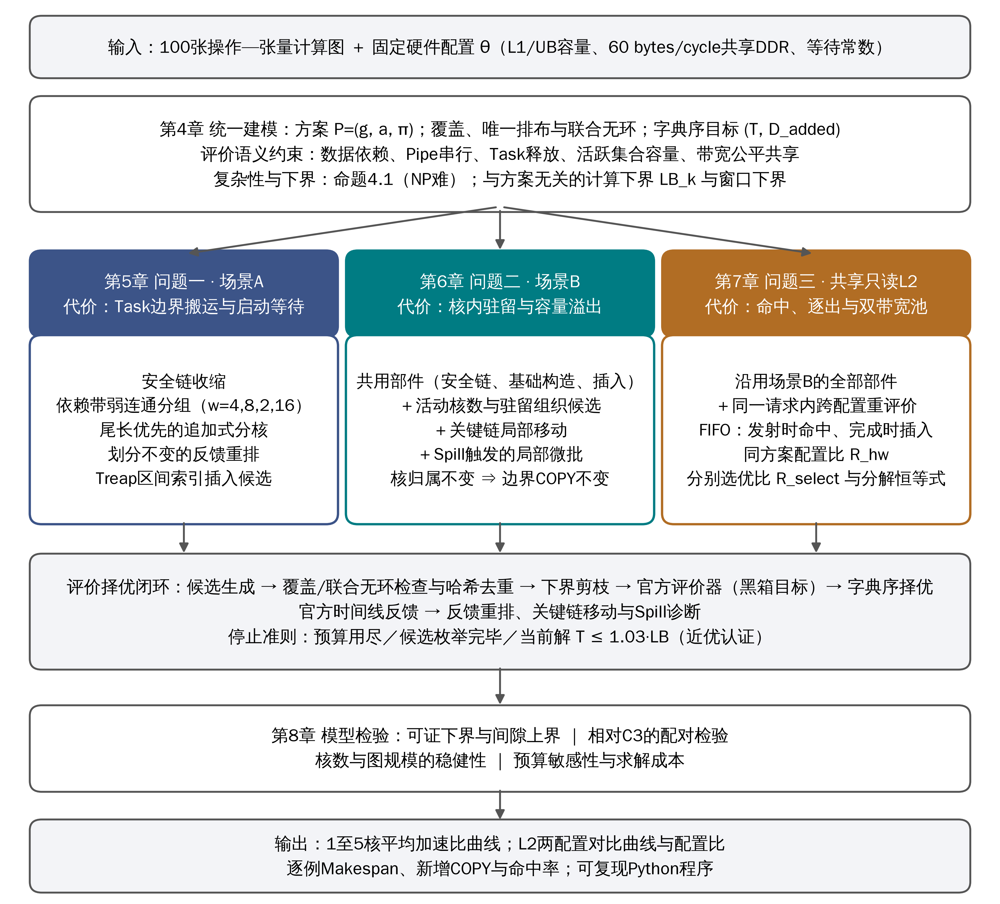

*图2-3  全文技术路线*

## 2.7 相关方法与本文定位

有向无环任务图在多处理器上的静态调度是经典问题，NP难已为人熟知，常用的是按优先级逐个放置任务的构造型启发式及其各种变体[4,5,6]。深度学习编译与加速器领域则更关注数据流与存储层次：加速器研究强调片上缓存复用对能效的决定作用[1,2]，编译器通过算子融合、图划分与并行策略搜索降低访存与通信开销[7,8,9,10]。与本题的联合无环约束直接相关的是有向无环划分，即要求划分后的商图仍然无环，已有多层划分算法[11]；有限容量下数据搬运量的下界问题，则可以追溯到红蓝卵石博弈[12]。

本题有两个特点使这些方法不能直接照搬。第一，目标由一个带启发式核内调度和共享带宽事件模拟的官方程序给出，任务时长不是常数，而是随切分、放置和并发状态变化；第二，三个场景的Task组织方式不同，同一种代价代理在一个场景合理，换到另一个场景就可能失效（6.4.1节给出了实例）。本文的定位是：以官方评价器为唯一目标，用结构化方法生成覆盖不同粒度与放置的合法候选，用与方案无关的下界做剪枝和近优认证，并对三个场景分别说明哪些机制需要增加、哪些应当舍弃。


# 3 模型假设与符号说明

## 3.1 模型假设

本文的假设分两类。第一类是与题面和官方评价程序一致的建模约定，它们不是为了简化而人为引入的，而是评分口径本身的规定，写成假设是为了让后文每一步推导都有明确的出发点；第二类是本文在方法上的选择，需要单独说明理由。

**（一）与题面及官方评价程序一致的建模约定**

**假设1（评价确定性）** 同一计算图 $G$、同一方案 $P$、同一固定配置 $\theta$ 在同一版本的官方评价程序下给出唯一的Makespan与搬运统计。
*依据*：题面附录C的核内拓扑排序按操作类型、预计算深度和id的固定优先级排列，题面附录D的离散事件循环按固定次序推进，评价过程中不含随机因素。

**假设2（输入不可改）** 原始计算图的操作、周期数、张量大小以及config.txt中的全部参数在实验中保持不变；算法只输出 `node_to_subgraph` 与 `core_schedules` 两个字段。
*依据*：题面附录B.1规定论文中的算法评估结果必须由使用统一配置的评估脚本给出，不得修改。

**假设3（零周期计算）** 周期数为零的计算操作按 $\max(1,\mathrm{cycles})$ 计时。
*依据*：这是当前原版实现的实际行为；本文按实现而非文字理解建模，以免估计值与评分出现系统偏差。

**假设4（容量约束的作用对象）** L1/UB容量约束作用于某一时刻核内实际活跃的驻留张量集合，而不是一个子图涉及的全部张量。
*依据*：题面附录C.3规定输入张量在最后一次使用完成后释放，题面附录D.4规定操作完成后递减引用、最后一次使用完成即释放空间。

**假设5（等待的计费方式）** 场景A中，同核前一Task完成后的100 cycles切换等待只对同核前一Task计一次；1000 cycles跨核等待只在前驱与后继分属不同核心时计入；场景B与L2场景中，跨核COPY_IN须在对应COPY_OUT完成500 cycles后才进入就绪判定。
*依据*：题面附录D.2对问题1与问题2、3的Task激活条件的描述。

**假设6（边界搬运的计数方式）** 边界搬运按张量的生产单元与消费单元计数，而不是按操作依赖边计数：场景A中，生产Task对跨Task使用的张量写出一次，其他每个消费Task各读入一次；场景B中，每一对“生产核心→消费核心”的跨核连接各计一次写出与一次读入。同一张量被同一远端单元多次使用只计一次。
*依据*：题面1.2节“边本身不设置通信量，搬运字节数由关联张量的大小决定”，以及官方评估程序重建边界COPY的实现（4.4.5节）。

**假设7（COPY计账时点）** 新增COPY字节数在事件模拟之前计账，模拟阶段的只读Cache命中不回减该量。
*依据*：官方问题3评估程序在模拟前完成 `added_copy_bytes` 统计；第7章的同方案对照中，固定方案在两种配置下的边界与Spill新增字节完全一致，与这一计账方式相符。

**假设8（带宽池独立）** DDR带宽池（60 bytes/cycle）与只读L2读带宽池（250 bytes/cycle）各自由全部核心共享，两池之间互不占用；池内在途搬运公平分享带宽。
*依据*：题面1.5节与附录D.5。

**（二）本文的方法学假设**

**假设9（黑箱目标）** 把官方评价程序当作确定性的黑箱目标函数，不为其建立代理模型，候选之间的优劣一律以完整官方评价结果判定。
*理由*：评价过程中Task释放、Pipe串行、内存申请次序与带宽公平分配以事件推进方式耦合，写不出闭式目标；代理模型的偏差无法事先界定（4.4.2节）。

**假设10（有限预算）** 每个求解请求在600秒软预算内完成候选生成与评价，预算用尽时输出已评价的最好方案；个别用例若在该预算内没有得到任何成功方案，单独放宽预算补跑并如实报告。
*理由*：题面要求在“合理时间内”生成方案，但没有给出具体时限；600秒使100张图、1400个配置格可在有限机时内全部完成，同时给大图保留多次完整评价的余地。本文不声称结果为全局最优。

**假设11（测试集代表性）** 结论只对题目给定的100张正式计算图与固定配置成立；向其他图结构或其他硬件参数外推时须另行验证。
*理由*：本文所有统计都是这100张图上的描述；第9章讨论了外推边界。

## 3.2 符号说明

全文通用符号列于表3-1，只在某一章使用的符号在首次出现处另行定义。

**表3-1  主要符号说明**

| 符号 | 含义 | 单位或取值 |
|------|--------------|------|
| $G=(V,E)$ | 操作—张量二部有向无环计算图，$V=V_T\cup V_O$ | — |
| $U$ | 非COPY计算操作集合（方案需要覆盖的对象） | — |
| $S$ | 非空子图集合 | — |
| $k$ | 核心数 | 场景A取2–5；场景B与L2取1–5 |
| $g$ | 操作划分 $g:U\to S$，即 `node_to_subgraph` | — |
| $a$ | 核心分配 $a:S\to\{0,\dots,k-1\}$ | — |
| $\pi_c$ | 核心 $c$ 上的子图执行顺序，即 `core_schedules[c]` | 排列 |
| $P=(g,a,\pi)$ | 多核切图与调度方案 | — |
| $\theta$ | 固定硬件配置（容量、带宽、等待常数） | 见表3-2 |
| $\mathrm{Eval}_A,\mathrm{Eval}_B,\mathrm{Eval}_{L}$ | 问题1、2、3的官方评价算子 | — |
| $T_A(P),T_B(P),T_L(P)$ | 三种评价下的Makespan | cycles |
| $T_{\mathrm{REF},i}$ | 第 $i$ 张图整图单核的原版核内调度结果（加速比基准） | cycles |
| $D_{\mathrm{added}}$ | 新增COPY字节数，$D_{\mathrm{added}}=D_{\mathrm{partition}}+D_{\mathrm{spill}}$ | bytes |
| $D_{\mathrm{partition}}$ | Spill之前的Task边界新增字节（下文简称“边界新增”） | bytes |
| $D_{\mathrm{spill}}$ | 核内容量不足时插入的换出与换入字节（“Spill新增”） | bytes |
| $\mathcal F_A,\mathcal F_B$ | 满足方案规则且官方执行成功的方案集合 | — |
| $f_p,\ r_s$ | Task $p$ 的完成时刻；Task $s$ 的必要释放时刻 | cycles |
| $\operatorname{Pred}(s)$ | 子图 $s$ 的数据前驱集合 | — |
| $C_m$ | 私有缓存 $m\in\{\mathrm{L1},\mathrm{UB}\}$ 的容量 | bytes |
| $\mathcal L_{c,m}(\tau)$ | 时刻 $\tau$ 核心 $c$ 上缓存 $m$ 的活跃驻留张量集合 | — |
| $b_t$ | 张量 $t$ 的字节数 | bytes |
| $W_M,W_V$ | 全图PIPE_M、PIPE_V计算周期总和 | cycles |
| $L_{\mathrm{CP}}$ | 只计计算周期的最长依赖路径长度 | cycles |
| $\mathrm{LB}_k$ | $k$ 核下与方案无关的计算下界（4.5节） | cycles |
| $\overline S_{k}$ | $k$ 核下100张图逐例加速比的算术平均 | — |
| $\rho_i$ | 相对C3的逐例耗时降幅 | % |
| $Q(t),H(t)$ | 只读L2的FIFO键序列及其字节占用（第7章） | —／bytes |
| $h_i$ | 第 $i$ 张图的按字节命中率（第7章） | % |
| $R_{\mathrm{hw}},R_{\mathrm{select}}$ | 同方案配置比、分别选优综合比（第7章） | — |

**表3-2  固定配置参数（全部实验不变）**

| 参数 | 取值 | 适用范围 |
|---|---|---|
| L1容量 $C_{\mathrm{L1}}$ | 524288 bytes | 每核私有，三问 |
| UB容量 $C_{\mathrm{UB}}$ | 131072 bytes | 每核私有，三问 |
| DDR总带宽 | 60 bytes/cycle | 全部核心共享，三问 |
| 同核Task切换等待 | 100 cycles | 问题1 |
| 跨核前驱等待 | 1000 cycles | 问题1 |
| 跨核拷贝同步延迟 | 500 cycles | 问题2、3 |
| 只读L2容量 | 1048576 bytes（1 MiB） | 问题3 |
| 只读L2读带宽 | 250 bytes/cycle | 问题3，独立于DDR |

文中 1 MiB = 1048576 bytes，1 KiB = 1024 bytes。加速比、配置比等无量纲比值在正文一般保留四位有效数字，表格保留六位小数；贴近1的配置比在正文也保留六位小数，原因见7.3.1节。


# 4 多核计算图的统一建模

三个问题共享同一组决策变量、同一套可行性条件和同一个评价机制，差别只在Task的组织方式以及由此决定的通信代价。本章把这部分公共骨架一次讲清：资源与规模、决策结构、目标与评价口径、评价语义下的时序与资源约束、问题的计算复杂性与下界、三个场景的关系，以及求解框架的总体形态。第5至7章不再重复推导，只写各场景新增的代价结构和相应的求解机制。

把公共部分单独立章，还有一个比节省篇幅更重要的用处：三个场景之间的差异由此可以被准确定位。从问题一到问题三，改变的究竟是哪几处，每一处改变又为什么会让最优策略随之改变，读者可以逐条对照。

## 4.1 资源与问题规模

### 4.1.1 硬件资源的归属

计算单元与私有缓存按核心独立配置，每个核心拥有各自的L1（524288 bytes）与UB（131072 bytes）；DDR带宽则不同，60 bytes/cycle由全部核心共同竞争。图4-1画出了这一归属关系：纵向的核心之间互不干扰，横向的DDR通道是唯一的公共资源（结构示意，图中画出三个核心仅作代表，不表示核数固定为三）。


*图4-1  计算资源、私有缓存与共享带宽池（示意图）*

这条不对称性是全文所有权衡的物理根源：**核心数可以增加，带宽不会**。并行度提高以后，只要搬运量随之上升，带宽就会成为新的瓶颈，加速比因此不可能随核数等比例增长。

三个场景共用这套硬件。只有问题三额外增加一块1 MiB、250 bytes/cycle的共享只读L2，它独立于DDR，构成第二条读路径。

### 4.1.2 输入规模的异质性

实验使用题目给定的100张正式计算图。图与图之间的规模差异很大：非COPY操作数从552到35705，最大与最小相差约65倍，中位数为3720.5；每张图M计算与V计算的工作量占比也明显分化，72张图以矩阵计算为主，28张以向量计算为主（图2-1，每点与每列各对应一张图）。

这一异质性直接决定了求解策略的形态。**任何固定的切分尺度都不可能对全部100张图都合理**：对五百操作量级的图合适的粒度，用在三万操作量级的图上会产生过多的子图与边界搬运。因此本文的切图不采用固定阈值，而由图自身的结构（链的分布与依赖深度）决定粒度，细节见5.2节。

全文共产生1400个配置结果：场景A的400格（100图×2至5核），场景B与L2场景各500格（100图×1至5核）。**这不是1400个独立样本**：同一张图在不同核数、不同场景下反复出现，因此涉及分布的陈述均按场景与核数分组给出，不做跨组汇总。

## 4.2 决策结构与可行性

### 4.2.1 决策三元组

方案由三项决策构成：

$$
P=(g,a,\pi),\quad g:U\to S,\quad a:S\to\{0,\dots,k-1\},\quad \pi_c\ \text{为核心}c\text{的子图顺序}
\tag{4-1}
$$


$g$ 把每个非COPY操作分配到一个子图，$a$ 把每个子图分配到一个核心，$\pi_c$ 给出核心 $c$ 上的子图执行次序。提交文件只含 `node_to_subgraph` 与 `core_schedules` 两个字段。

**算法能控制的只有这三项。** 操作的具体开始时刻由官方评价流程确定，不由方案指定。这一点在建模上是决定性的，4.3.2节会展开它的后果。

图4-2把同一个概念DAG分别画成操作—张量视图、子图划分视图与核心队列视图，三者中的对象一一对应，可以直观区分三项决策各自作用在哪一层；图中核心队列给出的是队列序号而非执行时刻（结构示意，非实际选解）。


*图4-2  调度方案的三种视图：操作划分、核心映射与核序（概念示例）*

### 4.2.2 可行性条件

方案合法需同时满足三条。前两条是覆盖性与唯一排布：

$$
\bigcup_{c=0}^{k-1}\ \bigcup_{s\in\pi_c} g^{-1}(s)=U,\qquad \text{任意两 } g^{-1}(s)\text{ 互不相交，每个 } s \text{ 仅在一条队列中出现一次}
\tag{4-2}
$$


即每个非COPY操作恰好归入一个子图，每个子图恰好在一条核心队列中出现一次。

第三条是**联合无环**。记 $u\prec u'$ 表示原图中存在经张量传递的依赖。子图依赖边与核心队列顺序边分别为

$$
E_{\mathrm{dep}}=\left\{(s,s'):s\ne s',\ \exists\,u\in g^{-1}(s),\,u'\in g^{-1}(s'),\ u\prec u'\right\},\qquad
E_{\mathrm{ord}}=\bigcup_{c}\left\{\left(\pi_c(j),\pi_c(j+1)\right)\right\}
\tag{4-3}
$$


方案可执行要求有向图 $H(P)=(S,\,E_{\mathrm{dep}}\cup E_{\mathrm{ord}})$ 无环。这一条容易被忽略，因为原始计算图本身无环；但核序引入的顺序边会与数据依赖边叠加成一个新的有向图，完全可能形成等待环。也就是说，原DAG无环不足以保证方案可执行。

联合无环是必要条件而非充分条件：它排除了顺序死锁，但不代替容量与带宽层面的可行性，后者由评价流程在执行中落实。

**三个场景共用这一整套决策结构与可行性条件。** 场景之间的差别不在这里，而在4.3节的评价算子与4.6节的Task组织方式。

## 4.3 目标函数与评价口径

### 4.3.1 目标与择优规则

总体执行时间由官方评价器统一计算：

$$
T_A(P)=\operatorname{Makespan}\!\left(\operatorname{Eval}^{\mathrm{orig}}_A(G,P;\theta)\right)
\tag{4-4}
$$


场景B为同一形式，只替换评价算子：

$$
T_B(P)=\operatorname{Makespan}\!\left(\operatorname{Eval}^{\mathrm{orig}}_B(G,P;\theta)\right)
\tag{4-5}
$$


问题三使用加载了只读L2配置的同一套评价流程，记为 $T_L(P)$。三者单位均为cycles。

择优采用字典序：

$$
\operatorname*{lex\,min}_{P\in\mathcal F}\ \left(T(P),\,D_{\mathrm{added}}(P)\right)
\tag{4-6}
$$


先比较Makespan，相同时再比较新增COPY字节数；两者都相同时按候选的确定性名称排序，保证结果唯一。

选择字典序而非加权和，是因为加权和需要一个把cycles与bytes通约的权重，而题目没有给出这个兑换率。任何自定权重都会把评分标准的一部分替换成我们的假设；字典序则严格对应题目“以缩短总体执行时间为主要目标，并兼顾总额外数据搬运量”的主次关系，不引入额外自由度。代价是无法表达“稍慢但搬运大幅减少”这类偏好，而这种偏好本来就不在评分标准里。

### 4.3.2 把评价器当作黑箱目标的取舍

一个自然的想法是把问题写成混合整数规划或约束规划，交给成熟求解器。本文没有走这条路，理由分三层，三层的性质各不相同。

**可写性**：目标函数是官方评价器，不是闭式表达式。Task释放、Pipe串行、内存申请次序、共享带宽的公平分配这四件事在评价流程内部以事件推进的方式耦合（4.4节），核内顺序和Spill插入还由题面附录C的启发式确定，写不出一个能交给求解器的目标函数。

**可信性**：即便构造代理模型近似评价器，代理与真实评价之间的偏差也会直接转化为解质量的偏差，而这个偏差**无法事先界定**。在评分标准已由评价器唯一确定的场合，用代理模型优化，等于在优化一个与评分无关的量。

**规模**：题目要求在合理时间内给出方案，而最大图有35705个非COPY操作；即使只保留操作到核心的分配，决策空间也随操作数指数增长，4.5.1节进一步说明问题在很弱的特例下已是NP难的。

三条求解路线的对比见表4-1。

**表4-1  三条求解路线的比较**

| 路线 | 目标与评分的一致性 | 大规模可行性 | 最优性信息 | 可复现性 |
|------|------------|--------|--------|--------|
| 精确规划（混合整数规划、约束规划） | 需近似评价语义，存在建模偏差 | 最大图35705个非COPY操作，决策空间指数增长 | 可解时给出最优或间隙 | 高 |
| 代理目标＋元启发式（遗传、模拟退火等） | 优化的是代理量，偏差无法事先界定 | 可行，但每一步都依赖代理评估 | 无 | 依赖随机种子 |
| 本文：结构化候选＋官方评价闭环 | 完全一致，官方评价器即目标 | 可行，成本由官方评价次数决定 | 下界剪枝与近优认证（4.5.2节） | 高：无随机种子，结果与方案哈希绑定 |

三层之中第二层是决定性的：即使时间无限，代理偏差的问题也不会消失。若把遗传、模拟退火等方法直接接在官方评价器上以消除代理偏差，又会受评价成本约束：大图的一次完整评价就要消耗可观的预算（case_087的场景A四格在600秒内没有得到成功方案，5.5.5节），而这类方法通常需要成百上千次评价才能收敛。因此本文选择“合法候选构造＋真实评价反馈”的闭环，**牺牲解析意义上的最优性保证，换取报告值与评分口径的严格一致**。4.5.2节给出的与方案无关的计算下界，则用于剪枝和判断何时可以停止搜索。

### 4.3.3 基准与对照

**基准REF** 取原版核内调度算法在整图单核上的结果。按题目要求，不使用各方法自行优化后的单核结果作为分母，因此单核加速比按定义为1。逐核平均加速比为

$$
\overline S_{A,k}=\frac{1}{100}\sum_{i=1}^{100}\frac{T_{\mathrm{REF},i}}{T_{A,i,k}},\qquad \overline S_{A,1}=1
\tag{4-7}
$$


先逐图求比值再取算术平均，不用“平均耗时之比”替代。场景B与L2场景同形式。REF本身来自启发式核内调度而非最优调度，因此个别图的多核加速比超过核数在原理上是可能的，8.2节给出了实际计数。

**对照基线C3** 是本文构造的可复现固定基线：合并安全链、按就绪层平衡计算负载、用场景A的等待与边界代理分核，一次成型后不再迭代。它与本文方法使用相同输入、相同官方评分口径。

C3的性质需要先说明，以免后续章节的相对降幅被误读。C3不是随机调度或朴素贪心，而是一个**自身即可独立运行的完整构造方法**；选这样一条基线，本文报告的相对改进就不会因基线过弱而虚高。另一方面，C3是一次性完成的构造，本文方法是利用官方反馈的多候选搜索，两者搜索成本不同，因此 **C3是事后同口径对照，不是等搜索预算的消融实验**，两者的终点性能差不能解释为等成本下的算法效率差。相对C3的逐例比较口径为

$$
\rho_i=1-\frac{T_{\mathrm{R12},i}}{T_{\mathrm{C3},i}},\qquad \overline\rho=\frac{1}{100}\sum_{i=1}^{100}\rho_i
\tag{4-8}
$$


同样是逐图先计算再平均，不是求解程序的墙钟降幅。

## 4.4 评价语义下的时序、容量与带宽约束

本节把题面附录C、D描述的评价语义写成约束的形式。需要强调，这些约束刻画的是“任何一次合法执行都必须满足的条件”，具体的开始时刻由评价流程按其确定性规则给出，并不是本文的决策变量。

### 4.4.1 操作级依赖与Pipe串行

记 $s_v$、$f_v$ 为操作 $v$ 的开始与完成时刻，$p_v$ 为其周期数（计算操作按假设3取 $\max(1,\mathrm{cycles})$），$\mathrm{pipe}(v)$ 与 $\mathrm{core}(v)$ 为其所在流水线与核心。数据依赖与同一Pipe上的串行分别为

$$
s_{v}\ \ge\ f_{u},\qquad \forall\,(u\to t\to v),\ t\in V_T
\tag{4-9}
$$


$$
f_u\le s_v\ \ \text{或}\ \ f_v\le s_u,\qquad \forall\,u\ne v,\ \mathrm{core}(u)=\mathrm{core}(v),\ \mathrm{pipe}(u)=\mathrm{pipe}(v)
\tag{4-10}
$$


计算操作满足 $f_v=s_v+p_v$；搬运操作的完成时刻由4.4.4节的带宽共享规则决定。不同Pipe、不同核心之间可以并行，同一核心内的Cube与Vector单元也因此可以同时工作，这正是题目提示的“核内矩阵单元与向量单元自动并行”。

### 4.4.2 Task的释放时刻

记 $f_p$ 为Task $p$ 的完成时刻。同核前一Task带来固定的切换等待：

$$
r_s^{\mathrm{seq}}=f_{\operatorname{prev}(s)}+100\quad(\text{存在同核前一Task}),\qquad r_s^{\mathrm{seq}}=0\ \text{否则}
\tag{4-11}
$$


数据前驱带来的释放约束为

$$
r_s^{\mathrm{dep}}=\max\left(\{0\}\cup\left\{f_p+1000\cdot\mathbf{1}_{\{a(p)\ne a(s)\}}:p\in\operatorname{Pred}(s)\right\}\right)
\tag{4-12}
$$


两者取大得到必要释放时刻：

$$
r_s=\max\left\{r_s^{\mathrm{seq}},\,r_s^{\mathrm{dep}}\right\}
\tag{4-13}
$$


两处计费细节直接影响代价估计的正确性：100周期的切换等待**只对同核前一Task计一次**，不在每条数据边上重复；1000周期的跨核等待**只在前驱与后继分属不同核心时计入**。并集中的0使无前驱的Task也有定义。$r_s$ 只是必要条件，Task内部的操作还须满足式(4-9)式(4-10)与内存申请次序。

场景B与L2场景的跨核传输另有一条同步约束：

$$
s(\text{COPY\_IN}_e)\ \ge\ f(\text{COPY\_OUT}_e)+500
\tag{4-14}
$$


$e$ 为一条实际跨核传输。这同样是必要释放条件，源端写出完成加500周期并不意味着目标端立即发射。

### 4.4.3 私有容量约束

$$
\sum_{t\in\mathcal L_{c,m}(\tau)} b_t\le C_m,\qquad m\in\{\mathrm{L1},\mathrm{UB}\}
\tag{4-15}
$$


这条约束最容易被误读的是它的作用对象：$\mathcal L_{c,m}(\tau)$ 是时刻 $\tau$ 核心 $c$ 上缓存 $m$ 的**实际活跃驻留集合**，不是该子图的全部张量集合。两者的区别直接影响对切图粒度上限的判断：从子图的张量总量推不出容量意义上的操作数上限。容量不足时，官方核内调度从未来仍会使用的驻留张量中换出下一次使用最晚者，这正是Belady最远未来使用策略[13]；换出与换入的字节计入 $D_{\mathrm{spill}}$。

图2-2给出了输入尺度的证据：100张图的最大单张量与对应容量之比全部落在1.0以内（最大为0.5625），73张图不到容量的十分之一（零值保留）。也就是说，**容量压力不来自单个张量装不下，而来自多个张量的生命周期重叠**。这正是式(4-15)必须约束活跃集合的原因，也解释了Spill为什么在切分粒度较粗时才成为主要代价（详见第6章）。最大单张量只描述输入尺度，不能由此推断运行时的驻留峰值。

### 4.4.4 共享带宽的公平分配

访问DDR的搬运以“独占全部带宽时尚需的周期数”记录剩余工作量 $w_j$。设带宽池 $p$ 的总带宽为 $B_p$、时刻 $t$ 的在途搬运集合为 $\mathcal A_p(t)$，则

$$
w_j(t_j^{\mathrm{issue}})=\frac{b_j}{B_p},\qquad \frac{\mathrm{d}w_j}{\mathrm{d}t}=-\frac{1}{\left|\mathcal A_p(t)\right|},\qquad f_j=\min\{t:w_j(t)=0\}
\tag{4-16}
$$


即每个在途搬运分得 $B_p/|\mathcal A_p(t)|$ 的速率；有搬运加入或完成时，评价器先按原并发数结算上一时段，再重算各搬运的预计完成时刻。三问的DDR池 $B_{\mathrm{DDR}}=60$ bytes/cycle；问题三另有只读L2读池 $B_{\mathrm{L2}}=250$ bytes/cycle，两池互不占用（第7章）。

式(4-16)说明了搬运时间为什么不能在切图阶段预先算定：同一次COPY的耗时取决于它执行期间有多少别的搬运在争用同一池，而这又取决于全部核心的执行进度。这是4.3.2节“写不出闭式目标”的具体来源之一。

### 4.4.5 边界搬运的计账

新增COPY由两部分组成：切图产生的Spill前边界搬运，以及核内容量不足时插入的换出与换入，

$$
D_{\mathrm{added}}(P)=D_{\mathrm{partition}}(P)+D_{\mathrm{spill}}(P),\qquad D_{\mathrm{partition}}(P)=\sum_{t\in V_T}D(t)-D_{\mathrm{orig}}
\tag{4-17}
$$


其中 $D_{\mathrm{orig}}$ 为原始计算图已有的COPY字节。记张量 $t$ 的生产单元集合为 $\mathcal P_t$、消费单元集合为 $\mathcal C_t$，只统计非COPY操作所在的单元：场景A的单元是子图（即Task），场景B的单元是核心；图输入张量由原有的COPY_IN产生，其 $\mathcal P_t=\varnothing$。记 $\varphi_t$ 表示 $t$ 是最终输出或没有消费者。按官方评估程序重建边界COPY的实现，

$$
D^{A}(t)=b_t\Big(\left|\mathcal C_t\setminus\mathcal P_t\right|+\sum_{p\in\mathcal P_t}\mathbf 1\big[\varphi_t\ \lor\ \mathcal C_t\setminus\{p\}\ne\varnothing\big]\Big)
\tag{4-18}
$$


$$
D^{B}(t)=b_t\Big(\left|\mathcal C_t\right|\cdot\mathbf 1\big[\mathcal P_t=\varnothing\big]+\left|\mathcal P_t\right|\cdot\mathbf 1\big[\varphi_t\big]+2\sum_{p\in\mathcal P_t}\left|\mathcal C_t\setminus\{p\}\right|\Big)
\tag{4-19}
$$


场景A中，生产Task把跨Task使用的张量写出一次，其他每个消费Task各读入一次；图输入被几个Task使用就要读入几次，这正是题面所说的“重复读取”。场景B中，同核消费不产生搬运，每一条跨核连接各对应一次写出与一次读入。两式直接给出两条后文要用的推论：

- 场景A的 $D_{\mathrm{partition}}$ 只由划分 $g$ 决定，与核心分配 $a$、核序 $\pi$ 无关，所以“保持划分不变的反馈重排”不会改变边界搬运（5.2.3节）；
- 场景B的 $D_{\mathrm{partition}}$ 只由每个操作的核心归属 $a\circ g$ 决定，与核内子图划分和次序无关，所以保持核归属不变的局部微批不会改变边界搬运（6.2.4节）。

两式都不含Spill，也不扣除问题三中只读Cache的命中，因此 $D_{\mathrm{added}}$ 是计划中的搬运请求量，而不是物理DDR的净流量（7.4.6节）。

### 4.4.6 模型汇总

综合4.2至4.4节，三问共用的多核切图与调度模型为

$$
\operatorname*{lex\,min}_{P=(g,a,\pi)}\ \bigl(T(P),\,D_{\mathrm{added}}(P)\bigr)\qquad \text{s.t.}\quad
\begin{cases}
\text{覆盖、唯一与无环：式(4-2)式(4-3)}\\
\text{依赖与Pipe串行：式(4-9)式(4-10)}\\
\text{释放与跨核同步：式(4-11)至式(4-14)}\\
\text{活跃集合容量：式(4-15)}\\
\text{带宽公平共享：式(4-16)}\\
\text{搬运计账：式(4-17)至式(4-19)}
\end{cases}
\tag{4-20}
$$


三个场景在这一模型中只有三处不同：Task的组织（场景A为“一个子图一个Task”，场景B与L2为“一个核心一个Task”），释放规则（场景A用式(4-11)至式(4-13)，场景B与L2用式(4-14)），以及评价算子与带宽池（场景A、B为 $T_A$、$T_B$ 与DDR单池，L2另加只读读池与FIFO状态，见第7章）。决策变量只有 $(g,a,\pi)$，各操作的开始时刻、核内顺序与Spill由评价语义唯一确定，所以式(4-20)不是一个可以直接交给求解器的规划模型，而是对“评价器作为目标”这一问题的完整数学描述。

## 4.5 问题的计算复杂性与下界

### 4.5.1 NP难性

**命题4.1** 即使令全部张量大小为0（从而不产生任何搬运耗时）、全部计算操作两两独立，在 $k=2$ 时求场景A或场景B的最小Makespan仍是NP难问题。

*证明* 取 $n$ 个相互独立、均在PIPE_V上执行的计算操作，周期为正整数 $p_1,\dots,p_n$。场景B中每个核心的全部子图合并为一个Task，同核操作在PIPE_V上串行（式(4-10)），而不同核心互不影响，故Makespan等于两核PIPE_V周期和的较大者。场景A中，把同核的全部操作放入同一个子图可以得到同一数值，而把它们拆成多个子图只会额外引入同核切换等待（式(4-11)），不会更短。因此在两种场景下，“是否存在Makespan不超过 $\tfrac12\sum_j p_j$ 的方案”都等价于判定 $\{p_j\}$ 能否划分为和相等的两部分，即PARTITION问题，它是NP完全的[14]。$\square$

命题4.1给出了本文放弃精确求解的另一个理由：一般情形还叠加了依赖、共享带宽与容量，只会更难。它也说明，对大规模实例能做的是在有限预算内给出好的可行解，并判断何时已经不值得继续搜索，这正是下一小节下界的用处。

### 4.5.2 与方案无关的计算下界

记 $W_M$、$W_V$ 为全图PIPE_M与PIPE_V计算周期之和，$L_{\mathrm{CP}}$ 为只计计算周期的最长依赖路径长度，定义

$$
\mathrm{LB}_k=\max\left\{\left\lceil\frac{W_M}{k}\right\rceil,\ \left\lceil\frac{W_V}{k}\right\rceil,\ L_{\mathrm{CP}}\right\}
\tag{4-21}
$$


**命题4.2** 对任意核数 $k$ 下的任意可行方案 $P$，三种评价下都有 $T(P)\ge\mathrm{LB}_k$。

*证明* 每个核心只有一条PIPE_M，同一核心的矩阵计算在其上串行（式(4-10)），全部 $W_M$ 周期分布在 $k$ 条PIPE_M上，至少有一条承担不少于 $W_M/k$ 周期；周期为整数，故可取上整。$W_V$ 同理。沿任一依赖路径，计算操作须依次完成（式(4-9)），搬运耗时与各类等待均非负，故Makespan不小于 $L_{\mathrm{CP}}$。计算操作的实际耗时 $\max(1,\mathrm{cycles})$ 不小于其周期数，下界仍然成立。$\square$

把“开始不早于某时刻、结束后还须接续一段计算”的操作放在一起看，可以得到更紧的窗口下界。记 $r_v$ 为只计计算周期时操作 $v$ 的最早开始时刻，$q_v$ 为其全部后继链上计算周期的最大值，$c_v$ 为其周期数。对任一流水线类型 $p\in\{\mathrm{M},\mathrm{V}\}$ 与阈值 $\alpha,\beta\ge0$，集合 $U(\alpha,\beta,p)=\{v:\mathrm{pipe}(v)=p,\ r_v\ge\alpha,\ q_v\ge\beta\}$ 中的操作只能在 $[\alpha,\,T-\beta]$ 内执行，且全图共有 $k$ 条该类流水线，于是

$$
T(P)\ \ge\ \alpha+\beta+\left\lceil\frac{1}{k}\sum_{v\in U(\alpha,\beta,p)}c_v\right\rceil
\tag{4-22}
$$


取 $\alpha=\beta=0$ 即回到式(4-21)的前两项。求解器用区间最大值线段树在全部阈值组合上取式(4-22)的最大值作为窗口下界，它同样与方案无关。

$\mathrm{LB}_k$ 与划分、分核、核序都无关，因此可以同时用于两件事：在求解中判断当前解是否已足够接近最优（4.7.3节的停止准则），以及作为全部官方结果的一致性检验（任何评价结果若低于它，说明实现或记录有误）。它忽略了共享带宽、跨核等待和边界搬运，在核数较多、搬运较重时会变松，因此只用于剪枝与停止判断，不用来比较候选之间的优劣。

## 4.6 三个场景的关系

三个场景共用4.2至4.5节的全部结构，差别集中在Task的组织方式与由此引出的代价结构上。

**表4-2  三个场景的对照**

| 维度 | 场景A（问题一） | 场景B（问题二） | L2场景（问题三） |
|---|---|---|---|
| Task组织 | 每个子图独立成Task | 每核全部子图合并为一个Task | 同场景B |
| 同核跨子图数据 | 必须经DDR中转 | 留在L1/UB中直接复用 | 同场景B |
| 跨核同步 | 前驱完成后 + 1000 cycles | 写出完成后 + 500 cycles | 同场景B |
| 主要代价 | Task边界搬运 | 核内驻留与容量溢出 | 缓存交互（命中与逐出） |
| 评价配置 | $\mathrm{Eval}_A$ | $\mathrm{Eval}_B$ | $\mathrm{Eval}_B$ + 1 MiB只读L2、250 bytes/cycle |
| 求解策略差异 | 不使用局部微批 | 可用Spill触发的局部微批 | 同场景B，另做配置效应与选解效应的分离分析 |

从A到B只改动了一条规则，即同核子图是否合并；但这一条改动使代价结构整体转向：同核边界搬运消失，跨子图驻留带来的容量溢出取而代之，核内执行顺序第一次成为独立的优化对象。从B到L2的改动更局部，只增加一条独立读路径；正因为效应微小，它带来了一个前两问不会遇到的问题：如何确认测到的究竟是硬件的效应，还是求解器行为变化的效应。

这里先点明两条边界，细节分别在第6、7章展开：**场景B不能由场景A替换同步常数平移得到**；**L2的收益必须把硬件配置效应与求解器选解效应分开报告**。

## 4.7 求解框架总览

### 4.7.1 三层结构

本文的求解框架记为R12，由三层构成。

**候选生成层**从原图产生结构合理的合法方案，包含安全链收缩、依赖带分带与追加式分核；**筛选剪枝层**在送评价之前排除不可能更优的候选，包含覆盖性与联合无环检查、有效资源下界，以及用于加速插入位置查找的区间索引；**评价择优层**调用官方评价器，按式(4-6)的字典序保留最优解。

三层之间只有一个接口，即候选方案，因此任何一层都可以在不改动其余两层的前提下替换。**三个场景的专属机制全部加在第一层**，这是同一套框架能够适配三种代价结构的结构性原因。

### 4.7.2 组件清单

各组件的设计依据与实现细节分别见5.2、6.2、7.2节，此处只交代职责。一次请求内，各组件按下列顺序依次运行，共用同一软预算：

1. **控制链**：先运行基础构造器得到首个可行解；再尝试至多6个“减少活动核心”的候选；场景A随后生成依赖带候选（宽度4、8、2、16）。依赖带候选由安全链收缩、依赖带弱连通分组与追加式分核构成，追加式分核沿统一的合法拓扑序推进，不会由构造自身引入等待环。
2. **反馈重排**：利用官方评价返回的时间线修正代理时长后重新安排。场景A为“划分 $g$ 不变、按实测Task时长重新分核与排序”，划分不变意味着边界搬运结构不变；场景B与L2场景为沿官方时间线上关键链的至多4个局部移动。
3. **分量家族**：对活动核数 $m\le k$ 与驻留组织参数枚举候选，至多评价6个新候选（场景B与L2场景的主要结构候选；场景A同样运行，但以Task激活下界剪枝）。
4. **跨配置重评价**（仅L2场景）：在同一请求内独立求解一个场景B方案，并按L2配置重新评价，成本计入该请求。
5. **插入式候选**：用确定性区间索引加速“最早可行位置”的查找。它只加快同一条插入规则的执行，不改变判定结果。
6. **Spill触发的局部微批**：仅当当前解确有容量溢出时才诊断并重排（场景B与L2场景；场景A因不存在驻留复用收益而不使用）。

第1至4项的每个阶段在开始前都检查近优认证条件式(4-23)（基础构造在评价每个候选之前检查），成立即跳过；第5、6项不受这一门控，只受剩余预算约束。每个组件产生的候选都走同一条处理链：覆盖与联合无环检查、哈希去重、下界剪枝、官方评价、字典序择优。执行顺序与门控条件如图4-3所示，各组件的参数汇总于表4-3，全部取自求解器源码，在1400个配置格的实验中保持不变。

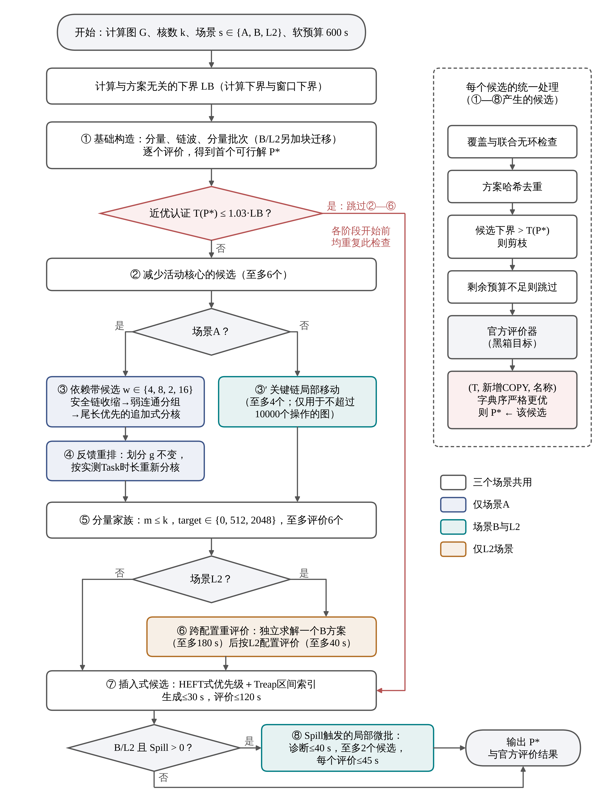

*图4-3  R12一次求解请求的流程*

**表4-3  R12算法参数一览**

| 模块 | 参数 | 取值 | 说明 |
|------|--------|--------|------------|
| 全局 | 单请求软预算 | 600 s | case_087的场景A四格补跑用1800 s |
| 全局 | 近优认证阈值 | $T\le1.03\cdot\mathrm{LB}$ | 满足即跳过其余改进阶段 |
| 控制链 | 基础构造的单次评价上限 | 120 s | 同时做下界剪枝 |
| 控制链 | 减少活动核心的候选 | 至多6个 | 三个场景 |
| 控制链（A） | 依赖带宽度 $w$ | 4、8、2、16 | 四种粒度 |
| 控制链（A） | 分组软目标 | 2048个操作 | 粒度控制参数，不是容量上限 |
| 反馈重排（B/L2） | 关键链局部移动 | 至多4个 | 仅用于不超过10000个操作的图 |
| 分量家族 | 活动核数 $m$；驻留组织 target | $m\le k$；0、512、2048 | 至多评价6个新候选，单次30 s |
| 插入式候选 | 生成时限；评价上限 | 30 s；120 s | 场景A的日历间隔为100 |
| 局部微批（B/L2） | 触发条件 | Spill新增>0；张量不小于容量的1/4；前后使用距离不超过8 | 见式(6-4) |
| 局部微批（B/L2） | 窗口 | 4、8个子图；至多16个窗口；每窗至多128个原计算操作；至多2个候选 | 见式(6-5) |
| 局部微批（B/L2） | 诊断时限；单候选评价上限 | 40 s；45 s | 诊断在独立进程中进行 |
| 跨配置重评价（L2） | B方案求解时限；评价上限 | 至多180 s；40 s | 成本计入同一请求 |

### 4.7.3 停止准则与两条性质

**停止准则。** 请求在三种情况下结束：预算用尽；全部候选枚举完毕；当前最好解已被下界认证为近优，即

$$
T(P^{\ast})\ \le\ 1.03\cdot \mathrm{LB}
\tag{4-23}
$$


此时最优性间隙不超过3%，后续改进阶段直接跳过（$\mathrm{LB}$ 取式(4-21)或同性质的窗口下界）。这条准则把节省下来的预算让给确实还有改进余地的大图，而不会让近优的小图空耗评价次数。

**同次请求内不变差。** 候选只有通过官方评价且字典序严格更优才会替换当前解，因此最终输出不会劣于流程起点得到的控制解。该性质成立于同一次请求、同一版本、同一机器、同一超时设置之下，不跨请求成立。

**确定性与可复现。** 索引的平衡优先级由固定的整数散列生成，候选按确定性名称排序，全流程不使用随机种子；每个结果都绑定方案、官方结果与输入的SHA256哈希。需要说明的是，各阶段受墙钟预算约束：预算未截断时，同一输入重复运行得到相同方案；若某阶段因预算或超时被截断，被评价的候选数可能随机器负载变化，最终方案也可能随之不同。本文全部结果均保留了实际运行的方案哈希，复查以存档方案为准。

## 4.8 小结

本章确立了三问共享的建模骨架：决策三元组 $P=(g,a,\pi)$、含联合无环在内的三条可行性条件、以官方评价器为黑箱目标的字典序择优、评价语义下的依赖、Pipe、释放、容量与带宽约束，以及问题的NP难性与一个与方案无关的计算下界。三个场景在这套骨架上只改变Task的组织方式与评价算子，求解框架相应地只在候选生成层增加场景专属机制。

有两处建模取舍决定了全文结论的形态。其一，把评价器当作黑箱目标，换来报告值与评分口径的零偏差，代价是放弃最优性的解析保证，本文以与方案无关的下界支撑剪枝与近优认证；其二，选择一条完整构造方法而非弱基线作为对照，使相对改进的数值更保守，也更可信。

按此框架，三个场景在五核下相对基准的平均加速比分别为3.743、4.131、4.219，相对C3的逐图耗时降幅平均分别为43.48%、34.49%、31.41%。这些结果的完整分布、代价分解、退化记录与边界条件，分别在第5、6、7章给出。


# 5 问题一：场景A下的多核切图与调度

场景A要求把计算图切成若干子图，每个子图独立成为一个Task，再把Task分配到多个核心并确定核内次序。本章把官方评价器作为确定性的黑箱目标函数，给出“结构化候选生成—下界剪枝—整机评价—字典序择优”的求解框架，并在100张计算图、2至5核共400个配置格上给出完整结果。五核相对整图单核的平均加速比为3.743，中位数4.130，最小值1.202；相对固定构造对照基线C3，五核逐图耗时平均下降43.48%。

## 5.1 问题分析与数学模型

### 5.1.1 问题分析

第4章已经确立了三问共享的决策结构与评价机制。**场景A是三者中约束最直接的一个**：每个子图独立成为一个Task，跨Task数据一律经DDR中转，因此全部额外代价都由切分粒度与Task的放置决定。本章在这一最简结构上给出完整的求解路径与实验结果，后两章在此基础上替换代价模型。

**难在哪。** 子图独立成Task这条规则带来两个后果：跨Task的数据即使落在同一核心上也必须经DDR中转，Task之间还存在启动等待。于是“把操作数量平均分到各核”不是一个有意义的目标。切分变细会同时增加重复读取、边界搬运与启动次数；切分变粗则压缩并行空间，单个Task的驻留压力上升，官方核内调度被迫插入更多换出与换入。两个方向各有代价，最优粒度不在任何一端。资源归属使这个矛盾无法靠增加核心来回避：核心可以增加，DDR带宽不会（4.1.1节）。

**为什么不能直接套用现成方法。** 目标函数是官方评价器，不是闭式表达式（4.3.2节）；即使在忽略搬运的特例下，问题也已是NP难的（命题4.1）。以精确规划为路线的方法在这里没有入口，基于代理模型的方法又会引入无法事先界定的偏差。

**我们的切入点。** 用图自身的结构信息生成合法候选，再用官方评价的真实反馈筛选与改进；评价器既是目标也是唯一的裁判，全程不引入代理目标函数。代理量只用于构造候选和剪枝，不参与最终择优。

**本章产出。** 100张计算图在2至5核下的400个配置格全部得到完整结果，并给出加速比分布、新增COPY的两类来源分解、全部退化配置与预算例外的完整记录。

### 5.1.2 场景A的模型

场景A的决策变量、可行域与目标完全沿用第4章：方案 $P=(g,a,\pi)$ 见式(4-1)，覆盖性、唯一排布与联合无环见式(4-2)式(4-3)，目标为式(4-4)的 $T_A(P)$，择优按式(4-6)的字典序，$\mathcal F_A$ 为满足方案规则且官方执行成功的方案集合。场景A特有的约束是Task的释放规则式(4-11)至式(4-13)：同核前一Task完成后等待100 cycles，跨核前驱完成后等待1000 cycles，并且每个Task开始执行时核内缓存为空，其全部输入都要从DDR读入。问题一的模型因此是式(4-20)在场景A下的实例：

$$
\operatorname*{lex\,min}_{P=(g,a,\pi)}\ \bigl(T_A(P),\,D^{A}_{\mathrm{added}}(P)\bigr)\qquad \text{s.t.}\quad
\begin{cases}
\text{式(4-20)的全部约束组}\\
\text{Task}\equiv\text{子图，释放按式(4-11)至式(4-13)}\\
\text{边界计账按式(4-18)}
\end{cases}
\tag{5-1}
$$


联合无环这一条在场景A中尤其要紧，因为一个核心上往往排着几十乃至上千个Task。当核心0的队列写成 $S_3$ 先于 $S_0$ 时，$S_0\to S_1\to S_3\to S_0$ 就形成了等待环，尽管每条数据依赖本身都没有问题（图5-1的反例，结构示意）。核序合法性必须在式(4-3)定义的并图上检验。

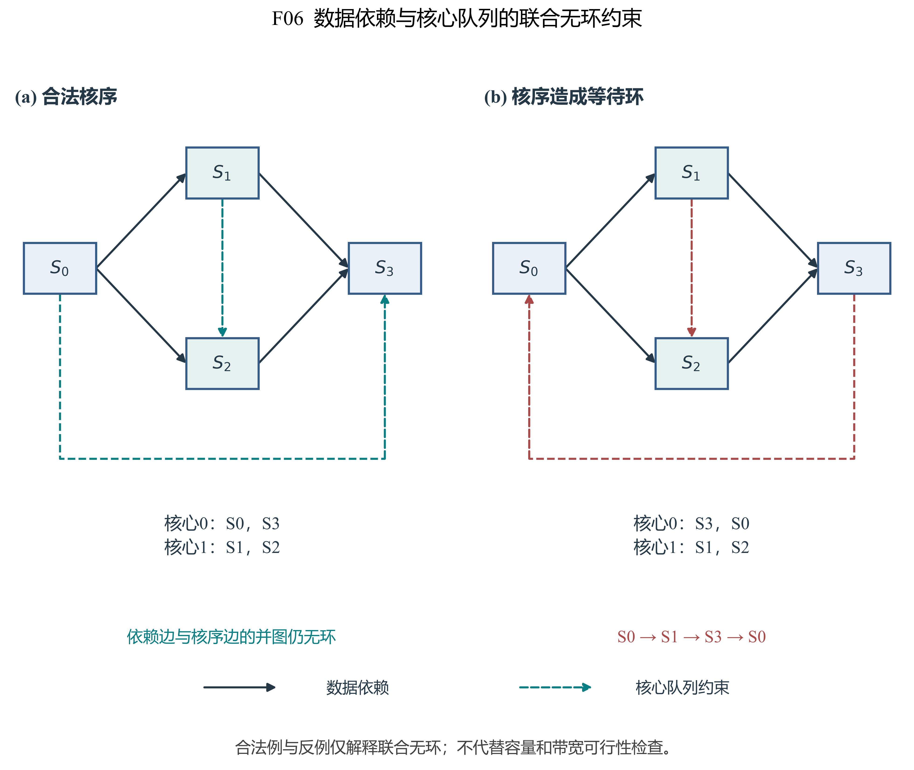

*图5-1  数据依赖与核心队列的联合无环约束（合法例与反例）*

场景A中每个Task独立占用缓存，容量约束式(4-15)在每个Task内部分别起作用。开始时刻、核内顺序、Spill插入全部由官方Step1/Step2/Step3决定，算法能控制的只有 $(g,a,\pi)$；这正是本文把评价器当作黑箱目标的原因。这样做的收益是报告数值与官方口径完全一致，代价是无法对最优性给出解析保证。

## 5.2 求解算法

### 5.2.1 求解路径与方法选择

本章的求解路径分三步。第一步用图的结构信息确定切分粒度：先收缩不该被切开的链，再按依赖深度分带成组。第二步把子图沿合法拓扑序追加到各核心队列，使构造本身不产生等待环。第三步把得到的方案交官方评价器打分，用真实反馈筛选并改进，直到预算耗尽或当前解被下界认证为近优。框架的三层结构见4.7.1节，每次请求都从原图开始，不读取历史结果中的优胜方案。

方法选择上有一处需要单独说明：**为什么安全链要求两端独占。** 出度为1且入度为1是使合并必不劣成立的最弱条件。若源操作出度大于1，合并会使其余消费者变成跨Task访问；若目标操作入度大于1，合并会把其余生产者拉进同一依赖前沿。只有两端都独占时，合并才不改变该边之外的任何边界关系，强行切开只会凭空增加一次边界搬运。放宽这一条件可以得到更大的链块，但合并收益不再有保证，只能逐个送评价验证。

### 5.2.2 安全链收缩与依赖带分带

第一步是识别不该被切开的结构。沿拓扑序扫描，若一条边的源操作出度为1、目标操作入度为1，就把两端并入同一链块，直到遇到分支为止；每个非COPY操作恰好属于一个链块 $C$，链块是后续切分的最小单位。由于被收缩的每条边都满足两端独占，收缩不会在商图中制造新的环。

链块按依赖深度分带：

$$
\mathrm{depth}(C)=1+\max\left(\{-1\}\cup\{\mathrm{depth}(C'):C'\in\mathrm{Pred}(C)\}\right),\qquad \mathrm{band}(C)=\left\lfloor \mathrm{depth}(C)/w \right\rfloor
\tag{5-2}
$$


无前驱的链块深度为0。宽度 $w$ 依次取4、8、2、16，生成四种粒度的候选。带内不是把整条带并成一个Task，而是只沿同带链块之间的依赖做图遍历，求出带内的弱连通分量；过大的分量再按原链块拓扑顺序切成连续段，每段不超过2048个操作（粒度控制的软目标，不是物理容量上限）。

这样构造保证了三件事：跨带依赖只指向后续带，带内不同弱连通分量之间无依赖，连续拓扑段之间也只向前。图5-2以 $w=2$ 的概念例展示完整流程：带2含两个互不相连的分量，因此形成 $S_2$ 与 $S_3$ 两个独立子图而非一个（结构示意，示意规模不触发2048操作的软分组目标）。

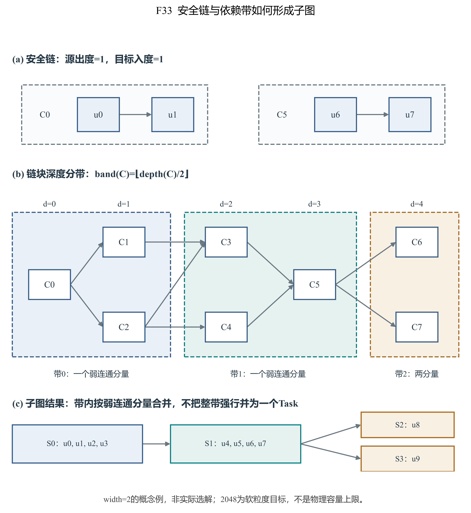

*图5-2  安全链与依赖带如何形成子图（示意图）*

### 5.2.3 追加式分核与反馈重排

得到子图之后，用一个与场景A规则一致的代理时长来决定分核。记子图 $s$ 的矩阵、向量计算周期为 $W_M(s)$、$W_V(s)$，子图内部只计计算周期的最长路径为 $L_{\mathrm{int}}(s)$，从外部读入与向外写出的字节为 $B^{\mathrm{in}}_s$、$B^{\mathrm{out}}_s$，则代理时长为

$$
d_s=\max\left\{W_M(s),\ W_V(s),\ L_{\mathrm{int}}(s),\ \frac{B^{\mathrm{in}}_s+B^{\mathrm{out}}_s}{60}\right\}
\tag{5-3}
$$


取最大值而不是求和，对应的是核内Cube、Vector与搬运Pipe可以并行（4.4.1节），题目提示的“两个计算单元之间的负载均衡”由此进入代理。子图的尾长定义为

$$
\mathrm{tail}(s)=d_s+\max\left(\{0\}\cup\{1000+\mathrm{tail}(s'):s'\in\mathrm{Succ}(s)\}\right)
\tag{5-4}
$$


它估计从 $s$ 开始到图结束至少还要多久。算法维护就绪集合，每次取出尾长最大的子图 $s$（平局依次比较代理时长与编号），对每个核心 $c$ 估计 $s$ 的最早开始时刻

$$
\hat r_c(s)=\max\left\{\ell_c+100\cdot\mathbf 1_{\{\pi_c\ne\varnothing\}},\ \max_{p\in\operatorname{Pred}(s)}\left(\hat f_p+1000\cdot\mathbf 1_{\{a(p)\ne c\}}\right)\right\}
\tag{5-5}
$$


其中 $\ell_c$ 为核心 $c$ 当前队尾的估计完成时刻，$\hat f_p$ 为前驱的估计完成时刻；然后把 $s$ 追加到使 $\hat r_c(s)+d_s$ 最小的核心队尾（平局取负载较小、编号较小者），并更新 $\hat f_s$ 与 $\ell_c$。式(5-5)与式(4-11)式(4-12)的释放规则一一对应，只是用代理时长代替了真实时长。这一构造不会由自身引入等待环：

**命题5.1（追加式分核的联合无环性）** 若划分 $g$ 的子图依赖图无环（依赖带候选满足这一点，见5.2.2节），则按式(5-5)逐个追加得到的核序 $\pi$ 满足联合无环条件式(4-3)。

*证明* 记子图的追加次序为 $\sigma$。子图只在全部前驱都已放置后才进入就绪集合，所以每条子图依赖边 $(s',s)$ 都满足 $\sigma(s')<\sigma(s)$；每个核心的队列按追加先后排列，所以每条核序边 $(s,s^{+})$ 也满足 $\sigma(s)<\sigma(s^{+})$。并图中的每条边都指向 $\sigma$ 值更大的顶点，沿任何路径 $\sigma$ 严格增加，不可能回到起点，因此并图无环。$\square$

反馈重排沿用同一追加过程，只替换代理时长，命题5.1对它同样成立；分量家族、插入式候选等其他构造不在命题范围内，仍逐个显式检查并图无环。

拿到成功方案后，官方评价器返回的不只是Makespan数值，还有每个Task的实际时间段。**反馈重排**用这份反馈修正代理：保持划分 $g$ 不变，把每个子图的 $d_s$ 替换为其实测时长（分别取核内排布时长与多核执行时长两种口径），再按式(5-4)式(5-5)重新分核与排序。划分不变意味着边界搬运结构不变，这一轮的改进收益完全来自负载与等待的重新安排，与搬运量解耦。

### 5.2.4 插入式候选与Treap区间索引

剩余预算用于构造插入式候选。它以5.2.2节的安全链链块为子图，沿用静态DAG调度中“优先级排序＋插入式最早完成”的构造规则[6]。链块 $u$ 的优先级为

$$
\mathrm{rank}(u)=d_u+\max\left(\{0\}\cup\left\{\sigma+\frac{2b_{uv}}{60}+\mathrm{rank}(v):v\in\mathrm{Succ}(u)\right\}\right)
\tag{5-6}
$$


其中 $d_u$ 按式(5-3)计算，$\sigma$ 为跨核同步常数（场景A取1000，场景B与L2场景取500），$b_{uv}$ 为 $u$ 流向 $v$ 的张量字节，$2b_{uv}/60$ 估计一次写出加一次读入的DDR时间。链块按优先级从大到小依次放置：对每个核心，先由跨核前驱的完成时刻加 $\sigma$ 与搬运估计求出就绪时刻 $\mathrm{ready}$，再在该核心的候选日历上找满足就绪时刻与持续时间的最早可行位置，最后放到完成最早的核心。场景A的日历在相邻Task之间保留 $\mathrm{gap}=100$ 的切换间隔，场景B与L2场景取0。在起点为 $\mathrm{low}$、终点为 $\mathrm{high}$ 的空闲区间中，判定式为

$$
t=\max(\mathrm{ready},\,\mathrm{low}),\qquad t+\mathrm{duration}+\mathrm{gap}\le \mathrm{high}
\tag{5-7}
$$


朴素做法是按时间顺序逐个扫描区间；当日历中区间数量增长时，这种扫描会反复检查大量明显放不下的短空隙。算法改用确定性Treap[15]维护空闲区间，每个节点额外记录子树内的最大可用跨度 $\mathrm{span}$ 与最右边界 $\mathrm{rightmost}$，据此整体跳过不可能命中的子树：

$$
\mathrm{span}+16\,\mathrm{ulp}(\cdot)<\mathrm{need}\ \ \text{或}\ \ \mathrm{rightmost}+16\,\mathrm{ulp}(\cdot)<\mathrm{ready}+\mathrm{need}\ \Rightarrow\ \text{剪枝},\qquad \mathrm{need}=\mathrm{duration}+\mathrm{gap}
\tag{5-8}
$$


容差按机器精度给出，避免浮点误差造成错误剪枝。剪枝条件是必要条件：被跳过的子树确实不可能容纳该任务，通过剪枝的候选仍由式(5-7)最终判定。在精确算术下该索引与顺序扫描第一个可行空隙等价，浮点实现另有包内等价性测试。图5-3给出一个 $\mathrm{ready}=5$、$\mathrm{duration}=5$、$\mathrm{gap}=1$ 的例子：左子树最大空隙为3、小于所需的6，可整体跳过，首个可行起点落在 $I_3$ 的 $t=14$（结构示意，查询的是候选构造用的虚拟日历，最终执行时刻仍由官方评价器给出）。

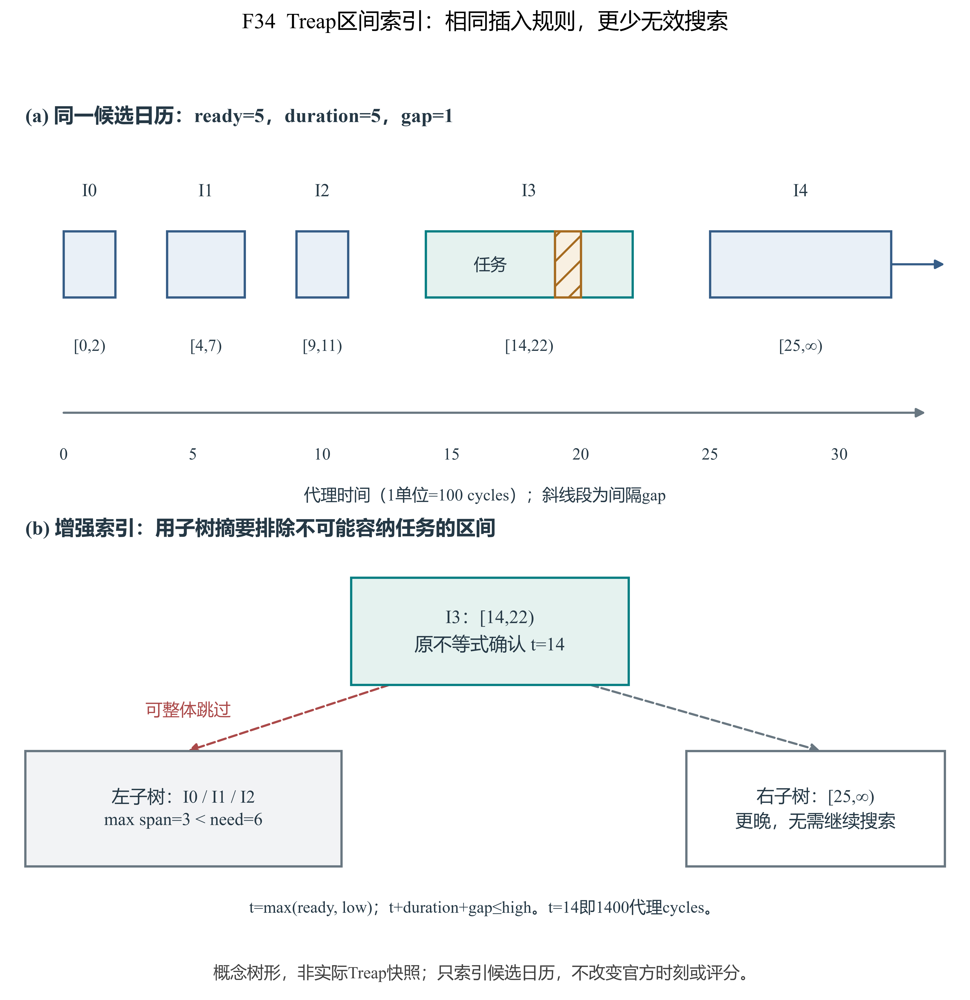

*图5-3  Treap区间索引：相同插入规则，更少无效搜索（示意图）*

这里有一处刻意的取舍：场景A不使用场景B与L2场景的局部微批策略。那类策略的收益来自操作级细分后的核内驻留复用，而场景A每个子图独立成Task、跨Task数据一律经DDR，驻留收益并不存在，平移过来只会增加边界搬运。

### 5.2.5 求解流程与停止准则

**算法5-1  R12场景A求解流程**

> **输入**：计算图 $G$；固定硬件配置 $\theta$；核心数 $k$；总软预算 $B$（600秒）  
> **输出**：方案 $P^\ast$ 及其官方评价结果；或失败标志
>
> 1 构造依赖索引与张量索引，计算与方案无关的下界 $\mathrm{LB}$（式(4-21)式(4-22)）；  
> 2 从原图运行控制链的基础构造器，得到首个成功方案 $P^\ast$；若失败则返回失败标志；  
> 3 **for** 阶段 $\in$（减少活动核心候选；依赖带候选 $w\in\{4,8,2,16\}$；反馈重排；分量家族）**do**  
> 4  **if** $T(P^\ast)\le 1.03\cdot\mathrm{LB}$ **then** 跳过其余改进阶段（近优认证，式(4-23)）；  
> 5  生成该阶段候选，检查覆盖性式(4-2)与联合无环式(4-3)，按哈希去重；  
> 6  对每个候选计算其Task激活下界，若大于 $T(P^\ast)$ 则剪枝；  
> 7  其余候选送官方评价（单次上限30至120秒，因阶段而异，并受剩余预算约束）；  
> 8  **if** 候选完整成功且 $(T,D_{\mathrm{added}},\text{名称})$ 字典序优于 $P^\ast$ **then** $P^\ast\leftarrow$ 该候选；  
> 9 **end for**  
> 10 用至多30秒构造Treap插入候选（式(5-7)式(5-8)），按第5—8行检查、评价与更新；  
> 11 输出 $P^\ast$ 的两字段方案文件；若无成功解，明确返回失败而不输出占位方案。
>
> **终止条件**：预算耗尽、候选枚举完毕或近优认证成立，以先到者为准。

第6行的Task激活下界是对固定方案的松弛：把每个Task的时长换成式(5-3)那样的下限，再按式(4-11)至式(4-13)推进激活时刻。它只承担剪枝职责；实现中还对每个官方结果检查“不得低于该下界”，一旦违反即中止请求，全部成功请求中这一检查从未触发。

### 5.2.6 结构性质、确定性与复杂度

**不变差性质。** 同一次请求内，候选只有通过官方评价且字典序严格更优才会替换当前解，因此最终输出不会劣于第2行得到的控制解。该性质成立于同一次请求、同一版本、同一机器、同一超时设置之下。

**确定性。** Treap的平衡优先级由固定整数散列生成，候选按确定性名称排序，全流程不使用随机种子；预算未截断时同一请求重复运行得到相同方案，受预算截断的阶段则可能随机器负载评价到不同数量的候选（4.7.3节）。

**核数的边界。** 核数增加时允许添加空核心，形式上 $k$ 核的可行域包含 $k-1$ 核的可行域，但有限预算下的启发式搜索不因此具备逐例单调性，5.5.2节的case_062就是反例。此外，命题5.1的无环保证只覆盖追加式分核与反馈重排；其他候选仍显式检查并图无环。

**求解成本。** 一次请求的墙钟成本可分解为

$$
C_{\mathrm{solve}}=C_{\mathrm{index}}+C_{\mathrm{generate}}+C_{\mathrm{bound}}+\sum_{j=1}^{K}C_{\mathrm{official}}(G,P_j,A)+C_{\mathrm{IO}}
\tag{5-9}
$$


$K$ 为实际评价过的候选数。记计算图的非COPY操作数为 $|U|$、边数为 $|E|$、子图数为 $|S|$、子图间依赖数为 $|E_S|$、日历中空闲区间数为 $m$。单个候选的构造成本按步骤为：安全链收缩与链块深度都是沿拓扑序的一次遍历，$O(|U|+|E|)$；带内弱连通分量的图遍历为 $O(|U|+|E|)$，按拓扑秩切段另需一次排序，$O(|U|\log|U|)$；追加式分核的就绪堆操作为 $O(|S|\log|S|)$，每次对 $k$ 个核心按式(5-5)扫描前驱，合计 $O(k(|S|+|E_S|))$；Treap的期望深度为 $O(\log m)$[15]，带剪枝的最早可行查询每次访问的节点数不超过顺序扫描的 $O(m)$，在区间数较多时通常远少于它。因此单个候选的构造复杂度为

$$
O\!\left((|U|+|E|)\log|U|+k(|S|+|E_S|)+|S|\cdot q_m\right),\qquad q_m\le m
\tag{5-10}
$$


其中 $q_m$ 为单次插入查询访问的节点数。各部件的复杂度汇总于表5-1。

**表5-1  R12各部件的时间复杂度**

| 部件 | 复杂度 | 说明 |
|------|--------|------------|
| 安全链收缩与链块深度 | $O(\lvert U\rvert+\lvert E\rvert)$ | 沿拓扑序一次遍历、一次动态规划 |
| 带内弱连通分量与切段 | $O(\lvert U\rvert+\lvert E\rvert+\lvert U\rvert\log\lvert U\rvert)$ | 同带图遍历，按拓扑秩排序后切段 |
| 尾长优先的追加式分核 | $O(\lvert S\rvert\log\lvert S\rvert+k(\lvert S\rvert+\lvert E_S\rvert))$ | 就绪堆，逐核估计最早开始时刻 |
| Treap插入候选 | $O(\lvert S\rvert\cdot q_m)$，$q_m\le m$ | Treap期望深度 $O(\log m)$ |
| 下界计算 | $O(\lvert U\rvert+\lvert E\rvert)$；窗口下界另加线段树维护 | 与方案无关，每请求算一次 |
| 官方评价 | $C_{\mathrm{eval}}$，随图规模增长 | 主导项，一次请求共 $K$ 次 |

**但这不是求解的总复杂度。** 由式(5-9)，总成本由 $K$ 次官方评价主导：每次官方评价都要对全部Task完整运行核内调度与多核事件模拟。$K$ 由剩余预算与单次评价上限共同决定，在预算固定时随单次评价成本反向变化。本测试集的非COPY操作数范围为552至35705，大图评价一次就要消耗可观的预算，能试的候选数自然少；case_087是这一机制的极端情形（5.5.5节）。Treap索引优化的是候选构造项，主导项是官方评价求和项，因此不能用某个子模块的复杂度代表整套算法。

## 5.3 实验设置

实验在题目给定的100张正式测试计算图上进行，核数取2至5，共400个配置格。硬件参数全部使用官方配置（表3-2），单次请求软预算600秒。加速比按式(4-7)以REF为分母逐图计算后取平均，单核加速比按定义为1；相对C3的比较按式(4-8)逐图计算，C3的定义与性质见4.3.3节，本章及后两章沿用。

### 5.3.1 对比实验的设计

调度类问题的性能对比容易出现两类失真：一是对照基线过弱，使相对改进虚高；二是把不同来源的改进混算成一个数字，使读者无法判断收益归属。本文用四条相互独立的对照轴来规避这两点。

**轴一：题目基准REF。** 原版核内调度算法在整图单核上的结果，由题目指定，不含任何本文的设计。它回答“相对于不做多核切分，我们快了多少”。

**轴二：独立构造对照C3。** C3是一个自身即可独立运行的完整构造方法：合并安全链、按就绪层平衡计算负载、用等待与边界代理分核。选择这样一条基线，本文报告的相对降幅（五核43.48%）就不会因基线过弱而虚高。同时，C3是一次性完成的构造而本文方法是多候选搜索，两者搜索成本不同，因此C3是事后同口径对照，不是等搜索预算的消融实验。

**轴三：同请求阶段对照。** 在同一次请求内记录控制链、插入后、微批后三个阶段的方案质量（6.4.4节），回答“框架内部各机制各自保留了多少收益”。该轴在场景B五核上给出的结论是控制链单独已达到最终水平的98.6%。三阶段共享同一预算，这是增量对照而非等预算消融，结论相应限定。

**轴四：跨场景对照。** 同一框架在场景A、场景B、L2场景下的表现（7.6节），回答“代价结构改变时，同一套方法如何响应”。


## 5.4 主要结果

**表5-2  场景A逐核主结果（每格100图）**

| 核数 | 平均加速比 | 中位加速比 | 最小加速比 | 均值新增COPY/MiB | 其中边界/MiB | 其中Spill/MiB | 墙钟中位/s | 墙钟P95/s |
|---|---:|---:|---:|---:|---:|---:|---:|---:|
| 2 | 1.855274 | 1.963848 | 1.045561 | 13.2023 | 11.9502 | 1.2521 | 25.6756 | 376.9549 |
| 3 | 2.560587 | 2.768124 | 1.113337 | 14.5546 | 13.1640 | 1.3906 | 20.8955 | 399.0524 |
| 4 | 3.197302 | 3.459641 | 1.171898 | 14.8736 | 14.4942 | 0.3794 | 18.8994 | 465.8099 |
| 5 | 3.743282 | 4.130239 | 1.202340 | 14.7913 | 13.5574 | 1.2340 | 21.4839 | 470.6481 |

注：加速比为逐图比值的算术平均；1 MiB = 1048576 bytes；P95为经验最近秩；墙钟含候选构造、评价与I/O。表中保留完整精度，正文取四位有效数字。

题目要求的1至5核平均加速比折线见图5-4，一核点按定义取1。平均加速比随核数单调上升，从两核的1.855增至五核的3.743。每增加一核的边际增量在缩小，依次为0.705、0.637、0.546，方向与共享带宽的物理限制一致；本章未做带宽敏感性实验，不把递减完全归因于带宽。

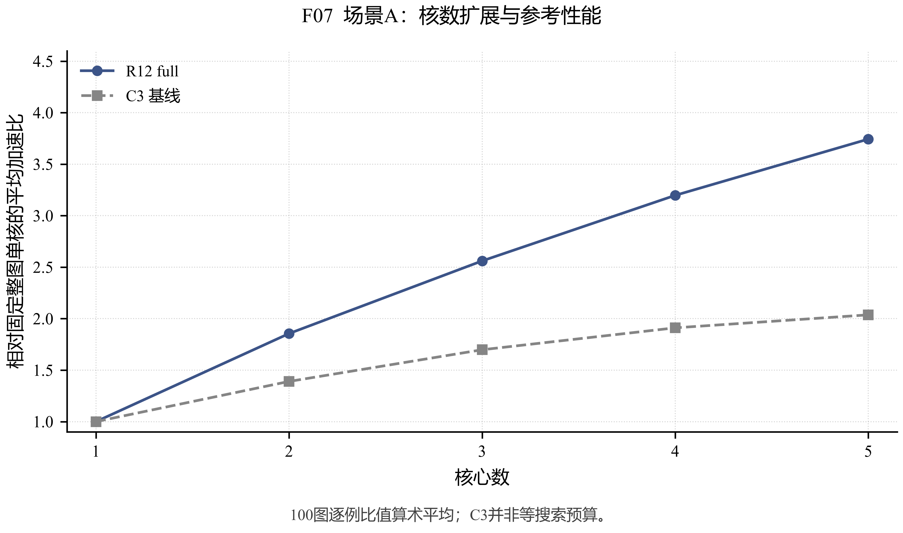

*图5-4  问题一：场景A下1至5核平均加速比折线图（R12完整流程与C3基线）*

中位数在各核数上都高于均值（五核4.130对3.743），说明存在少数低加速比用例拉低均值；这些用例的最小值在2至5核都来自同一张图case_064。最小加速比一列给出分布下沿：五核最差的一张图仍有1.202，400个配置格中没有出现比单核参考更慢的情况。

核数扩展趋势与C3的差距随核数拉大（图5-4）。C3曲线是相同输入与评分口径下的事后对照，两者搜索成本不同。

## 5.5 结果分析

### 5.5.1 与C3的逐例比较

平均曲线的差距需要落到逐例层面。按式(4-8)逐图计算耗时降幅，结果见表5-3。

**表5-3  场景A相对C3的逐例对照（每格100图）**

| 核数 | 加速比均值 $T_{\mathrm{C3}}/T_{\mathrm{R12}}$ | 逐图降幅均值 | 更快 / 持平 / 更慢 | 更快但COPY更高 |
|---|---:|---:|---:|---:|
| 2 | 1.398926 | 25.0121% | 92 / 7 / 1 | 4 |
| 3 | 1.622964 | 32.9501% | 91 / 7 / 2 | 2 |
| 4 | 1.828961 | 38.9334% | 92 / 4 / 4 | 3 |
| 5 | 2.053093 | 43.4760% | 93 / 5 / 2 | 2 |

注：C3为同输入、同评分口径的事后对照，非等搜索预算消融；时间为官方cycles，非求解墙钟。

五核逐图降幅均值43.48%。这是逐图先算降幅再平均的结果，不是求解程序的墙钟下降率；依赖带、反馈重排、分量家族与插入式候选在同一次请求中共同竞争预算，该数值不能归因于其中某一个模块。

胜负分布比均值更有信息量：五核为93例更快、5例持平、2例更慢。平均优势不等于逐例必胜，这在任何核数上都成立。8.3节对这组配对结果做了符号检验。

### 5.5.2 退化配置与case_062

400个配置格中有9个相对C3更慢：case_062在2核为+22.97%、3核为+40.94%；case_085在3核为+0.997%；case_016、case_024、case_051、case_082在4核分别为+0.25%、+0.24%、+0.24%、+0.21%；case_028与case_090在5核分别为+0.60%、+0.16%。

除case_062外的7个退化幅度均在1%以内，属于小幅退化。case_062是唯一的显著退化，且幅度随核数从2增到3不降反升，而在4核与5核未进入退化清单。

逐例数据可以部分检验这一现象的来源（表5-4）。

**表5-4  case_062在场景A各核数下的最终方案**

| 核数 | Makespan/cycles | C3 Makespan/cycles | Task数 | 每Task操作数中位 | 新增COPY/bytes | C3新增COPY/bytes |
|---|---:|---:|---:|---:|---:|---:|
| 2 | 1976451 | 1607247 | 4361 | 8 | 13393920 | 13393920 |
| 3 | 1593547 | 1130638 | 4361 | 8 | 13393920 | 13393920 |
| 4 | 764940 | 889045 | 293 | 71 | 897024 | 13393920 |
| 5 | 619333 | 746374 | 293 | 71 | 897024 | 13393920 |

注：Task数与每Task操作数来自最终方案；C3的Task数未记录。

两组核数的最终方案属于完全不同的粒度。2核与3核时R12选中的方案有4361个Task，每个Task中位只有8个操作，新增COPY与C3完全相同；4核与5核时选中的是293个Task的粗粒度方案，新增COPY降为897024 bytes，只有前者的约十五分之一，并反过来比C3快。细粒度方案的代价可以从释放规则直接估出下限：2核时最忙的核心至少排有2181个Task，按式(4-11)仅同核切换等待就不少于218000 cycles，约占该方案Makespan的11.0%；293个Task的方案在4核时这一下限只有7300 cycles。

据此可以把原先的假设收紧为一个有数据支持的判断：case_062在低核数的退化，来自求解在预算内没有选到那个粗粒度划分，细粒度划分下的启动等待与边界搬运吞掉了并行收益；与C3相比，两者搬运量相同而R12更慢，差距来自Task的放置与次序。至于低核数下为什么没有评价到293个Task的候选，现有记录不足以回答，本章不作推断。场景B取消了同核Task边界，该图只在五核出现+0.502%的轻微退化（6.4.6节），与上述判断方向一致。

全部400格的对数比值热力图与9个退化配置的逐项定位见图5-5；该图保留了完整色标与全部负例，避免用均值掩盖。


*图5-5  场景A：全量性能变化与退化定位*

### 5.5.3 新增搬运的构成

新增COPY由两个来源合成：切图产生的Task边界搬运，以及官方核内调度阶段因容量不足插入的Spill，两者之和等于官方报告的新增COPY字节字段。

边界搬运在各核数上都是主导项，占比在九成以上。五核平均新增14.79 MiB，其中边界13.56 MiB、Spill 1.234 MiB。四核的Spill均值明显更低（0.3794 MiB），而边界均值在四核最高（14.49 MiB）。这一组合在数值上自洽：切分更细时单个Task的驻留压力下降，Spill随之减少，代价是边界搬运上升。不过这只是四个观测点上的一次共变，样本不足以支撑一般性结论。

图5-6把两类来源分开堆叠，并统计各核数下实际发生Spill的图数：2至5核分别为25、25、20、26张。Spill不是普遍现象，而是集中在部分用例上，因此均值里那1 MiB多的Spill并不代表典型用例。

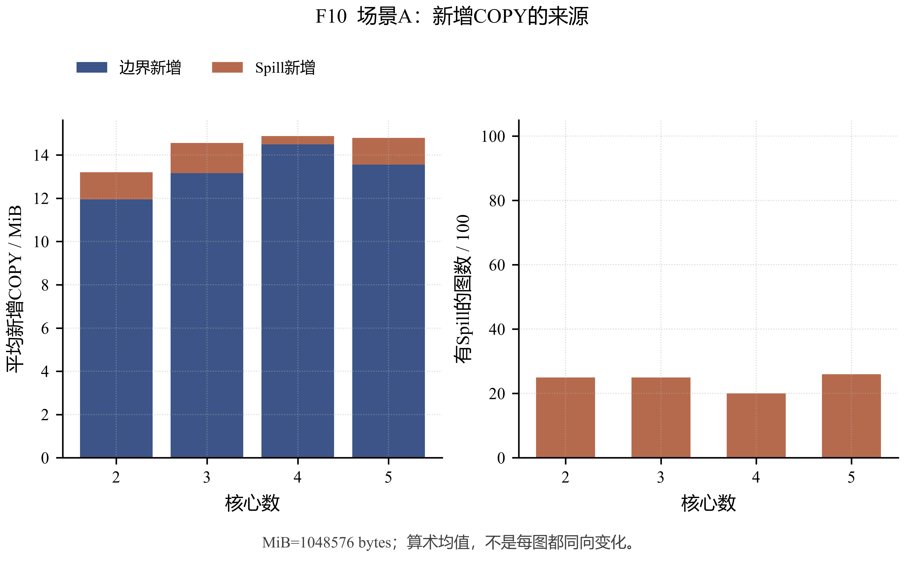

*图5-6  场景A：新增COPY的来源*

### 5.5.4 并行与搬运的权衡

字典序目标先比Makespan再比COPY，意味着算法会接受“更快但搬运更多”的方案。五核下有2例在比C3更快的同时增加了官方COPY计账，因此不能把全部加速解释为通信量下降。

**表5-5  并行—搬运权衡案例（五核）**

| 用例 | Makespan/cycles | 新增COPY/bytes |
|---|---:|---:|
| case_002 | 58180 | 82944 |
| case_005 | 69060 | 2483610 |

注：两例均比C3更快且COPY更高；展示的是最终选解的终点值，非控制单一变量的对照。

两例Makespan相差不到两成，新增COPY却相差近三十倍。同一目标函数在不同图结构上会落到很不一样的权衡点：case_002的结构允许在几乎不增加搬运的前提下取得并行收益，case_005则必须用大量边界搬运换取并行度。

### 5.5.5 预算例外

case_087是唯一在600秒软预算内没有产生顶层成功结果的用例，A2至A5四个配置全部如此；该组单独使用1800秒预算重跑后均告成功。

**表5-6  预算例外完整记录**

| 用例 | 场景/核数 | 首次预算 | 补跑预算 | 补跑墙钟/s | Makespan/cycles |
|---|---:|---:|---:|---:|---:|
| case_087 | A2 | 600 s 首次无成功 | 1800 s | 819.1333 | 2093249 |
| case_087 | A3 | 600 s 首次无成功 | 1800 s | 752.9736 | 1483711 |
| case_087 | A4 | 600 s 首次无成功 | 1800 s | 910.7309 | 1204070 |
| case_087 | A5 | 600 s 首次无成功 | 1800 s | 1036.1133 | 1038529 |

注：首次600秒的失败结果予以保留，不以补跑结果替换来源记录；仅本组使用1800秒预算。

四次补跑的墙钟在753.0至1036.1秒之间，全部超过600秒，说明600秒对该用例确实不足而非偶发失败。1800秒约为五核请求中位墙钟的84倍。补跑方案的五核执行时间线见图5-7：画面中的空白保留了真实空闲，不自动解释为某一种原因。

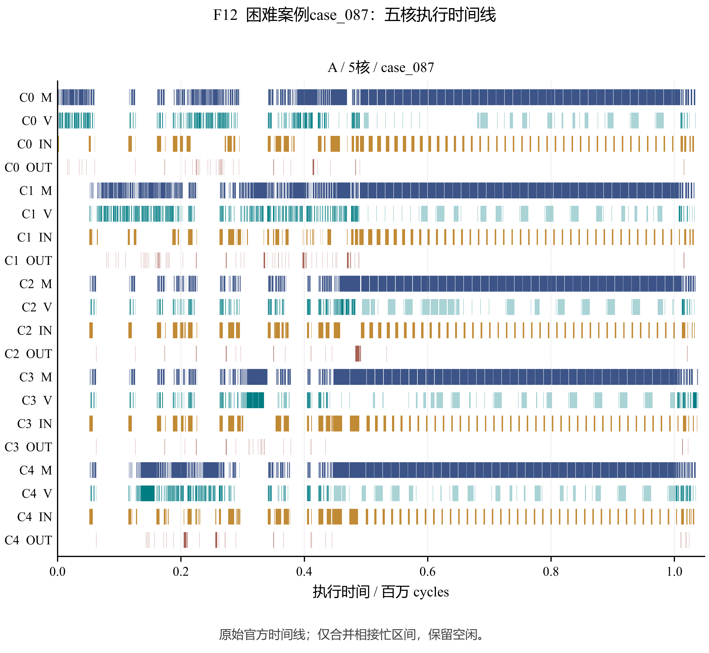

*图5-7  困难案例case_087：五核执行时间线*

整体墙钟分布高度右偏：五核请求中位数21.48秒、P95为470.6秒、最大1036.1秒。绝大多数图在半分钟内完成，少数大图会用满预算。题目要求在合理时间内生成方案而未规定具体时限，本文以600秒作为单请求软预算；除case_087外，全部396个场景A请求都在该预算内得到结果。

### 5.5.6 校验范围

全部输出方案均通过官方评价器执行，并在覆盖性、周期数、核心归属、依赖关系、Pipe占用与COPY计账等方面完成核查；全部400个结果均不低于式(4-21)的下界。本章未另行独立重建全部带宽与容量的活期状态，相关校验属于内部自检。

## 5.6 小结

联合选择Task粒度、核心归属与执行顺序，可以在全部400个配置格上取得稳定的多核加速：五核平均加速比3.743、中位4.130、最小1.202，相对C3的逐图耗时平均下降43.48%。三项决策必须联合选择，任何一项单独最优都不能保证总体执行时间最短。

本章的做法是先用安全链收缩与依赖带分带构造结构合理的候选粒度，再用尾长优先的追加式分核放置，借助官方评价反馈在划分不变的前提下改进分核与排序，最后用Treap区间索引加速插入式候选的生成；当前解一旦被下界认证为近优即停止，把预算留给仍有改进余地的大图。

同时需要如实记录三点边界：平均优势不代表逐例必胜，五核仍有2例慢于对照，400格中有9个退化配置，其中case_062的低核数退化源于未选到粗粒度划分；加速并不总伴随搬运下降，字典序目标会接受更快但搬运更多的方案；600秒预算对case_087不足，该组使用了1800秒补跑。全部结论限定在这100张图、题目给定的固定配置与已披露的预算设置之内。


# 6 问题二：场景B下的同核驻留与多核调度

场景B把同一核心上的全部子图合并为一个Task。这条规则改变的不只是通信常数：相邻子图之间不再必然经DDR交换数据，但张量跨多个子图驻留会持续占用L1/UB，容量溢出（Spill）因此取代边界搬运成为新的主要代价。本章给出场景B的差异化建模，设计以实际Spill事件为触发条件的局部重排方法，并在100张计算图、1至5核的全部配置上给出结果。五核相对固定整图单核的平均加速比为4.131，中位数4.447，最小值1.812；相对C3的逐图耗时降幅平均为34.49%。

## 6.1 问题分析与建模差异

### 6.1.1 问题分析

场景B相对场景A只改动一条规则：同核的全部子图合并为一个Task。但这一条改动使第5章的代价结构整体失效：同核边界搬运消失，取而代之的是跨子图驻留带来的容量溢出。切分粒度不再是唯一的调节变量，核内执行顺序第一次成为独立的优化对象。

**难在哪。** 减少跨核边界、保持双Pipe负载均衡、减少驻留冲突这三件事可能互相竞争。合并Task换来的驻留复用有代价：张量若跨越多个子图被使用，就要在整段区间内占据私有缓存，压缩其间其他张量的可用空间。“同核数据永不换出”是一个不成立的假设。

**为什么第5章的办法不够用。** 场景A的代价代理量在场景B下失去意义。最直接的证据来自对照基线本身：C3沿用场景A的等待与边界代理构造方案，放到场景B的单核配置下评价，平均REF加速比只有0.9487，小于1，即构造出的方案平均慢于不切分的原版基准。仅替换同步常数无法完成场景迁移。

**我们的切入点。** 在第5章框架的候选生成层增加两类针对驻留问题的机制：活动核数与驻留组织候选族，以及以实际发生的容量溢出为触发条件的局部微批。其余两层不变。

**本章产出。** 100张计算图在1至5核下的500个配置格完整结果，新增COPY按边界与Spill两类来源的分解，以及同一次请求内三个阶段的收益归因。

### 6.1.2 沿用与替换

方案表示与可行性条件与场景A相同：仍记 $P=(g,a,\pi)$，三项决策的定义、覆盖性条件与联合无环条件见式(4-1)式(4-2)式(4-3)。固定参数 $\theta$ 同样包括 L1=524288 bytes、UB=131072 bytes 与全部核心共享的60 bytes/cycle。目标函数形式不变，只换用场景B的评价算子 $T_B(P)$（式(4-5)），择优仍按式(4-6)的字典序，可行集记为 $\mathcal F_B$。问题二的模型是式(4-20)在场景B下的实例：

$$
\operatorname*{lex\,min}_{P=(g,a,\pi)}\ \bigl(T_B(P),\,D^{B}_{\mathrm{added}}(P)\bigr)\qquad \text{s.t.}\quad
\begin{cases}
\text{式(4-20)的全部约束组}\\
\text{Task}\equiv\text{核心，跨核同步按式(4-14)}\\
\text{边界计账按式(4-19)}
\end{cases}
\tag{6-1}
$$


瞬时容量由官方展开过程与容量复用依赖控制，不能用子图全部张量之和代替。合并Task后驻留窗口被显著拉长，这一区分在场景B比在场景A更关键。

### 6.1.3 Task边界的消失与不消失

第一处实质差异在Task边界。设操作 $u_0$ 产生 $b$ 字节的中间张量、$u_1$ 消费它，无其他消费者且非最终输出。场景A中若两者分属不同子图，即便调度到同一核心也要一次写出加一次读入，共 $2b$ 字节；场景B中两者落在同核的同一个Task里，只要不发生Spill，这 $2b$ 字节就不产生。图6-1并排给出两种情形（结构示意）：场景B消除的是“同核跨Task”这一类边界搬运，前提是“驻留且无Spill”，消除边界不等于容量足够。


*图6-1  同一计算片段在场景A与场景B下的Task边界（示意图）*

跨核情形则按连接计费。按官方评估程序的实现（式(4-19)），场景B对每一对“生产核心→消费核心”的跨核连接各插入一次COPY_OUT与一次COPY_IN。对单生产者、非最终输出的中间张量，设字节数为 $b$、不同远端消费核心数为 $r$，Spill前的边界计账为

$$
D^{B}_{\text{边界}}(t)=\begin{cases}2r\,b,&r>0\\[2pt] 0,&r=0\end{cases}
\tag{6-2}
$$


即每个远端消费核心各对应一次写出与一次读入；$r=0$ 表示所有消费者都在生产核上，不产生这一项。同样的张量在场景A中若分布在 $r$ 个其他Task上，计为一次写出加 $r$ 次读入，即 $(r+1)b$。两者在 $r=1$ 时相同，$r\ge2$ 时场景B的跨核扇出反而更贵，这可能是场景B的边界新增随核数上升较快（6.4.2节）的原因之一。该特例不含Spill、原始输入的重复读入与最终输出。

跨核传输另有一条时序约束式(4-14)：目标核的COPY_IN要在源核COPY_OUT完成500周期后才进入就绪判定。这是必要释放条件，目标操作还须满足Pipe FIFO、本地前驱与内存申请次序，源端完成加500周期不等于目标端立即发射。

### 6.1.4 逻辑活期不等于物理驻留

合并Task换来的驻留复用有代价。张量若跨越多个子图被使用，它在整段区间内都要占据私有缓存，压缩其间其他张量的可用空间。

这里需要区分两个概念：**逻辑活跃**指张量从产生到最后一次使用之间的区间，**物理驻留**指它实际占据缓存的字节。两个张量的逻辑活期重叠，不能直接换算成占用量或Spill量。320 KiB与256 KiB两个张量各自都能放进512 KiB的L1，合计576 KiB却超出容量，无法同时常驻（图6-2，概念例）。容量冲突必须按活跃集合判断。

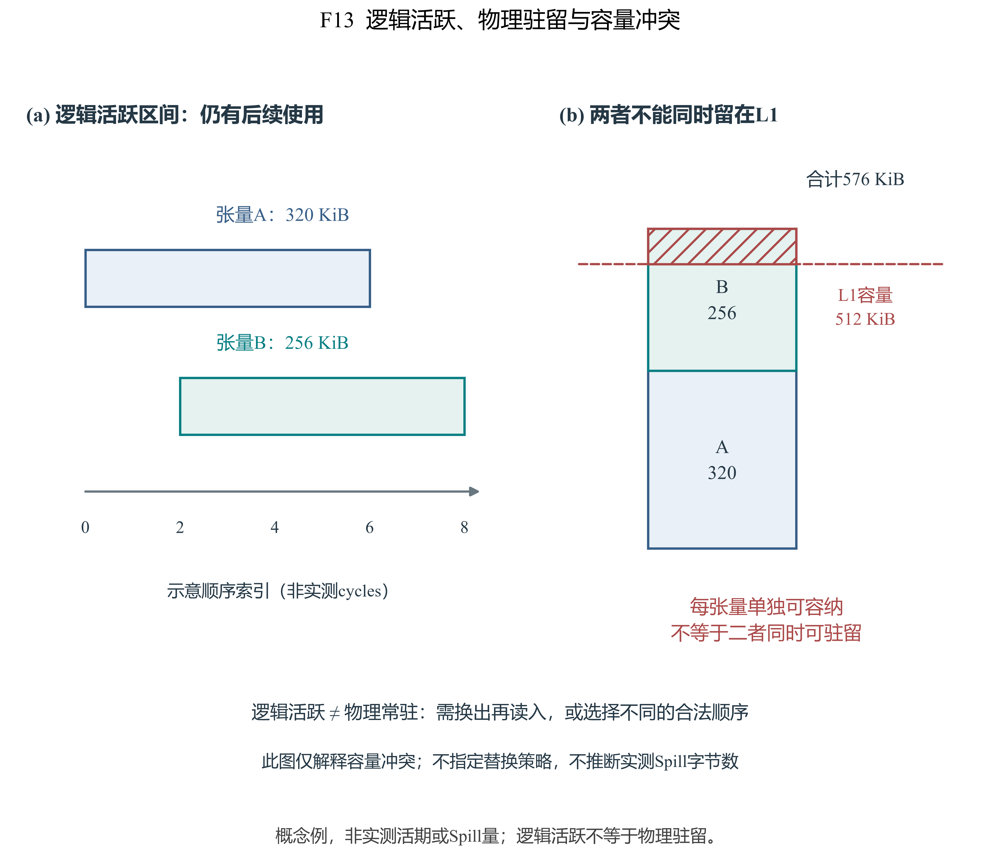

*图6-2  逻辑活跃、物理驻留与容量冲突（示意图）*

至此场景B的权衡结构清楚了：减少跨核边界、保持双Pipe负载均衡、减少驻留冲突这三件事可能互相竞争；核心归属与可表达的操作顺序是能优化的对象，而“同核数据永不换出”是一个不成立的假设。

## 6.2 求解算法

### 6.2.1 求解路径概述

本章沿用第5章的三层框架，改动集中在候选生成层。求解路径分四步。第一步仍从原图生成并评价控制链，得到首个可行解。第二步枚举活动核数与驻留组织的候选族：减少活动核心会减少跨核边界但牺牲并行度，净效果无法预先判断，因此每个候选都要完整评价。第三步用区间索引生成插入候选。第四步只在当前解确有容量溢出时才启动微批诊断与窗口重排，无溢出则跳过。四步共用同一预算，择优规则与第5章相同。

### 6.2.2 活动核数与驻留组织候选

从原图得到当前可行解后，在剩余预算与质量界允许时枚举一族候选：

$$
\mathcal C_{\mathrm{family}}=\left\{\left(m,\mathrm{target}\right):\ m\le k,\ \mathrm{target}\in\{0,512,2048\}\right\},\quad \text{补空队列使输出始终含 }k\text{ 条核心队列}
\tag{6-3}
$$


$m$ 为活动核心数，$\mathrm{target}$ 控制驻留排序的组织粒度；该扩展阶段最多评价六个新候选。

枚举 $m<k$ 的意义在于：减少活动核心会减少跨核边界，但同时牺牲并行度。两个方向的净效果无法预先判断，因此每个候选都要完整评价，而不是用代理分数筛掉。

### 6.2.3 Spill触发的局部微批

第二类机制只在确有Spill时启动。仅当当前成功结果的Spill新增字节大于零，才进行微批诊断；诊断在独立子进程中观察原版Step2返回的Spill事件，并核对诊断中的搬运分解与成功结果一致，正式评分在未插桩的新进程中进行，不修改原版仿真。

诊断关注满足下列条件的大张量事件：

$$
\mathrm{size}(t_b)\ge \tfrac14 C_{m},\qquad \mathrm{dist}\!\left(s_{\mathrm{before}},s_{\mathrm{after}}\right)\le 8
\tag{6-4}
$$


即张量大小至少为相应容器容量的四分之一，且前后两次使用所在子图的距离不超过8。两个阈值是启发式候选规则。候选窗口参数为

$$
w\in\{4,8\},\qquad \#\{\text{窗口}\}\le16\ (\text{互不重叠}),\qquad \#\{\text{原计算操作}\}\le128\ (\text{每窗口})
\tag{6-5}
$$


窗口内细化到操作级子图，用稳定Kahn顺序[16]优先复用最近使用的大型外部输入，平局时沿原位置与ID确定；窗口外的顺序不改变。设计动机见图6-3：四条 $A_i\to B_i$ 依赖链共享两份大输入 $t_A$ 与 $t_B$，交替顺序会让两份输入反复换入，成组顺序则让同一输入连续使用（结构示意）。窗口重排改变的只是同核内部的执行次序，中间张量的活期可能因此被拉长，实际收益仍须完整评价确认。


*图6-3  局部微批：依赖不变，共享输入成组使用（示意图）*

### 6.2.4 微批的不变量：能推出什么，不能推出什么

微批重排满足核心归属不变式：

$$
a_{\mathrm{new}}\!\left(g_{\mathrm{new}}(u)\right)=a_{\mathrm{old}}\!\left(g_{\mathrm{old}}(u)\right),\qquad \forall u\in U
\tag{6-6}
$$


场景B下每个核心只有一个Task，核心归属不变意味着每个张量的生产核心集合与消费核心集合都不变，于是Spill前的边界COPY计账严格保持：

$$
D_{\mathrm{partition,new}}^{B}=D_{\mathrm{partition,old}}^{B}
\tag{6-7}
$$


这条推论的适用范围需要划清，它是本章分析中最容易被误用的一步。式(6-7)只覆盖Spill前的边界COPY；执行顺序改变了，Spill量可以改变，Makespan当然也可以改变。因此不能由它推出“微批不改变总时间”或“微批不改变总搬运”。该结论也不适用于场景A：A中一个核心上有多个Task，核心归属不变并不保证Task边界集合不变。

同样，局部Kahn顺序只保证窗口内部的原依赖被满足；与窗口外顺序、跨核释放及内存复用边的组合是否合法，由完整方案检查与官方评价决定。只有完整成功且 $(\text{Makespan},\text{新增COPY},\text{名称})$ 更优的候选才替换当前解。

### 6.2.5 求解流程与预算分配

**算法6-1  R12场景B求解流程**

> **输入**：原图 $G$；固定B配置 $\theta$；核心数 $k$；单请求软预算 $B$（600秒）  
> **输出**：通过原版评价的最佳已得方案 $P^\ast$，及诊断与失败记录
>
> 1 从原图生成并评价控制链（基础构造、减少活动核心候选、沿官方时间线关键链的局部移动），保存当前最好解 $P^\ast$；  
> 2 **if** $T(P^\ast)>1.03\cdot\mathrm{LB}$ **then** 按式(6-3)生成分量家族、活动核心数与驻留组织候选，去重、下界剪枝后至多评价6个；  
> 3 用区间索引生成插入候选，完整评价后按字典序更新 $P^\ast$；  
> 4 **if** $P^\ast$ 的Spill新增字节 $D_{\mathrm{spill}}(P^\ast)>0$ 且预算尚有剩余 **then**  
> 5  在独立进程中观察原版Step2的Spill事件，按式(6-4)筛选大张量事件；  
> 6  按式(6-5)生成至多两个固定窗口的微批候选，逐个检查合法性并送官方评分，按字典序更新 $P^\ast$；  
> 7 **end if**  
> 8 输出两字段方案；未产生成功方案则明确返回失败，不补0、不删图以伪造完整均值。

各阶段共用总软预算600秒，其中快速生成上限30秒、插入候选评分120秒、Spill诊断40秒、每个微批候选评分45秒，均受剩余预算约束，控制链已消耗的预算同样计入。

第4行的条件顺序决定了微批的触发面：它不是无条件执行的优化，而是“先看有没有Spill，再决定是否诊断”，见6.4.4节。

场景B的候选构造复杂度与场景A同阶（式(5-10)）。新增的分量家族枚举为常数规模，该扩展阶段最多评价六个新候选；微批重排本身的规模由窗口参数式(6-5)限定（每份候选最多16个互不重叠的窗口、每个窗口不超过128个原计算操作），附加的构造成本很小；Spill诊断需要在独立进程中运行一次带观测的核内调度，成本与一次核内排布同阶，并受40秒上限约束。总成本仍由官方评价次数主导。

### 6.2.6 与C3对照的可比性

C3在场景B中的构造沿用4.3.3节的定义：合并安全链，按就绪层平衡计算负载，用场景A的等待与边界代理分核，再在场景B的真实规则下评价。两者输入与官方配置相同，搜索成本结构不同，终点性能比较不能解释为等成本下的算法效率比较。

## 6.3 实验设置与主要结果

### 6.3.1 口径：一核的两种含义

场景B的实验里“一核”出现两次，含义不同：标准参考曲线的一核点按原题定义取1，是加速比的分母定义；优化B1则是把R12框架实际作用在单核配置上得到的结果，平均REF加速比1.061。两者不可混用，也不能用后者替换曲线上的参考点。

### 6.3.2 逐核主结果

**表6-1  场景B逐核主结果（每格100图）**

| 核数 | 平均加速比 | 中位加速比 | 最小加速比 | 均值新增COPY/MiB | 其中边界/MiB | 其中Spill/MiB | 有Spill图数 | 墙钟中位/s | 墙钟P95/s |
|---|---:|---:|---:|---:|---:|---:|---:|---:|---:|
| 1 | 1.061366 | 1.008872 | 1.000000 | 8.7090 | 0.0000 | 8.7090 | 50 | 13.8222 | 183.0985 |
| 2 | 1.992522 | 1.994111 | 1.424760 | 9.1437 | 2.7091 | 6.4346 | 36 | 9.8964 | 105.6320 |
| 3 | 2.801109 | 2.925982 | 1.355264 | 8.7155 | 3.9676 | 4.7479 | 23 | 10.1644 | 94.2155 |
| 4 | 3.521046 | 3.724109 | 1.736104 | 7.7976 | 4.5703 | 3.2273 | 23 | 9.9414 | 86.0755 |
| 5 | 4.131077 | 4.446792 | 1.811818 | 8.2173 | 5.5112 | 2.7062 | 22 | 7.9157 | 77.4654 |

注：一核行为优化B1实测均值，标准参考曲线的一核点按原题定义为1，两者不可混用；1 MiB = 1048576 bytes；P95为经验最近秩；“有Spill图数”分母为100。表中保留完整精度，正文取四位有效数字。

平均加速比从两核的1.993升到五核的4.131，五核最小值1.812，100张图全部快于固定整图单核。五核请求墙钟中位7.916秒、P95为77.47秒、最大127.1秒，全部500个请求在600秒预算内完成。

两处非单调需要指出。其一是最小加速比列：两核与三核的最小值都来自同一张图case_064，它在三核下的加速比（1.355）低于两核（1.425），四核与五核的最小值换成了其他图并恢复上升。case_064也是场景A全部核数下的最小值（5.4节），是本测试集里最难并行化的一张图。其二是新增COPY总量列既不单调增也不单调减，成因见6.4.2节。

核数扩展趋势与C3的差距随核数扩大（图6-4）；该图同时提示一核参考点按定义取1、优化B1另行报告。


*图6-4  问题二：场景B下1至5核平均加速比折线图（R12完整流程与C3基线）*

### 6.3.3 优化B1

单核配置下R12框架仍能在原版结果之上改进：平均REF加速比1.061，其中55图改善、45图相同，没有变慢的用例。中位数1.009显著低于均值，改善集中在少数图上而非普遍分布（图6-5，纵轴为加速比超出1的幅度，不是耗时降低率）。

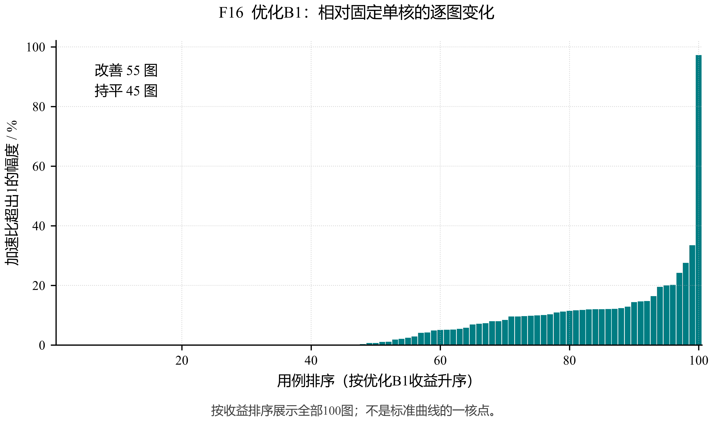

*图6-5  优化B1：相对固定单核的逐图变化*

单核是一个干净的对照点：此时不存在跨核边界，表6-1一核行的边界项为0.0000，全部8.709 MiB新增COPY都来自Spill。这从口径上确认了两类来源的划分是互斥的。

## 6.4 结果分析

### 6.4.1 与C3的逐例对照

逐图耗时降幅定义同式(4-8)，五核结果为

$$
\overline\rho_B=\frac{1}{100}\sum_{i=1}^{100}\left(1-\frac{T_{\mathrm{R12},i}}{T_{\mathrm{C3},i}}\right)=34.4910\%
\tag{6-8}
$$


**表6-2  场景B相对C3的逐例对照（每格100图）**

| 核数 | 加速比均值 $T_{\mathrm{C3}}/T_{\mathrm{R12}}$ | 逐图降幅均值 | 更快 / 持平 / 更慢 | 更快但COPY更高 | C3平均加速比 $T_{\mathrm{REF}}/T_{\mathrm{C3}}$ |
|---|---:|---:|---:|---:|---:|
| 1 | 1.138380 | 10.8752% | 82 / 18 / 0 | 15 | 0.948680 |
| 2 | 1.227637 | 16.3835% | 90 / 10 / 0 | 20 | 1.670220 |
| 3 | 1.357801 | 22.6021% | 92 / 7 / 1 | 11 | 2.163389 |
| 4 | 1.498911 | 28.1411% | 93 / 7 / 0 | 5 | 2.514776 |
| 5 | 1.718822 | 34.4910% | 94 / 5 / 1 | 4 | 2.668780 |

注：C3为同输入、同评分口径的事后对照，非等搜索预算消融；时间为官方cycles，非求解墙钟。

最后一列有一个值得单独说明的现象：C3在单核配置下的平均REF加速比为0.9487，**小于1**，即它的固定构造在单核上平均慢于原版整图单核基准。单核时不存在跨核边界，C3按场景A代理切出的子图次序改变了核内的执行与驻留顺序，结果反而不如不切分。这一观察支持6.1.1节的判断：场景B不能靠替换同步常数从场景A平移过来。

五核下R12为94例更快、5例持平、1例更慢。“更快但COPY更高”一列在两核达到峰值（一核15例、两核20例），此后随核数递减（11、5、4），提示核数较多时主次目标的冲突较少；这是五个观测点上的趋势，未做机制层面的验证。

### 6.4.2 边界与Spill的反向变化

表6-1中两个分解项走向完全相反。边界项随核数单调上升：0、2.709、3.968、4.570、5.511 MiB；Spill项随核数单调下降：8.709、6.435、4.748、3.227、2.706 MiB。总量因此非单调，在四核取到最低的7.798 MiB。

两条走向各有直接的机制解释。核数增加意味着更多依赖跨核，边界搬运必然上升；同时每个核心承担的计算量减少，单个Task的驻留压力下降，Spill减少。总量是两条相反趋势的合成，本身不携带机制信息：只报告总量会把这个结构完全掩盖。

发生Spill的图数同样随核数下降：50、36、23、23、22（表6-1末列，另见图6-6的字节分解）。这条计数与Spill字节的下降方向一致，说明减少的不只是溢出的量，也包括发生溢出的用例范围。

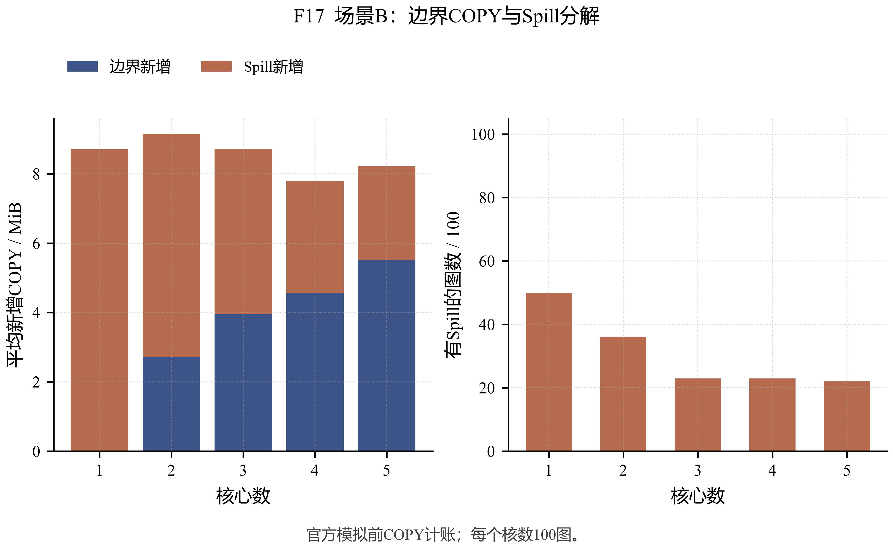

*图6-6  场景B：边界COPY与Spill分解*

### 6.4.3 Spill的集中度

五核B的100张图中有Spill的只有22图，其余78图为零。在这22张图内部分布同样极不均匀：按Spill降序排列的前10图贡献了全部Spill字节的93.84%。

因此表6-1五核行那2.706 MiB的平均Spill并不代表典型用例。对四分之三以上的图，同核合并已经完全消除了容量溢出；剩余的容量代价高度集中在少数困难实例上。图6-7用对数轴展示22个非零值并标明零值图数，右侧的累计贡献曲线以完整100图为分母：保留全部图作分母是为了避免用非零子集冒充整体典型情况。

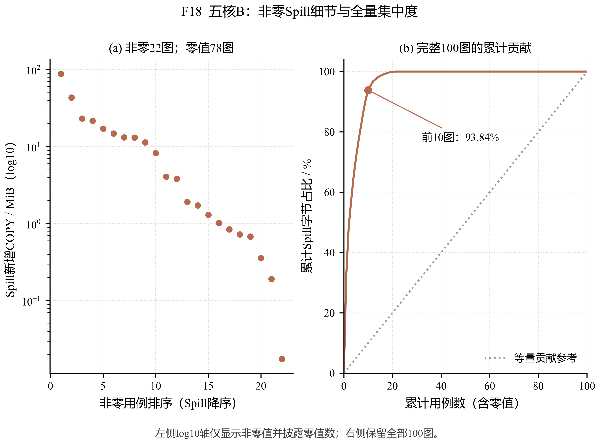

*图6-7  五核B：非零Spill细节与全量集中度*

### 6.4.4 同次请求的阶段增量

为观察各机制各自保留了多少收益，记录同一次请求内三个阶段的方案质量：

$$
\overline S_{\mathrm{stage}}=\frac{1}{100}\sum_{i=1}^{100}\frac{T_{\mathrm{REF},i}}{T_{\mathrm{stage},i}},\qquad \mathrm{stage}\in\{\mathrm{control},\mathrm{indexed},\mathrm{full}\}
\tag{6-9}
$$


**表6-3  五核B同次请求的三阶段结果**

| 阶段 | 相对REF平均加速比 / 原始cycles | 较前阶段严格改善 |
|---|---:|---:|
| 控制 | 4.073198 | （基准） |
| 插入后 | 4.111995 | 12 / 100 |
| 微批后 | 4.131077 | 2 / 100 |
| case_067（明细） | 15,255,427 → 13,798,191 → 13,054,159 | — |
| case_073（明细） | 3,210,135 → 3,046,190 → 2,034,983 | — |

注：三阶段共享同一总软预算，不是等预算独立消融；未改善含相同、未触发或未完成三种情况。

严格改善的计数定义为

$$
N_{j}=\#\left\{i:\ T_{\mathrm{stage}_{j+1},i}<T_{\mathrm{stage}_{j},i}\right\},\qquad (N_{\text{插入}},N_{\text{微批}})=(12,\,2)
\tag{6-10}
$$


这组数据最值得说的一点是量级：**控制链单独就达到了最终水平的98.6%**（4.0732对4.1311），插入与微批两阶段合计贡献余下的1.4%。也就是说，本方法的绝大部分收益来自5.2节的结构化候选构造与反馈重排，而不是后续的精细机制。把这一点直说出来，比含糊地把三个阶段并列更接近事实。

改善面同样很窄：插入阶段12/100，微批阶段2/100（图6-8，纵轴局部放大，标注的两段增量为+0.038797与+0.019083）。“未改善”包含三种不同情况（候选评价后未更优、诊断条件未触发、预算耗尽未完成），因此2/100既不是触发率也不是成功率。三阶段共享同一总预算，后面的阶段用的是前面剩下的时间，这组数据不构成等预算的独立消融。


*图6-8  五核B：同次请求的阶段增量*

### 6.4.5 微批阶段的两个改善实例

微批阶段全部两个进一步改善的实例是case_067与case_073（图6-9给出配对结果，其余98例未进一步改善）。case_067从插入后到微批后耗时降低5.39%、对该阶段加速比增量贡献13.82%；case_073对应为33.20%与86.18%。

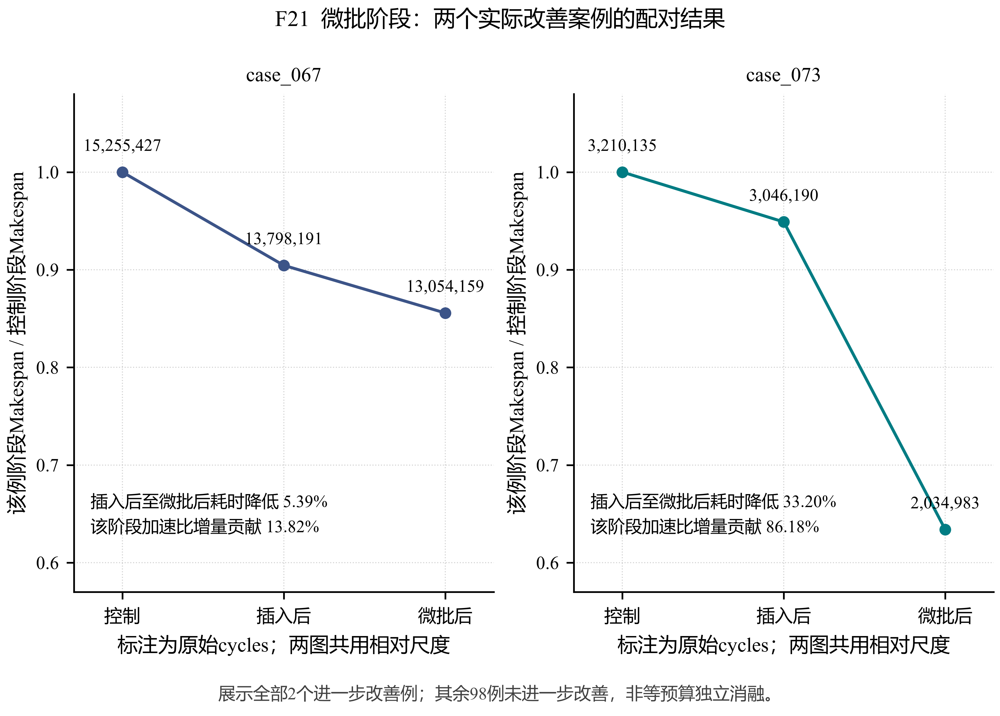

*图6-9  微批阶段：两个实际改善案例的配对结果*

也就是说，微批阶段那+0.019083的平均增量里，86.18%来自case_073一张图。

**表6-4  开发诊断案例终点值（case_073，B五核）**

| 指标 | 数值 |
|---|---:|
| Makespan/cycles | 2034983 |
| 边界新增/bytes | 21712384 |
| Spill新增/bytes | 15489024 |

R12提出窗口排序的依据是“两份大输入交替使用可能造成反复换入”这一有源码依据的机制推测，case_073正是一个Spill量级很高的实例。本章把它作为设计动机的来源记录下来，而不把这组终点值当作微批有效性的因果证据：要做因果论证需要等预算的独立消融，本章没有做。

### 6.4.6 退化配置

500个B配置格中相对C3更慢的只有两个：case_089在3核为+0.038%，case_062在5核为+0.502%。两者幅度都在1%以内，属于小幅退化。

case_062在场景A的低核数上有显著退化（+22.97%、+40.94%），5.5.2节的逐例数据显示其根源是低核数下选中了4361个Task的细粒度划分，启动等待与边界搬运吞掉了并行收益。场景B取消了同核Task边界，这一代价随之消失：该图在B的1至4核都快于C3，只在五核出现+0.502%的轻微退化，幅度比场景A三核低约两个数量级。

### 6.4.7 主次目标的权衡

五核下有4图比C3更快而新增COPY更高（图6-10给出执行时间与COPY的散布关系）。主指标改善不等于逐例搬运下降，也不构成每个用例上的双目标Pareto支配。


*图6-10  五核B：执行时间与COPY的权衡*

这类用例数随核数下降（1核15例、2核20例、3核11例、4核5例、5核4例），两核为峰值。这一形态与6.4.2节的分解一致：核数较低时Spill占主导，减少Spill所需的顺序调整可能同时增加别处的搬运；核数升高后Spill本身已经很小，冲突随之减少。这是对已有数据的一种解释，不是实验验证的结论。

### 6.4.8 求解成本与校验

表6-1显示墙钟P95随核数单调下降（183.1→105.6→94.22→86.08→77.47秒），全部500个请求在600秒预算内完成，原图、配置与评分代码未作修改。这一形态与场景A相反：场景A的P95随核数上升且出现了需要1800秒补跑的例外（见表5-2与5.5.5节）。一个与数据相容的解释是场景B的候选空间更受约束：每核只有一个Task，不需要在Task划分与Task间排序之间反复权衡。本章未做求解成本的分解实验，故不作为结论。

既有核查覆盖原操作计数、周期、核心归属、原依赖、Pipe与COPY分解，并核对了官方记录的容量峰值；完整的动态容量与共享带宽未用第二套实现全量重建，相关校验属于内部自检。

## 6.5 小结

场景B的结论可归为四点。

**同核合并没有消除容量代价，只是把它从普遍现象变成了少数用例的集中负担**：五核下78图完全无溢出，而剩余22图中前10图就占了93.84%的溢出字节。代价改变的是形态与分布，不是总量意义上的消失。

**边界与Spill随核数反向变化，总量掩盖机制。** 报告新增COPY时必须分开列出两类来源，否则四核那个最低的总量7.798 MiB会被误读成“四核搬运最省”。

**收益的主体来自结构化候选构造，而非精细机制。** 控制链单独达到最终水平的98.6%，插入与微批合计1.4%；微批阶段在100个五核请求中只有2例进一步改善，其中一例贡献该阶段86.18%的增量。这个机制有明确的源码依据与合理动机，但现有数据只支持“在特定结构的实例上有效”。

**场景B不能由场景A平移得到。** C3在单核上0.9487的平均加速比是最直接的证据：把场景A的等待与边界代理照搬到场景B，构造出的方案会劣于不切分。

全部结论限定在这100张图、题目给定的固定配置与600秒软预算之内。


# 7 问题三：共享只读L2下的调度与性能影响

问题三在场景B的硬件基础上增加一块1 MiB的共享只读L2，读带宽250 bytes/cycle，独立于DDR。

如果把本章的任务理解成“测出这块缓存能提速多少”，得到的会是一个不大的数字：五核下同方案配置比均值1.016766。但这个数字本身并不是本章的主要产出，甚至单独看还具有误导性：它的中位数只有1.000546，500对配置对照中还有8对开启L2后反而更慢。

本章真正要回答的是**如何正确测量一块缓存对调度的影响**。为此做了三件事：按官方实现重建FIFO缓存的状态语义，明确命中、插入与逐出的时点关系；设计一套能把“硬件配置效应”与“求解器选解效应”分开的对照实验，因为常规报告方式会把两者合并成一个数字；在此基础上给出三个与直觉相反的事实：命中率与性能不成对应、只读缓存也可能造成退化、开启缓存后计划中的搬运量反而上升。这三条结论对后续的调度设计比那1.68%更有价值。

第6章的代价结构在本章保持不变，新增的只有一条独立读路径。正因为改动如此局部，它反而暴露出一个前两章不会遇到的问题：当改动的效应很小时，如何确认测到的究竟是硬件的效应，还是求解器行为变化的效应。本章因此先建立测量框架，再谈优化结果。

## 7.1 缓存模型

### 7.1.1 沿用与新增

方案表示、可行性条件、Spill与驻留规则、跨核同步约束式(4-14)全部沿用场景B（见6.1节）；每核的全部子图仍合成一个Task，L1与UB容量不变。本章新增的只有一条读路径与随之而来的状态规则。

记同一方案在无L2、有L2两种配置下的官方Makespan分别为 $T_B(P)$ 与 $T_L(P)$。主目标是最小化 $T_L$，主指标相同时比较新增COPY。方案不增加任何额外的计算、复制、预热或等待指令，也不改变FIFO策略：能优化的仍然只有 $(g,a,\pi)$。问题三的模型为

$$
\operatorname*{lex\,min}_{P=(g,a,\pi)}\ \bigl(T_L(P),\,D^{B}_{\mathrm{added}}(P)\bigr)\qquad \text{s.t.}\quad
\begin{cases}
\text{式(6-1)的全部约束组}\\
\text{FIFO容量式(7-2)}\\
\text{双带宽池式(7-4)}
\end{cases}
\tag{7-1}
$$


新增COPY的计账与场景B相同（假设7），只读Cache只改变读取走哪一个带宽池。

### 7.1.2 FIFO语义：命中在发射时，插入在完成时

令 $Q(t)$ 为按插入先后排列的逻辑张量FIFO，$H(t)$ 为其字节占用：

$$
H(t)=\sum_{\tau\in Q(t)} b_\tau\ \le\ 1048576
\tag{7-2}
$$


正字节且键有效的读入操作在**发射时**查询缓存：命中则进入独立L2读池，未命中进入DDR池；写出操作始终走DDR。命中不刷新已有键的FIFO次序，即这是先进先出而非最近最少使用。

插入发生在**完成时**：每个读入完成都会尝试插入，若无键、超容量或键仍存在则不插入，否则逐出最早的键直至能够容纳。

两个时点的分离带来一个容易被忽略的情形：一次命中读取在途期间，其对应的键可能被别的插入挤出，等该读取完成时缓存里已无此键，于是它会重新插入。图7-1用每键256 KiB、容量1 MiB的概念例走完整个过程：$t_0$ 发射读取A时命中并进入L2读池，$t_1$ 另一读取E完成并插入、最早的A被逐出，$t_2$ 读取A完成时A已不在缓存，于是逐出B后重新插入A（结构示意，按官方语义构造）。键被逐出不会撤销已发射读取的带宽池选择，这两个时点必须分开理解。

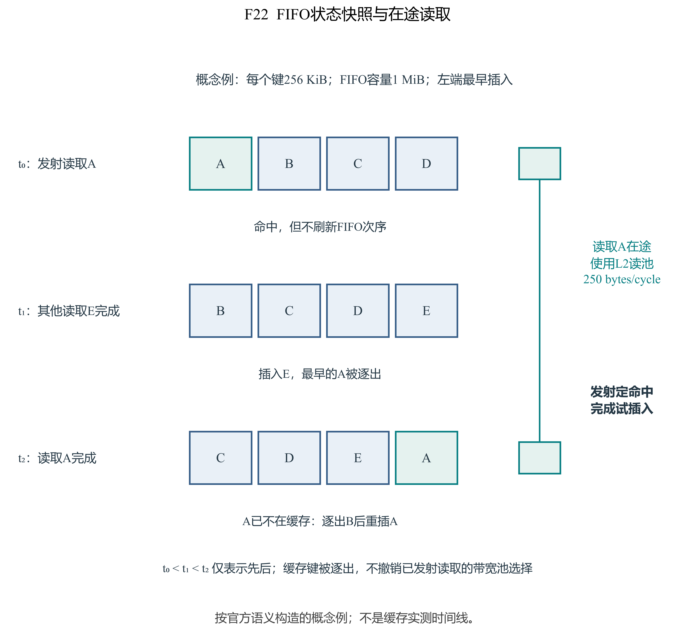

*图7-1  FIFO状态快照与在途读取（示意图）*

逐图按字节命中率定义为

$$
h_i=\frac{B_{\mathrm{hit},i}}{B_{\mathrm{hit},i}+B_{\mathrm{miss},i}},\qquad B_{\mathrm{hit},i}+B_{\mathrm{miss},i}>0;\quad \text{分母为零时沿原版约定 }h_i=0
\tag{7-3}
$$


零字节读取不进入正字节命中统计。本章报告的命中率均为100图逐图计算式(7-3)后的算术平均，不是把全部命中字节池化后计算的总体命中率。

### 7.1.3 两个互不占用的带宽池

$$
\sum_{j\in\mathcal A_p(t)} v_j(t)\ \le\ B_p,\qquad B_{\mathrm{DDR}}=60,\quad B_{\mathrm{L2}}=250\ \text{bytes/cycle}
\tag{7-4}
$$


$\mathcal A_p(t)$ 为池 $p$ 中的在途传输集合。每个池由全部核心共享，两池之间互不占用，这是L2可能带来收益的结构性原因：命中的读取不再与未命中读取、写出争抢那60 bytes/cycle。

忽略取整与并发时，单次搬运的理想参考延迟为

$$
d_{\mathrm{DDR}}^{\mathrm{isolated}}=b/60,\qquad d_{\mathrm{L2}}^{\mathrm{isolated}}=b/250
\tag{7-5}
$$


两者相差约4.17倍。这个比值只用于说明独立读池的量级：局部传输时间缩短不等于整图同比加速，关键计算、Pipe占用、跨核释放与其他搬运都可能成为瓶颈。

### 7.1.4 未命中的三类来源

未命中至少有三类不同来源，终点统计无法区分它们：单条数据超过1 MiB容量，永远无法缓存；数据能够缓存，但在两次使用之间被其他张量挤出；多个核心在首次读取尚未完成时同时发射同一输入，此时缓存中还没有这个键，它们会全部未命中。

第三类的存在意味着低命中率既可能反映容量不足，也可能只反映并发时序。本轮实验固定了容量与带宽，未做参数扫描，因此识别的是该指定L2配置的**联合净效应**，无法为容量增加与带宽增加分别指定因果贡献。

## 7.2 实验设计：分离配置效应与选解效应

这是本章的方法学核心。

本章的分析分为两个层次。层次一回答“固定同一个方案，这块缓存值多少”，对应同方案配置比；层次二回答“允许求解器重新选择方案后，总共值多少”，对应分别选优比。两个层次使用同一个分子、不同的分母，不能互换。本章先把测量框架建立在层次一上，再用层次二说明二者的差额来自何处。

之所以必须这样拆，是因为开启L2后测得的性能提升实际混合了两件事：同一个方案在更好的硬件上跑得更快；以及求解器在新配置下可能选出另一个方案。前者是硬件配置的效应，后者是搜索行为的变化。合并报告会高估“加上这块缓存能带来多少”。

### 7.2.1 两种比值

记图 $i$ 在 $k$ 核下由B场景与L2场景分别选定的方案为 $P_{B,i,k}$ 与 $P_{L,i,k}$。同方案配置比与分别选优综合比分别为

$$
R_{\mathrm{hw},i,k}=\frac{T_B\!\left(P_{B,i,k}\right)}{T_L\!\left(P_{B,i,k}\right)}
\tag{7-6}
$$


$$
R_{\mathrm{select},i,k}=\frac{T_B\!\left(P_{B,i,k}\right)}{T_L\!\left(P_{L,i,k}\right)}
\tag{7-7}
$$


前者分子分母是同一个方案，差异只来自配置；后者的分母换成了L2场景自己选出的方案，因此包含选解变化，不能称为纯硬件收益。图7-2用方案×配置的2×2矩阵给出两种比较的结构（结构示意）：固定方案 $P_B$ 在两个配置下的两格构成配置效应，右下角 $T_L(P_L)$ 参与的是综合效应，左下角“$P_L$ 在无L2配置下”这一格未纳入本比较。两个比值共用同一分子但分母不同，互换会改变结论的含义。


*图7-2  方案×配置：两种比较的实验结构（示意图）*

### 7.2.2 分解恒等式及其使用边界

两个比值之间有一条**逐例成立**的恒等式：

$$
R_{\mathrm{select},i,k}=R_{\mathrm{hw},i,k}\cdot\frac{T_L\!\left(P_{B,i,k}\right)}{T_L\!\left(P_{L,i,k}\right)}
\tag{7-8}
$$


右侧第二项即选解效应：同在L2配置下，换用 $P_L$ 相对沿用 $P_B$ 的比值。

恒等式逐例成立，但不能推广到均值。配置比的均值按

$$
\overline R_{\mathrm{hw},k}=\frac{1}{100}\sum_{i=1}^{100}R_{\mathrm{hw},i,k}
\tag{7-9}
$$


计算，是100个逐图比值的算术平均；三个量各自取算术均值后不再满足乘积关系。因此不能用 $\overline R_{\mathrm{select}}/\overline R_{\mathrm{hw}}$ 去估计平均选解效应。本章严格避免这一操作，选解效应的量级另行用逐例配对数据给出（7.4.4节）。同理，两条主性能曲线各自用同一个整图REF归一化，配置比则另行对100个逐图比值取平均，不能用两条均值曲线相除得到。

### 7.2.3 对照的构造

配置对照通过图、核数、配置、评估器与方案哈希五项匹配。500对中430对的B/L2最终方案本来就相同；其余70对方案不同，其中62对复用了同哈希的既有候选评分，8对只补做官方L2评分，均不重跑求解器。对照补评分不反向参与既有主方案的选型，主实验的选解来源保持不变，本章只新增读表分析。

一项与官方实现相符的观察可作交叉校验：固定 $P_B$ 时，两个配置下的边界与Spill新增COPY字节完全一致。这是因为官方在事件模拟之前就完成了新增COPY的计账，缓存命中发生在模拟阶段，不会回减该量。

### 7.2.4 求解路径

L2求解从原图生成基础可行解，尝试不同的活动核心数与驻留组织；预算允许时独立生成B场景候选并按L2配置重新评价：这部分成本计入同一请求，不免费读取另一批次已选出的B方案。随后尝试快速插入与实际Spill触发的至多两个局部微批，按官方Makespan与新增COPY的字典序保留成功结果。完整流程见算法7-1。

**算法7-1  R12共享只读L2场景求解流程**

> **输入**：原图 $G$；L2配置 $\theta_L$；核心数 $k$；单请求软预算 $B$（600秒）  
> **输出**：L2下选出的方案 $P_L$ 及其官方评价结果
>
> 1 从原图生成并评价控制链（基础构造、减少活动核心候选、关键链局部移动），得到当前最好解 $P^\ast$；  
> 2 **if** $T_L(P^\ast)>1.03\cdot\mathrm{LB}$ **then** 生成分量家族候选，下界剪枝后至多评价6个；  
> 3 **if** 预算允许且仍未近优 **then** 在同一请求内独立求解一个场景B方案（至多180秒），并按L2配置评价（至多40秒）；  
> 4 用区间索引生成插入候选（生成至多30秒，评价至多120秒）；  
> 5 **if** $P^\ast$ 的Spill新增字节 $D_{\mathrm{spill}}(P^\ast)>0$ **then** 诊断Spill事件，生成至多两个局部微批候选并逐个评价；  
> 6 每一步都只在候选完整成功且 $(T_L,D_{\mathrm{added}},\text{名称})$ 字典序更优时更新 $P^\ast$；最后输出 $P_L=P^\ast$。

同次请求内的择优不变差性质不能推广到两个独立请求：两次请求的最终方案谁优谁劣没有保证，7.4.4节给出了实例。

L2场景在同一请求内额外独立求解一个B方案（至多180秒）并按L2配置重新评价，官方评价次数 $K$ 因此多于场景B。五核请求的墙钟P95从场景B的77.47秒升至197.70秒，与这一额外成本方向一致；由于各请求的评价次数没有单独汇总，这里不对两者作定量归因（复杂度分解见式(5-9)式(5-10)）。

## 7.3 主要结果

### 7.3.1 本章五个五核指标的口径

本章涉及五个含义不同的五核数字，混用会得出相反结论，先集中辨析（表7-1）。

**表7-1  本章五个五核指标的口径**

| 指标 | 数值 | 含义 |
|---|---|---|
| 同方案配置比（均值/中位） | 1.016766 / 1.000546 | 固定 $P_B$，开关L2的耗时比，**纯配置效应** |
| 分别选优比（均值） | 1.027400 | 分母换成 $P_L$，**含选解变化** |
| 固定 $P_B$，L2相对REF | 4.187457 | 主性能曲线，方案固定 |
| L2独立选优相对REF | 4.218978 | 主性能曲线，方案可变 |
| 逐图命中字节率均值 | 23.4614% | 式(7-3)逐图计算后取平均 |

后两条曲线的定义为

$$
\overline S_{L2}^{\mathrm{fixed}}=\frac{1}{100}\sum_{i=1}^{100}\frac{T_{\mathrm{REF},i}}{T_L\!\left(P_{B,i}\right)}=4.187457
\tag{7-10}
$$


$$
\overline S_{L2}^{\mathrm{select}}=\frac{1}{100}\sum_{i=1}^{100}\frac{T_{\mathrm{REF},i}}{T_L\!\left(P_{L,i}\right)}=4.218978
\tag{7-11}
$$


**关于数值精度**：配置比这类贴近1的比值在本章保留六位小数，因为四舍五入到常规精度会抹掉退化记录（如0.999831与0.999991）之间的差别，使数据失去意义。其余量按四位有效数字报告。

### 7.3.2 L2独立选优的逐核主结果

**表7-2  L2逐核主结果（每格100图，L2独立选优方案）**

| 核数 | 平均加速比 | 中位加速比 | 最小加速比 | 均值新增COPY/MiB | 其中边界/MiB | 其中Spill/MiB | 墙钟中位/s | 墙钟P95/s |
|---|---:|---:|---:|---:|---:|---:|---:|---:|
| 1 | 1.063807 | 1.011370 | 1.000000 | 8.4131 | 0.0000 | 8.4131 | 17.3699 | 193.1206 |
| 2 | 2.002948 | 1.995712 | 1.424760 | 8.1986 | 2.7611 | 5.4375 | 18.9794 | 193.8599 |
| 3 | 2.834798 | 2.939286 | 1.356033 | 9.0377 | 4.2787 | 4.7590 | 21.7490 | 201.4150 |
| 4 | 3.581091 | 3.742978 | 1.815040 | 8.2813 | 4.6212 | 3.6601 | 22.2803 | 189.8324 |
| 5 | 4.218978 | 4.470774 | 1.932301 | 9.4032 | 5.8467 | 3.5565 | 20.7454 | 197.7045 |

注：本表为L2配置下独立选优的结果，与“同一B方案开关L2”的配置对照（表7-3）口径不同。

场景B的结构特征在这里重现：一核的边界项为0.0000，全部新增COPY都是Spill；边界项随核数上升，Spill项随核数下降。最小加速比在三核处仍有小幅回落（1.356，低于二核的1.425），与场景B形态一致。

值得一提的是，两核最小加速比在场景B与L2场景下完全相同（均为1.424760）。逐例数据确认两者来自同一张图case_064，三核的最小值（B为1.355264，L2为1.356033）也来自该图，即同一张困难图在开启L2后几乎没有得到配置收益，三核回落是这一张图的现象而非普遍规律。case_064同时是场景A全部核数下的最小值（5.4节）。

### 7.3.3 三条方案曲线

图7-3左侧给出三条相对同一REF归一化的曲线：无L2的 $P_B$、有L2的同一 $P_B$、有L2另选 $P_L$，五核值分别为4.131、4.187、4.219。中间那条才是固定方案的配置效应，最上面那条已经包含了选解变化：两类平均收益不能混为纯硬件收益。三条曲线在1至3核几乎重合，从4核起才明显分离。右侧给出两种比值随核数的变化（纵轴围绕1局部放大）。

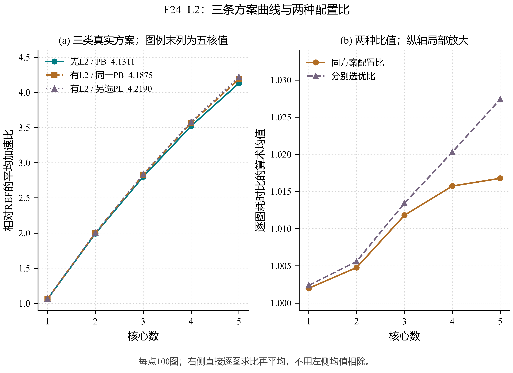

*图7-3  问题三：无L2与只读Cache两种配置下的1至5核平均加速比对比曲线（a）与两种配置比（b）*

### 7.3.4 逐核配置比与选优比

**表7-3  同核数L2配置比与选优比（每行100图）**

| 核数 | 同方案配置比均值 | 同方案配置比中位 | 分别选优比均值 | 改善 / 相同 / 退化 | 逐图命中字节率均值 | 最终方案不同对数 |
|---|---:|---:|---:|---:|---:|---:|
| 1 | 1.001978 | 1.000000 | 1.002364 | 31 / 69 / 0 | 6.0886% | 3 |
| 2 | 1.004765 | 1.000174 | 1.005591 | 57 / 39 / 4 | 16.0858% | 5 |
| 3 | 1.011799 | 1.000210 | 1.013423 | 55 / 43 / 2 | 21.6492% | 13 |
| 4 | 1.015729 | 1.000200 | 1.020292 | 55 / 45 / 0 | 19.6118% | 21 |
| 5 | 1.016766 | 1.000546 | 1.027400 | 61 / 37 / 2 | 23.4614% | 28 |

注：配置比与选优比口径不同，不可互换；一核配置比为实测值，不能强设为1。

配置比随核数单调上升，从一核的1.001978到五核的1.016766。核数越多，同一块L2服务的并发读取越多，单位时间内可卸载到独立读池的字节也越多，方向与式(7-4)的池共享结构一致。

改善计数的分布值得单看：一核下69图完全没有变化，只有31图改善；即便到五核也仍有37图保持相同。在大多数核数下，超过三分之一的图对这块缓存没有任何可观测响应。

一核配置比是实测值1.001978而非按定义设定的1：单核同样会发射重复读取，同样可能命中。这与加速比曲线的一核参考点（按原题定义取1）性质不同。

## 7.4 结果分析

### 7.4.1 收益的分布形态

五核同方案配置比均值1.016766，中位数1.000546，相差一个数量级以上。收益在用例之间极不均匀：超过一半的图提升不到千分之一，均值被少数大幅受益的用例抬起。图7-4左侧保留全部500对的箱线与完整长尾，右侧是五核100对的ECDF局部视窗（视窗虽截取横轴，分母仍是完整100图，视窗之外还有16图）。

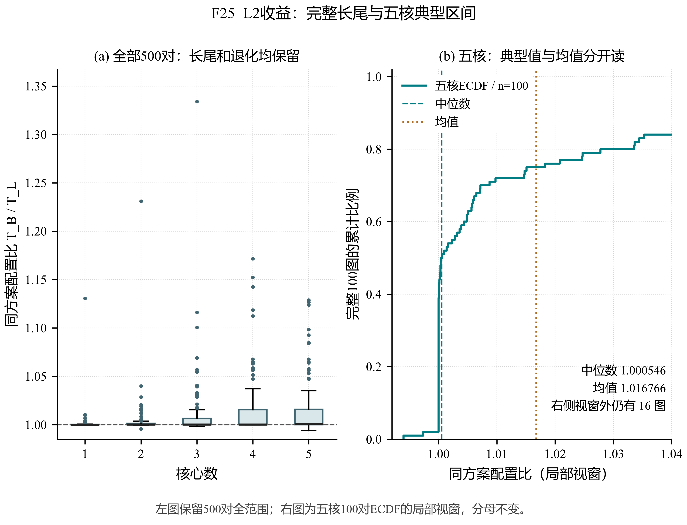

*图7-4  L2收益：完整长尾与五核典型区间*

表7-3的中位数一列进一步印证：五个核数的中位配置比全部贴近1（最高者为五核的1.000546）。只报均值会给出“普遍提速约1.7%”的印象，只报中位数会给出“几乎没有效果”的印象：两个数字都真实，必须同时给出。

### 7.4.2 命中率与性能不成对应

这是本章最重要的负面结论，有两条独立证据。

**核数维度上的反向变化。** 命中字节率随核数为6.09%、16.09%、21.65%、19.61%、23.46%，四核处出现回落，而同期的配置比仍在上升（1.011799→1.015729）。命中率下降、收益上升，两者并非同向。

**退化记录内部的无关联。** 表7-4中配置比第二差的是case_090在两核的0.995638，而它的命中率是全表最高的36.29%；命中率最低的case_049（1.83%）配置比反而最接近1（0.999991）。八条记录内部，命中率与退化幅度看不出任何对应关系。五核下命中率与配置收益的散点同样不呈一一对应（图7-5）。

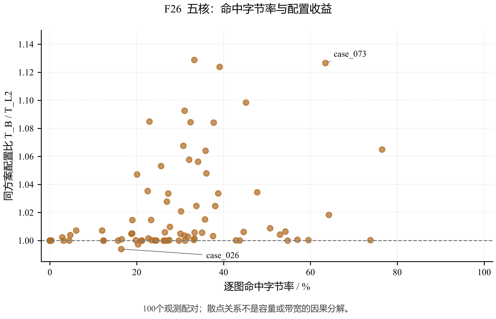

*图7-5  五核：命中字节率与配置收益*

机制上这并不矛盾。命中只决定这次读取走哪个带宽池，而更早完成的读取会改变后续操作的发射时刻，进而改变FIFO状态、改变后续读取的命中情况，也改变两个池各自的并发数。整条事件轴都被重排了，终点的Makespan由重排后的关键路径决定，与命中字节总量之间没有单调关系。

**结论是：把命中率当作优化目标的代理不安全。** 本章的算法没有这样做：选解依据始终是官方Makespan与新增COPY的字典序。

### 7.4.3 全部退化记录

**表7-4  全部同方案L2退化记录（8条）**

| 用例 | 核数 | 同方案配置比 | 同方案命中字节率 |
|---|---:|---:|---:|
| case_014 | 2 | 0.999863 | 23.8602% |
| case_049 | 2 | 0.999991 | 1.8294% |
| case_053 | 2 | 0.999831 | 11.6049% |
| case_090 | 2 | 0.995638 | 36.2899% |
| case_092 | 3 | 0.998346 | 11.1234% |
| case_094 | 3 | 0.999572 | 13.0478% |
| case_026 | 5 | 0.993980 | 16.4131% |
| case_092 | 5 | 0.997391 | 20.3016% |

注：低于1表示退化。

500对中有8对退化，最差为case_026在五核的0.993980，相当于慢了约0.6%。八条记录中有四条集中在两核，case_092在三核与五核各出现一次。图7-6完整保留这八条记录并放大横轴：放大是为了读出小差异，不意味着退化幅度很大。

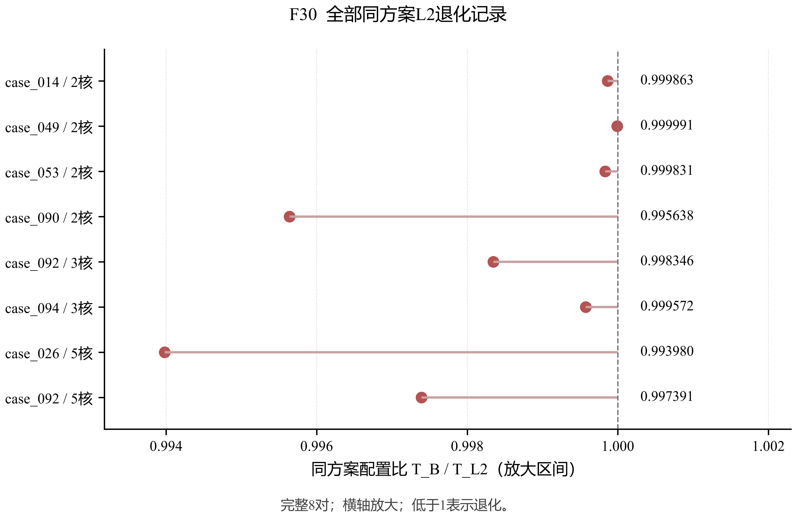

*图7-6  全部同方案L2退化记录*

**为什么只读缓存也可能造成退化。** L2是只读的，命中走独立池，直觉上不应拖慢任何事情。但命中改变的是完成时刻，完成时刻改变发射顺序，发射顺序又改变后续的命中与池内并发；整个事件轴被重新排列后，新的关键路径完全可能比原来更长。这解释了退化在原理上为何可能，但不构成对任何一条具体记录的归因：逐事件的因果追踪本章未做。

### 7.4.4 选解效应的量级

表7-3中配置比与选优比的差随核数扩大：0.000386、0.000826、0.001624、0.004563、0.010634（对表内两列逐差得到）。同期最终方案不同的对数为3、5、13、21、28，两组数字同向增长。核数越多，求解器在L2配置下找到另一个方案的机会越多，选解效应在综合比中占的份额也越大。

因此五核下1.027400与1.016766之间的差距不能全部记在L2头上：其中有28对的最终方案本身就换了。按7.2.2节的说明，这里也不能用两个均值相除来估计平均选解效应。

图7-7给出五核28对方案不同的配对结果：在同一L2配置中，另选方案较 $P_B$ 有26例更快、1例相同、**1例更慢**。


*图7-7  五核：不同最终方案的选解效应*

那个“1例更慢”值得单独留意。它正是7.2.4节所预告情形的实例：两个独立请求各自在自己的配置下择优，同次请求内的不变差性质并不跨请求成立，因此L2请求选出的方案在L2配置下反而可能劣于B请求选出的方案。观察到这一例，说明该限定不是纸面上的谨慎措辞。

### 7.4.5 case_073：一个收益实例的事件轴

**表7-5  五核异质性案例**

| 用例 | 无L2 $P_B$/cycles | 有L2 同一 $P_B$/cycles | L2独立选优/cycles |
|---|---:|---:|---:|
| case_073（5核） | 2034983 | 1806253 | 1805392 |
| case_026（5核） | 33518 | 33721 | 33721 |

注：case_026为同方案配置比最小的五核用例。

两个案例形态完全相反。case_073固定方案后开启L2，Makespan从2034983降到1806253 cycles；再让求解器在L2下独立选优，只进一步降到1805392，这一例的提升基本全部来自配置。case_026则相反：开启L2后从33518升到33721，而L2独立选优的结果与固定方案完全相同，说明求解器在该图上没有找到更好的替代方案。

case_073完整4252条缓存事件的FIFO占用与累计命中率演化见图7-8：缓存占用在早期迅速逼近1 MiB容量上限后长期维持高位，共同观察窗口内出现最大的一次占用净降，即事件e2428（1143536 cycles）处由986880降至762624 bytes，净降219 KiB。这里必须注明，占用的净变化不等于该次逐出的字节量。

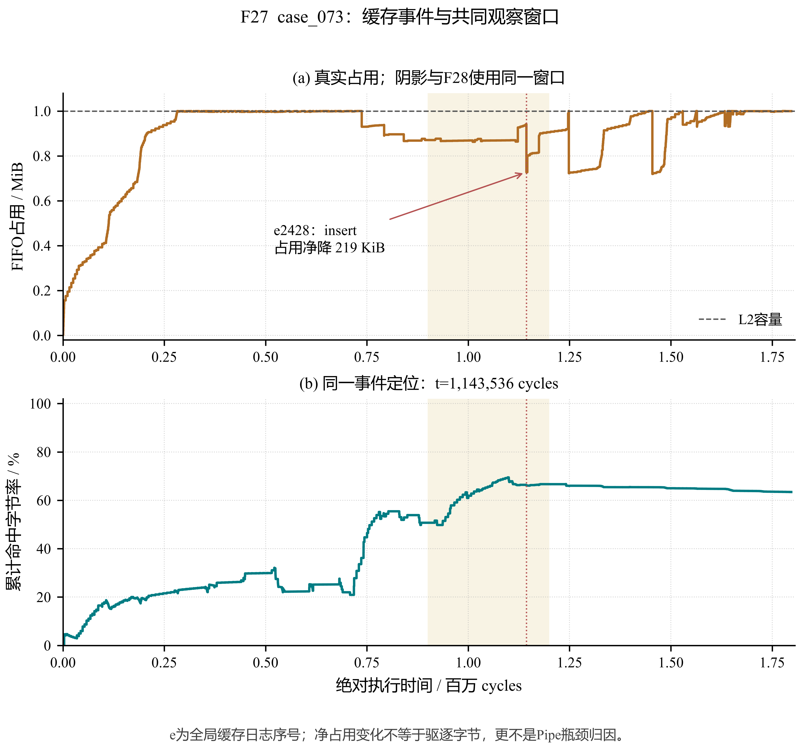

*图7-8  case_073：缓存事件与共同观察窗口*

图7-9把同一方案在两个配置下的多核时间线并排（固定 $P_B$ 时两配置Makespan分别为2034983与1806253 cycles），L2视图中读入通道的密集段整体前移；红线只是全局缓存日志的事件定位，不指定给核心0的任何具体操作，也不建立Pipe层面的因果关系。

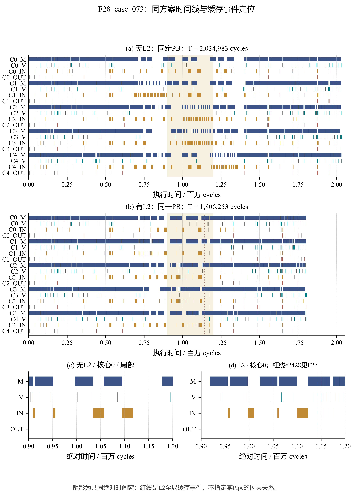

*图7-9  case_073：同方案时间线与缓存事件定位*

选择case_073作展示，是因为它在第6章已作为微批机制的开发诊断案例出现过，Spill量级较高、重复读取特征明显，用同一实例贯穿两章便于对照。两个案例合起来只能说明异质性的存在，不代替全部100图的分布。

### 7.4.6 新增COPY反而更高

**表7-6  五核L2独立选优的COPY与请求成本**

| 五核L2独立选优指标 | 数值 |
|---|---:|
| 平均新增COPY/MiB | 9.4032 |
| 其中边界/MiB | 5.8467 |
| 其中Spill/MiB | 3.5565 |
| 请求墙钟中位/s | 20.7454 |
| 请求墙钟P95/s | 197.7045 |
| 请求墙钟最大/s | 423.6723 |

一个反直觉的结果：L2独立选优的五核平均新增COPY为9.403 MiB，高于场景B独立选优的8.217 MiB（见表7-10）。开启缓存之后，计划中的搬运量反而更多了。

原因有两层。**计账时点**：官方在事件模拟之前就完成新增COPY的计账，之后的缓存命中不会回减该量，所以这个数字反映的是计划中的搬运请求，不是物理DDR净流量。**目标结构**：字典序先比Makespan，当L2使某些读取变得廉价时，求解器会接受那些搬运更多但时间更短的方案，这正是前两章反复出现的主次目标权衡，在这里以更明显的形式出现。

因此不能因为开了L2就说“搬运减少了”。要衡量物理流量，需要模拟阶段的实际DDR字节统计，本章没有这项数据。

### 7.4.7 相对C3的对照

**表7-7  L2最终方案相对C3的逐例对照（每格100图）**

| 核数 | 加速比均值 $T_{\mathrm{C3}}/T_{\mathrm{L2}}$ | 逐图降幅均值 | 更快 / 持平 / 更慢 | 更快但COPY更高 |
|---|---:|---:|---:|---:|
| 1 | 1.136025 | 10.6912% | 81 / 19 / 0 | 14 |
| 2 | 1.222827 | 16.2115% | 91 / 9 / 0 | 21 |
| 3 | 1.336165 | 21.8332% | 92 / 7 / 1 | 16 |
| 4 | 1.454170 | 26.4412% | 93 / 7 / 0 | 7 |
| 5 | 1.621458 | 31.4081% | 94 / 5 / 1 | 7 |

注：C3与R12的L2方案在本表中均按L2配置评价；C3为同输入、同评分口径的事后对照，非等预算消融。

五核下为94例更快、5例持平、1例更慢，逐图降幅均值31.41%，其中7个更快的实例COPY更高。

这个31.41%低于场景B的34.49%：开启L2之后，本方法相对C3的**相对优势反而缩小了**。原因在于对照基线同步抬升：C3在本表中同样按L2配置评价，因而也获得了配置收益，分子分母同时变小，比值随之收敛。这一现象不说明方法在L2场景下变弱，而说明L2的收益对固定构造方案与搜索方案都是普遍的。若要衡量本方法在L2场景下的“净增量”，正确的口径是7.3.4节的配置比与选解效应分解，而不是与C3的相对差。

### 7.4.8 求解成本与校验

L2请求的墙钟P95在各核数上都接近190至200秒区间，五核最大值423.7秒，全部在600秒软预算内完成。这一水平高于场景B（五核P95为77.47秒，见表7-10），与7.2.4节的描述一致。

三问的选解与各类对照共检查1470组输出：1400组为逐格选解（场景A的400格、场景B与L2场景各500格），另70组是最终方案与L2主方案不同的同方案对照（62组复用同哈希的既有候选评分、8组新补官方L2评分；其余430对两场景最终方案本来相同，无需另查）。核查覆盖执行计数、周期、原依赖、核心归属、Pipe与COPY分解，全量结果与同方案对照保留了图、方案、官方结果及哈希绑定。本章未另写独立的缓存与带宽模拟器，相关校验属于内部自检。

## 7.5 方法的通用性与泛化性

参赛方法的价值不只在于能否在给定测试集上取得好结果，还在于它在多大范围内成立。本节从三个层次分析。

### 7.5.1 测试规模提供的泛化证据

本文在100张官方计算图上完成全部实验，三个场景共1400个配置格，全部结果无筛选保留。这一规模使泛化性可以用分布而非个例来论证。

**表7-8  三场景五核结果的分布形态**

| 场景 | 五核加速比 均值 / 中位 / 最小 | 是否全部优于基准 | 退化配置数 |
|---|---|:---:|:---:|
| A | 3.743 / 4.130 / 1.202 | 是 | 9 / 400 |
| B | 4.131 / 4.447 / 1.812 | 是 | 2 / 500 |
| L2 | 4.219 / 4.471 / 1.932 | 是 | 8 / 500（同方案配置对照） |

注：退化配置的含义按场景而异：A、B为相对C3更慢的配置格，L2为同方案开启缓存后更慢的配置对；三者不可直接相加。

三个场景中没有任何一个配置格的结果劣于题目基准，最小加速比分别为1.202、1.812、1.932。这比任何单点结果都更能说明方法的适用范围：它说的不是“平均表现好”，而是“在全部1400个配置格上都不慢于整图单核”。唯一的例外发生在求解阶段而非结果上：case_087的场景A首次请求在600秒内没有得到成功方案，放宽到1800秒后才完成（5.5.5节）。

与此同时，最小值与中位数之间的差距（场景A为1.202对4.130）说明收益的分布高度右偏：方法的下限有保证，上限依图结构而变。这一形态在三个场景中一致。

### 7.5.2 框架层面的通用性

方法的通用性来自部件的可替换结构，而非参数调优。表7-9按求解器源码列出了各部件在三个场景中的启用情况。决策与择优、下界剪枝与近优认证、安全链收缩、基础构造器、反馈重排、活动核数与驻留组织候选、Treap插入这些部件三个场景共用；依赖带分带与尾长优先的追加式分核只在场景A启用，因为只有场景A的代价几乎完全由Task粒度与放置决定；Spill触发的局部微批只在B与L2启用；跨配置重评价只在L2启用。每一项场景专属机制都对应代价结构中一个明确的新增维度：

- 场景A的代价由Task粒度决定 → 引入依赖带分带与追加式分核；
- 场景B新增容量溢出 → 引入Spill触发的局部微批；
- L2场景新增缓存状态 → 引入跨配置候选重评价。

反过来，场景A因不存在驻留复用收益而不引入微批（5.2.4节）。主动放弃一个机制并说明理由，与引入一个机制同样需要对代价结构的判断。

**表7-9  框架部件与场景专属机制**

| # | 部件 | 作用 | A | B | L2 | 出处 |
|--|------|--------------|:--:|:--:|:--:|------|
| 1 | 决策变量与可行性 | 方案三元组及其覆盖、唯一排布、联合无环约束 | ● | ● | ● | 式(4-1)式(4-2) |
| 2 | 字典序择优与下界 | 先Makespan、相同时比新增COPY；下界剪枝与3%近优认证 | ● | ● | ● | 式(4-6)式(4-23) |
| 3 | 安全链收缩 | 合并非分支链为链块，避免凭空增加边界 | ● | ● | ● | 5.2.2 |
| 4 | 基础构造器 | 弱连通分量打包、链块波次；B/L2另含链块迁移 | ● | ● | ● | 4.7.2 |
| 5 | 依赖带分带 | 按链块深度分带成组，构造合理粒度 | ● | ○ | ○ | 5.2.2 |
| 6 | 追加式分核 | 尾长优先、沿合法拓扑序追加，构造不引入等待环 | ● | ○ | ○ | 5.2.3 |
| 7 | 反馈重排 | 用官方时间线修正代理：A为划分不变重排，B/L2为关键链局部移动 | ● | ● | ● | 4.7.2、5.2.3 |
| 8 | 活动核数与驻留组织候选 | 枚举 $m\le k$ 与驻留排序粒度，权衡跨核边界与并行度 | ● | ● | ● | 式(6-3) |
| 9 | Treap区间索引插入 | 加速最早可行位置的查找，不改变判定规则 | ● | ● | ● | 5.2.4 |
| 10 | Spill触发局部微批 | 仅确有溢出时诊断并做窗口重排 | ◐ | ● | ● | 式(6-4)式(6-5) |
| 11 | 跨配置候选重评价 | 同一请求内按L2配置重新评价B方案 | ○ | ○ | ● | 7.2.4 |

注：● 启用；○ 未启用；◐ 经分析后不使用（5.2.4节）。启用情况按求解器源码核对。

这一结构意味着：若将本方法迁移到新的硬件配置，需要替换的是通信代价模型与场景专属机制，核心部件可以沿用。

### 7.5.3 通用性的边界

以下三点限制了结论的外推范围。

**测试集边界。** 全部结论基于题目给定的100张计算图，其非COPY操作数范围为552至35705。对结构差异极大的计算图（例如深度远大于宽度的长链图，或分支因子极高的图），本文没有观测数据。

**参数边界。** 只读L2的容量（1 MiB）与读带宽（250 bytes/cycle）本轮固定未扫描，因此7.4节识别的是该指定配置的联合净效应。若容量或带宽变化，命中率与收益之间的关系可能改变。

**预算边界。** 全部结果在600秒软预算下取得（case_087除外，该组使用1800秒补跑）。预算与解质量之间存在阈值效应：1800秒约为场景A五核请求中位墙钟的84倍，说明预算的充分性依赖于图的规模。

### 7.5.4 一条可迁移的方法学结论

除去具体算法，本文有一条结论不依赖于本问题的硬件设定：**在时序耦合的系统中，标量累计指标只能用于剪枝，不能用于择优**（见7.4.2节与本章小结）。命中率、搬运总量、瞬时占用都是标量累计量，而性能由重排后的事件轴决定。本文在三个场景中一以贯之地遵循了这条区分：有效资源下界只用于排除候选，从不用于比较候选之间的优劣；亲和度、命中率、Spill减少量都不参与选解；最终择优一律使用完整的官方评价结果。

这条认识对任何以缓存命中率或以通信总量为优化目标的调度设计都构成直接的提示，其适用范围超出本题的硬件设定。

## 7.6 小结与跨场景对照

**表7-10  跨场景五核对照（A / B / L2）**

| 场景 | 平均加速比 | 边界/MiB | Spill/MiB | 墙钟P95/s |
|---|---:|---:|---:|---:|
| A | 3.743282 | 13.5574 | 1.2340 | 470.6481 |
| B | 4.131077 | 5.5112 | 2.7062 | 77.4654 |
| L2 | 4.218978 | 5.8467 | 3.5565 | 197.7045 |

注：三场景的搜索预算各不相同；C3对照为事后同评分口径，非等预算消融。本表侧重代价构成的转移，分布形态与退化计数见表7-8。

三个场景的五核结果连起来看，可以读出一条清晰的**代价转移路径**。从A到B，边界搬运从13.56降到5.511 MiB，降幅接近六成，这是同核Task合并消除跨Task边界的直接效果；同时Spill从1.234升到2.706 MiB，驻留压力接管了一部分原本由边界搬运承担的代价。从B到L2，边界与Spill都小幅上升（5.847与3.556 MiB），加速比却继续提高到4.219，这正是7.4.6节所说的情形：字典序目标接受了搬运更多但时间更短的方案。三个场景的最优策略因此各不相同，单纯替换同步常数无法完成场景间的迁移。

本章自身的结论可归为三点。

**L2带来的是正向但高度不均的收益**：五核同方案配置比均值为1.016766，中位数却只有1.000546，超过三分之一的图没有可观测变化，500对配置对照中还有8对反而更慢。

**命中率不能代替Makespan。** 命中率在核数维度上非单调（四核19.61%低于三核21.65%）而收益仍在上升；退化记录中命中率最高的case_090（36.29%）恰是退化第二严重的一例。以命中率为优化代理不安全。

**配置效应与选解效应必须分开报告。** 五核综合比1.027400中包含28对最终方案的变化，其中还有1例换了方案反而更慢。分解恒等式式(7-8)逐例成立，但不能用于均值相除。

全部结论限定在这100张图、1 MiB与250 bytes/cycle的指定L2配置以及600秒软预算之内。本轮未做容量与带宽的参数扫描，识别的是该配置的联合净效应。


# 8 模型检验与算法分析

第5至7章从“结果好不好”的角度报告了三问。本章回答另外几个同样必须回答的问题：结果是否可信，优于对照是否只是偶然，核数与计算图规模变化时是否稳定，以及预算的大小会不会改变结论。本章的全部统计只读取存档的实验结果与校验记录，不新增任何求解与评分。

## 8.1 检验框架与证据矩阵

表8-1把每一类检验的手段、覆盖范围、结果与尚存的缺口放在一起，便于逐项核对。

**表8-1  模型检验的证据矩阵**

| 检验对象 | 手段 | 覆盖范围 | 结果 | 尚存缺口 |
|------|------------|--------|--------|--------|
| 方案合法性 | 官方评价器执行；覆盖、周期、核归属、原依赖、Pipe、COPY分解核查 | 1400格选解＋70组同方案对照，共1470组 | 全部通过 | 未用第二套实现重建带宽与容量活期 |
| 数值与来源一致性 | 方案、官方结果与输入的SHA256绑定；全文数字由存档数据重算核对 | 全部表、图与正文数字 | 一致 | 属作者自检 |
| 下界一致性 | 命题4.2的 $\mathrm{LB}_k$ 与官方Makespan比较；求解中的运行时断言 | 1400格 | 0格低于下界 | 下界不含带宽与等待项 |
| 相对对照的显著性 | 符号检验、Wilcoxon符号秩检验 | 14个场景-核数组 | 全部 $p<10^{-22}$ | C3不是等预算对照 |
| 稳健性 | 逐组最小值、退化计数、规模相关性 | 1400格 | 无一格慢于REF；规模与加速比弱相关 | 测试集之外无数据 |
| 组件作用 | 最终方案来源的白盒统计 | 1400格 | 改进阶段产生35.6%至40.0%的最终方案 | 不是等预算消融 |
| 预算灵敏度 | 首次失败与补跑、同请求阶段增量 | case_087四格；五核B三阶段 | 600秒对1张图不足 | 无等预算消融 |
| L2配置效应 | 同方案配对、分解恒等式 | 500对 | 8对退化，全部列出 | 未扫描容量与带宽 |

## 8.2 加速比分布、并行效率与超线性现象

**表8-2  加速比分布与并行效率（每组100图）**

| 场景-核数 | 平均加速比 | 并行效率 $\overline S_k/k$ | 最小（用例） | 最大（用例） | 加速比超过核数的图数 |
|---|---:|---:|---:|---:|---:|
| A2 | 1.8553 | 0.9276 | 1.0456（case_064） | 2.4751（case_084） | 26 |
| A3 | 2.5606 | 0.8535 | 1.1133（case_064） | 3.2877（case_084） | 14 |
| A4 | 3.1973 | 0.7993 | 1.1719（case_064） | 4.4784（case_059） | 14 |
| A5 | 3.7433 | 0.7487 | 1.2023（case_064） | 5.5011（case_059） | 8 |
| B1 | 1.0614 | — | 1.0000（case_001） | 1.9726（case_044） | 55 |
| B2 | 1.9925 | 0.9963 | 1.4248（case_064） | 3.4125（case_044） | 40 |
| B3 | 2.8011 | 0.9337 | 1.3553（case_064） | 3.5503（case_083） | 27 |
| B4 | 3.5210 | 0.8803 | 1.7361（case_069） | 4.8234（case_083） | 20 |
| B5 | 4.1311 | 0.8262 | 1.8118（case_071） | 5.9116（case_092） | 14 |
| L2-1 | 1.0638 | — | 1.0000（case_001） | 1.9726（case_044） | 71 |
| L2-2 | 2.0029 | 1.0015 | 1.4248（case_064） | 3.4128（case_044） | 43 |
| L2-3 | 2.8348 | 0.9449 | 1.3560（case_064） | 3.7727（case_090） | 30 |
| L2-4 | 3.5811 | 0.8953 | 1.8150（case_064） | 4.8234（case_083） | 21 |
| L2-5 | 4.2190 | 0.8438 | 1.9323（case_005） | 5.8962（case_092） | 17 |

注：并行效率为平均加速比除以核数；最后一列统计加速比大于核数的图数（单核组即大于1的图数）。

并行效率定义为平均加速比与核数之比，

$$
E_k=\frac{\overline S_k}{k}
\tag{8-1}
$$


它衡量每增加一个核心换来多少加速。**并行效率随核数下降。** 场景A从两核的0.9276降到五核的0.7487，场景B从两核的0.9963降到五核的0.8262，L2场景从两核的1.0015降到五核的0.8438。同样是五个核心，场景B与L2的效率明显高于场景A，差距来自Task边界搬运与启动等待（5.5.3节）；而三个场景的效率都随核数下降，这是共享DDR带宽与跨核等待不随核数扩展的体现（4.1.1节）：共享DDR带宽相当于Roofline模型中的带宽上限[17]，跨核等待则类似Amdahl定律中不随核数缩短的串行部分[18]。

**超线性加速比的来源。** 场景A两核有26张图的加速比超过2，场景B五核有14张、L2五核有17张图超过5，最大值为场景B五核case_092的5.9116。这并不违背物理约束：加速比的分母REF是原版启发式核内调度在整图单核上的结果，而不是单核最优。本文的单核方案在55张图上优于REF，最多达到1.9726倍（case_044），说明REF离单核最优还有相当距离。多核加速比因此同时包含“并行收益”与“相对原版调度的质量收益”两部分，个别图超过核数是后者叠加的结果。题目规定的加速比口径保持不变，这里只说明其构成。

**困难实例集中在少数图上。** 13个多核组中有9个组的最小加速比来自同一张图case_064，它只有906个非COPY操作、以向量计算为主，在场景A的2至5核都是最小值，在场景B的两核、三核与L2场景的两至四核也是最小值。小图可供并行的计算量有限，跨核通信与等待更难被计算掩盖，这与5.4节、6.3.2节的观察一致。

**方案并非简单均分。** 场景A最终方案的Task数中位数在2至5核依次为8、10.5、33.5、27.5，最少的只有2至3个Task，最多达4361个（图8-1）；静态计算负载的不均衡度定义为


*图8-1  场景A：最终Task粒度分布*

$$
\mathcal B=\frac{\max_c W_c}{\frac1k\sum_{c=0}^{k-1}W_c},\qquad W_c=\sum_{u:\,a(g(u))=c}\max(1,\mathrm{cycles}_u)
\tag{8-2}
$$


$\mathcal B=1$ 表示各核计算量完全均衡；它忽略通信、双Pipe重叠与等待，不等于实际利用率。场景A最终方案的 $\mathcal B$ 中位数为1.013至1.079，最大到2.727（图8-2）。五核时还有7张图的最终方案只使用了不到5个核心。这些都说明，算法在不同图上选择了差异很大的粒度与放置，并会在并行收益不抵通信代价时主动少用核心，而不是把图机械地切成 $k$ 块。

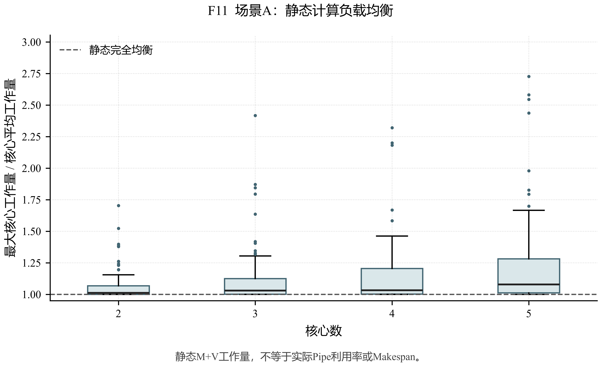

*图8-2  场景A：静态计算负载均衡*

## 8.3 相对对照基线C3的配对检验

第5至7章报告了R12相对C3的胜平负与平均降幅。为判断这种优势是否可能出于偶然，对每个场景-核数组把100张图按图配对，做两种非参数检验。符号检验只看每张图的胜负方向，剔除持平后，

$$
p=2\sum_{j=0}^{\min(n_{+},n_{-})}\binom{n_{+}+n_{-}}{j}2^{-(n_{+}+n_{-})}
\tag{8-3}
$$


其中 $n_{+}$、$n_{-}$ 为R12更快与更慢的图数。Wilcoxon符号秩检验[19]同时利用差异的大小：取 $d_i=\ln(T_{\mathrm{C3},i}/T_{\mathrm{R12},i})$，剔除 $d_i=0$ 后按 $|d_i|$ 取平均秩 $\mathrm{rk}_i$，

$$
W_{+}=\sum_{d_i>0}\mathrm{rk}_i,\qquad z=\frac{W_{+}-n(n+1)/4}{\sqrt{n(n+1)(2n+1)/24-\sum_{g}(t_g^3-t_g)/48}}
\tag{8-4}
$$


$n$ 为非零差异的配对数，$t_g$ 为第 $g$ 组并列值的个数。结果见表8-3，逐组胜平负的全貌见图8-3。

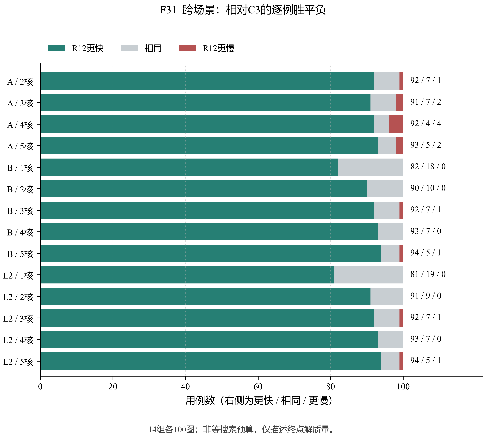

*图8-3  跨场景：相对C3的逐例胜平负*

**表8-3  R12相对C3的配对检验（每组100图）**

| 场景-核数 | 更快/持平/更慢 | 符号检验 $\log_{10}p$ | Wilcoxon $z$ | 有效配对数 |
|---|---:|---:|---:|---:|
| A2 | 92/7/1 | -25.72 | 8.29 | 93 |
| A3 | 91/7/2 | -24.05 | 8.28 | 93 |
| A4 | 92/4/4 | -22.06 | 8.47 | 96 |
| A5 | 93/5/2 | -24.64 | 8.45 | 95 |
| B1 | 82/18/0 | -24.38 | 7.87 | 82 |
| B2 | 90/10/0 | -26.79 | 8.24 | 90 |
| B3 | 92/7/1 | -25.72 | 8.37 | 93 |
| B4 | 93/7/0 | -27.69 | 8.37 | 93 |
| B5 | 94/5/1 | -26.31 | 8.46 | 95 |
| L2-1 | 81/19/0 | -24.08 | 7.82 | 81 |
| L2-2 | 91/9/0 | -27.09 | 8.28 | 91 |
| L2-3 | 92/7/1 | -25.72 | 8.37 | 93 |
| L2-4 | 93/7/0 | -27.69 | 8.37 | 93 |
| L2-5 | 94/5/1 | -26.31 | 8.46 | 95 |

注：符号检验为精确双侧检验，列出 $\log_{10}p$；Wilcoxon检验取正态近似并做并列校正。

14个组的符号检验 $p$ 值全部小于 $10^{-22}$（最大的一组为场景A四核，$\log_{10}p=-22.06$），Wilcoxon统计量 $z$ 在7.82至8.47之间。R12的最终方案在这100张图上系统性地快于C3，这一点不依赖于均值是否被少数图拉动。

检验的含义需要限定。第一，C3与R12的搜索预算不同（4.3.3节），检验说明的是“终点方案的差异不是偶然”，不是“等成本下算法效率更高”。第二，14个组共用同一批图，组与组之间并不独立，不能把14个 $p$ 值再合并成一个更小的数。第三，结论以这100张图为条件，推广到其他计算图需要另行验证。

## 8.4 稳健性分析：核数与计算图规模

题目要求算法“在2至5核范围内均能稳定地、高效地生成高质量结果”。从核数维度看，证据有四条：1400个配置格没有一格慢于REF（表8-2最小值列）；场景A的最小加速比随核数单调上升，从两核的1.0456升到五核的1.2023；每个组相对C3的更快图数都不少于81张，多核组都不少于90张；相对C3更慢的配置在场景A为9/400、场景B为2/500、L2场景为2/500，除case_062在场景A两核、三核外，幅度都在1%以内。求解成本方面，各组请求墙钟的中位数在7.916秒至25.68秒之间。

从规模维度看，用非COPY操作数衡量图的规模，计算它与加速比、与求解墙钟的Spearman秩相关系数[20]，结果见表8-4。

**表8-4  计算图规模与结果、成本的秩相关**

| 场景-核数 | 规模与加速比的Spearman $r_s$ | 规模与求解墙钟的Spearman $r_s$ |
|---|---:|---:|
| A2 | 0.107 | 0.901 |
| A5 | 0.158 | 0.905 |
| B2 | -0.051 | 0.924 |
| B5 | 0.192 | 0.879 |
| L2-5 | 0.185 | 0.844 |

规模与加速比的相关系数在−0.051至0.192之间，几乎不相关：大图并没有因为评价更慢、可试候选更少而系统性地得到更差的加速比。规模与墙钟的相关系数在0.844至0.924之间，高度正相关，与式(5-9)“总成本由官方评价主导”的分析一致，因为单次评价的成本随图规模增长。相关不等于因果，这里只作描述。

## 8.5 白盒统计：最终方案由哪个组件产生

R12在一次请求内按固定顺序运行多个组件（4.7.2节，图4-3）。每个配置格最终输出的方案，都能追溯到首次给出它的组件：该组件的候选在当时字典序最优，而此后运行的组件都没有找到更优的候选。表8-5按场景统计了1400个配置格最终方案的来源。

**表8-5  最终方案的来源组件（配置格数）**

| 产生最终方案的组件 | 场景A（400格） | 场景B（500格） | L2场景（500格） |
|---|---:|---:|---:|
| 基础构造 | 240 | 322 | 311 |
| 减少活动核心 | 4 | 5 | 4 |
| 依赖带候选 | 39 | — | — |
| 反馈重排 | 97 | 52 | 49 |
| 分量家族 | 18 | 8 | 3 |
| 跨配置重评价 | — | — | 3 |
| 插入式候选 | 2 | 107 | 123 |
| 局部微批 | — | 6 | 7 |
| 改进阶段合计（占比） | 160（40.0%） | 178（35.6%） | 189（37.8%） |

注：场景A为2至5核，场景B与L2场景为1至5核；“—”表示该组件在此场景不启用。基础构造包括分量打包、链块波次、分量批次，场景B与L2另有链块迁移；反馈重排在场景A为划分不变的重排，在场景B与L2为关键链局部移动。来源按选中方案的官方结果文件所在的阶段目录判定；五核B中来源为插入式候选或局部微批的图，与6.4.4节同请求阶段记录中“后两个阶段有改善”的图逐一对应。

这是存档运行记录的读表统计，不是等预算消融：某组件“产生了最终方案”，说明它在该请求中给出了字典序更优的候选，但不能说明去掉它以后其余组件补不上这一改进。在这一限定下，表中可以读出三点。

**基础构造给出约六成的最终方案，改进阶段贡献其余约四成。** 三个场景由改进阶段产生最终方案的配置格分别为160、178、189格，占40.0%、35.6%、37.8%。基础构造本身包含分量打包、链块波次等多种构造，在规模小、结构简单的图上直接胜出在意料之中；各改进阶段的作用集中在其余配置格上。

**场景专属组件在各自的场景中都产生了最终方案。** 场景A中，反馈重排产生97格，约占四分之一，依赖带候选产生39格，在两核、三核分别为7格与4格，在四核、五核各为14格；插入式候选只产生2格，这与场景A的代价主要由Task粒度与放置决定（5.1.1节）相符。场景B与L2场景中，插入式候选分别产生107格与123格，是最大的改进来源；关键链局部移动分别产生52格与49格；局部微批只产生6格与7格，这与它“只在确有Spill时启动”的设计以及Spill集中在少数图上的事实（6.4.3节）一致。

**来源随核数变化。** 场景B的插入式候选在一核时产生28格，五核时只有10格；关键链局部移动则从一核的0格增至五核的17格。L2场景的趋势相同，插入式候选从27格降到15格，关键链局部移动从0格增到16格。核数少时改进主要来自核内次序，核数多时越来越多地来自沿跨核关键链的调整。

**参数层面的观察。** 依赖带的四种宽度中，宽度4、8、16分别产生18、14、7格，宽度2没有产生任何最终方案；场景A的反馈重排有两种时长口径，按整机时间线实测时长重排的产生70格，按Task核内局部时长重排的产生27格。前者提示宽度2的候选在本测试集上边际作用很小，后者与“计入等待和带宽争用的实测时长更能反映Task真实代价”的直觉一致。两条同样是来源统计，不是控制变量的参数扫描。

## 8.6 灵敏度分析：求解预算与求解成本

三个场景的求解墙钟分布见图8-4，它们都高度右偏：多数请求在半分钟内结束，少数大图用满预算。预算对结论的影响集中在两处。


*图8-4  求解墙钟与预算长尾*

**预算阈值。** case_087是本测试集第5大的图（27556个非COPY操作），场景A的四个配置在600秒内都没有得到成功方案，改用1800秒后全部成功，补跑墙钟在753.0至1036.1秒之间（5.5.5节）。这说明对最大的一批图，600秒接近完成一次完整搜索所需的下限。其余1396个配置格都在600秒内得到结果，场景B与L2全部请求的墙钟最大值分别为265.0秒与423.7秒。

**预算在机制间的分配。** 五核B的同请求阶段数据（6.4.4节）显示，控制链阶段结束时的平均加速比已达4.0732，是最终值的98.6%；插入与微批阶段分别只在12张与2张图上进一步改善。也就是说，即使后两个阶段完全没有机会运行，五核B的平均加速比也不会低于4.0732。这是同一请求内的增量记录，不是等预算的独立消融，但它说明本文的主要收益并不依赖于把预算耗尽。

## 8.7 小结

本章的检验支持四条结论。第一，R12相对C3的优势在14个组中都通过了配对检验，$p$ 值全部小于 $10^{-22}$，但这是终点方案的比较，不是等预算的算法效率比较。第二，结果对核数与图规模是稳健的：没有一格慢于REF，并行效率随核数平稳下降，规模与加速比几乎不相关，规模只显著影响求解墙钟。第三，各组件都实际产生过最终方案：改进阶段在三个场景中产生了35.6%至40.0%的最终方案，场景A以反馈重排与依赖带为主，场景B与L2场景以插入式候选与关键链局部移动为主。第四，600秒预算对绝大多数图足够，对最大的一批图接近下限，case_087需要1800秒。此外，全部1470组输出都通过了合法性核查，1400个官方结果无一低于4.5.2节的计算下界。尚未完成的检验是等预算的单模块消融与L2容量、带宽的参数扫描，第9章把它们列为不足与改进方向。


# 9 模型评价与推广

## 9.1 主要认识

把三个场景放在一起，本文得到三条不依赖具体数字的认识。

**三项决策必须联合选择。** 切图、分核、核序中任何一项单独做到最好，都不能保证Makespan最短。case_062在场景A的表现说明了这一点：同一张图，4361个Task的细粒度划分在两核、三核下慢于对照，293个Task的粗粒度划分在四核、五核下反而比对照快，耗时分别低13.96%与17.02%。粒度的好坏只能在与分核、核序一起评价时才看得出来。

**同核合并转移而非消除容量代价。** 从场景A到场景B，五核平均边界新增由13.56 MiB降到5.511 MiB，Spill新增却由1.234 MiB升到2.706 MiB，而且高度集中在少数图上（前10张图占五核B全部Spill字节的93.84%）。优化的对象从“少切几刀”变成了“驻留谁、何时驻留”。

**标量累计指标只能用于剪枝，不能用于择优。** 命中率、搬运总量、瞬时占用都是标量，而Makespan由重排后的事件轴决定。第7章中命中率最高的退化记录恰是退化第二严重的一例，五核L2独立选优的新增COPY反而高于场景B。本文始终只用完整官方评价择优，下界与代理量只用于排除候选。

## 9.2 模型的优点

1. **评价一致。** 以官方评价器为唯一目标函数，报告值与评分口径零偏差；公式、代理与下界只服务于候选构造与剪枝，不会把代理误差带进结果。
2. **下界辅助的搜索。** 与方案无关的计算下界用于剪枝与近优认证停止，把预算留给仍有改进余地的大图；全部官方结果无一低于下界，同时充当了一项独立的一致性检验。
3. **结构化而非随机的搜索。** 安全链收缩、依赖带分组、尾长优先分核、反馈重排、Treap插入、Spill触发微批各有明确的结构依据，候选数量有界、全流程无随机种子，结果与方案哈希绑定，可以复查。
4. **全量无筛选的实验纪律。** 1400个配置格与500对同方案对照全部保留，退化记录、预算例外、首次失败全部披露；相对C3的优势在14个组中都通过了配对检验。
5. **方法学上的区分。** 把L2的收益拆成同方案配置效应与选解效应，并给出逐例成立的分解恒等式，避免把求解器行为的变化记在硬件头上。
6. **框架可迁移。** 三个场景共用决策结构、择优规则与多数候选部件，场景专属机制只加在候选生成层，每一项都对应代价结构中一个明确的新增维度。

## 9.3 模型的不足

1. **一般情形下没有最优性保证。** 黑箱目标建模只能给出可行解；计算下界忽略了共享带宽与等待，在高核数下偏松，只能用于剪枝与停止判断，不足以刻画解与最优之间的距离。
2. **缺少等预算的单模块消融。** 依赖带、反馈重排、分量家族与插入候选在同一请求内竞争预算，相对C3的43.48%降幅不能归因到具体模块；8.5节的来源统计说明每个组件都产生过最终方案，五核B的三阶段记录给出了增量，但二者都不是等预算消融。
3. **没有做L2的参数扫描。** 容量与带宽在全部实验中固定，第7章识别的是该配置的联合净效应，不能分别给容量与带宽分配贡献。
4. **个别实例的机制没有完全查清。** case_062在低核数下没有选到粗粒度划分，逐例数据说明了后果，但没有回答搜索为何没有评价到那类候选；case_026等L2退化记录同样只确认了事实，未做逐事件的因果追踪。
5. **验证属于自检。** 全部核查由作者完成，没有用第二套独立实现重建带宽与容量的动态过程。

## 9.4 改进方向

1. **做等预算的独立消融。** 固定预算、依次关闭依赖带、反馈重排、分量家族、插入与微批，把增量对照升级为可归因的比较；8.5节发现依赖带宽度2从未产生最终方案，可优先检验去掉它、把预算让给其余候选的效果。
2. **收紧下界。** 在计算下界之外加入跨Task边界搬运的必然字节与跨核等待，得到在高核数下更紧的下界，使剪枝与近优认证在更多实例上起作用。
3. **按图规模分配预算。** 规模与墙钟的秩相关达到0.844至0.924，可以在请求开始时按图规模动态分配预算，把节省下来的时间给case_087这类大图。
4. **L2参数扫描与缓存感知的候选。** 对容量与带宽做二维扫描以分离两者的作用；在候选生成中考虑共享输入的首次读取时序，减少多个核心同时未命中的情况。
5. **引入关键路径信息的粒度选择。** case_062提示，粒度候选应同时覆盖“粗”和“细”两端，并按关键路径上的等待累计量排序送评价，避免在低核数下错过粗粒度划分。

## 9.5 模型的推广

本文的框架对三类问题有直接的借鉴意义。第一，目标由仿真器或评价程序给出、写不出闭式表达式的调度问题，例如带共享总线或网络的多处理器任务映射，可以沿用“结构化候选—下界剪枝—真实评价—字典序择优”的闭环。第二，编译器中的算子融合与切分决策，本质上也是粒度、放置与次序的联合选择，安全链收缩与依赖带分组可以直接作为候选生成手段。第三，任何“开启一项硬件特性后性能变化”的评估，都可以用同方案配置比与分别选优比的分解，把硬件效应与软件行为变化分开报告。迁移时需要替换的是通信代价模型与场景专属机制，决策结构、择优规则与下界思路可以保留。


# 10 结论

本文把多核NPU上的切图与调度写成以官方评价器为目标的字典序优化问题，证明其在忽略搬运的特例下已是NP难的，给出与方案无关的计算下界；在此基础上设计了“结构化候选生成—下界剪枝—整机评价—字典序择优”的R12框架，在100张正式计算图、三个场景、1400个配置格上完成了全量实验。三问的核心结果汇总于表10-1。

**表10-1  三问核心结果汇总（每格100图，逐例比值的算术平均）**

| 核数 | 问题一 场景A | 问题二 场景B | 问题三 无L2（$P_B$） | 问题三 只读Cache（$P_L$） | 同方案配置比 $\overline R_{\mathrm{hw}}$ | 分别选优比 $\overline R_{\mathrm{select}}$ |
|---|---:|---:|---:|---:|---:|---:|
| 1 | 1（定义） | 1（定义） | 1.0614 | 1.0638 | 1.001978 | 1.002364 |
| 2 | 1.8553 | 1.9925 | 1.9925 | 2.0029 | 1.004765 | 1.005591 |
| 3 | 2.5606 | 2.8011 | 2.8011 | 2.8348 | 1.011799 | 1.013423 |
| 4 | 3.1973 | 3.5210 | 3.5210 | 3.5811 | 1.015729 | 1.020292 |
| 5 | 3.7433 | 4.1311 | 4.1311 | 4.2190 | 1.016766 | 1.027400 |

注：问题一、问题二的一核点按题目定义为1；问题三两条曲线的一核点为实测值（无L2列即优化后的B1）。同方案配置比固定无L2下选出的方案 $P_B$，分别选优比的分母换成L2下独立选出的方案 $P_L$。

**问题一（场景A）。** 以安全链收缩与依赖带弱连通分组构造Task粒度，以尾长优先的追加式分核放置，以官方时间线做划分不变的反馈重排，并用Treap区间索引加速插入式候选。2至5核的平均加速比为1.855、2.561、3.197、3.743，五核中位4.130、最小1.202，400个配置格无一慢于整图单核；相对固定构造基线C3，2至5核的逐图耗时平均降低25.01%、32.95%、38.93%、43.48%。新增COPY以边界搬运为主，五核平均14.79 MiB。1至5核平均加速比折线见图5-4，逐例Makespan与总额外数据搬运量见附录A。

**问题二（场景B）。** 同核合并Task以后，代价由边界搬运转向核内驻留与Spill。在问题一框架上增加活动核数与驻留组织候选、沿官方关键链的局部移动，以及只在确有Spill时启动的局部微批，并证明核归属不变可保证Spill前的边界COPY严格不变。2至5核平均加速比为1.993、2.801、3.521、4.131，五核最小1.812；一核按定义为1，优化后的单核方案平均为1.061。五核相对C3的逐图耗时平均降低34.49%；五核只有22张图发生Spill，其中前10张图占全部Spill字节的93.84%。折线见图6-4，逐例结果见附录A。

**问题三（共享只读L2）。** 按官方语义建立“发射时命中、完成时插入”的FIFO模型与两个互不占用的带宽池，用同方案配置比与分别选优比把硬件配置效应与选解效应分开，并给出逐例分解恒等式。L2下独立选优的1至5核平均加速比为1.064、2.003、2.835、3.581、4.219；同方案配置比随核数从1.001978升至1.016766，五核中位数只有1.000546，分别选优比五核为1.027400。收益高度不均：500对同方案对照中8对退化，命中率与收益不单调对应，开启L2后计划中的新增COPY反而由8.217 MiB升至9.403 MiB。两种配置的对比曲线与配置比见图7-3，逐例两配置的Makespan、新增COPY与命中率见附录A。

**模型检验。** 相对C3的优势在14个场景-核数组的配对检验中都显著（$p<10^{-22}$）；1400个配置格无一慢于整图单核，并行效率随核数平稳下降；图规模与加速比几乎不相关，只与求解墙钟强相关。

**本文的主要创新。** 第一，**评价一致的建模与可证下界**：把官方评价语义写成依赖、Pipe、释放、容量、带宽与边界计账六组约束，以（Makespan，新增搬运量）为字典序目标；证明问题在忽略搬运时已是NP难的，并用与方案无关的下界做剪枝与3%近优认证。第二，**按代价结构组织的结构化候选族**：场景A以安全链收缩、依赖带弱连通分组、尾长优先分核与划分不变的反馈重排控制边界搬运；场景B与L2场景以驻留组织候选和只在确有Spill时启动的局部微批处理容量溢出，并以核归属不变式保证Spill前的边界COPY严格不变。第三，**配置效应与选解效应的分解**：同方案配置比、分别选优比与逐例分解恒等式把L2的硬件收益与求解器行为变化分开，得到“命中率高不等于收益大”“只读缓存也会使个别方案变慢”“开启L2后新增COPY反而上升”三条可检验的结论。第四，**全量、可复查的实验**：1400个配置格与500对同方案对照全部报告，方案与官方结果以SHA256绑定，退化与预算例外逐项披露。

需要说明的边界是：结论限于这100张图、题目给定的固定配置与600秒软预算（case_087的场景A四格为1800秒补跑）；C3是事后同口径对照，不是等预算消融；L2的容量与带宽没有分别扫描，报告的是指定配置的联合净效应。


# 参考文献

[1] Sze V, Chen Y H, Yang T J, et al. Efficient processing of deep neural networks: a tutorial and survey[J]. Proceedings of the IEEE, 2017, 105(12): 2295-2329.

[2] Chen Y H, Krishna T, Emer J S, et al. Eyeriss: an energy-efficient reconfigurable accelerator for deep convolutional neural networks[J]. IEEE Journal of Solid-State Circuits, 2017, 52(1): 127-138.

[3] 2026年中国研究生数学建模竞赛组委会. 2026年中国研究生数学建模竞赛A题：通用神经网络处理器下的多核调度问题（赛题、附录与评估程序）[Z]. 2026.

[4] Graham R L. Bounds on multiprocessing timing anomalies[J]. SIAM Journal on Applied Mathematics, 1969, 17(2): 416-429.

[5] Kwok Y K, Ahmad I. Static scheduling algorithms for allocating directed task graphs to multiprocessors[J]. ACM Computing Surveys, 1999, 31(4): 406-471.

[6] Topcuoglu H, Hariri S, Wu M Y. Performance-effective and low-complexity task scheduling for heterogeneous computing[J]. IEEE Transactions on Parallel and Distributed Systems, 2002, 13(3): 260-274.

[7] Chen T, Moreau T, Jiang Z, et al. TVM: an automated end-to-end optimizing compiler for deep learning[C]//13th USENIX Symposium on Operating Systems Design and Implementation (OSDI 18). Carlsbad: USENIX Association, 2018: 578-594.

[8] Xing Y, Liang S, Sui L, et al. DNNVM: end-to-end compiler leveraging heterogeneous optimizations on FPGA-based CNN accelerators[EB/OL]. arXiv:1902.07463, 2019.

[9] Zheng L, Li Z, Zhang H, et al. Alpa: automating inter- and intra-operator parallelism for distributed deep learning[C]//16th USENIX Symposium on Operating Systems Design and Implementation (OSDI 22). Carlsbad: USENIX Association, 2022: 559-578.

[10] Shi Y, Yang Z, Xue J, et al. Welder: scheduling deep learning memory access via tile-graph[C]//17th USENIX Symposium on Operating Systems Design and Implementation (OSDI 23). Boston: USENIX Association, 2023.

[11] Popp M, Schlag S, Schulz C, et al. Multilevel acyclic hypergraph partitioning[EB/OL]. arXiv:2002.02962, 2020.

[12] Hong J W, Kung H T. I/O complexity: the red-blue pebble game[C]//Proceedings of the 13th Annual ACM Symposium on Theory of Computing. New York: ACM, 1981: 326-333.

[13] Belady L A. A study of replacement algorithms for a virtual-storage computer[J]. IBM Systems Journal, 1966, 5(2): 78-101.

[14] Garey M R, Johnson D S. Computers and intractability: a guide to the theory of NP-completeness[M]. San Francisco: W. H. Freeman, 1979.

[15] Seidel R, Aragon C R. Randomized search trees[J]. Algorithmica, 1996, 16(4-5): 464-497.

[16] Kahn A B. Topological sorting of large networks[J]. Communications of the ACM, 1962, 5(11): 558-562.

[17] Williams S, Waterman A, Patterson D. Roofline: an insightful visual performance model for multicore architectures[J]. Communications of the ACM, 2009, 52(4): 65-76.

[18] Amdahl G M. Validity of the single processor approach to achieving large scale computing capabilities[C]//Proceedings of the AFIPS Spring Joint Computer Conference. New York: ACM, 1967: 483-485.

[19] Wilcoxon F. Individual comparisons by ranking methods[J]. Biometrics Bulletin, 1945, 1(6): 80-83.

[20] Spearman C. The proof and measurement of association between two things[J]. The American Journal of Psychology, 1904, 15(1): 72-101.

# 附录

## 附录A 逐例结果（官方评估程序输出）

以下各表由脚本从存档结果表直接生成，数值即官方评估程序输出，未作任何取舍。Makespan单位为cycles，新增COPY（总额外数据搬运量）单位为bytes，命中率为按字节计算的百分比。场景A的case_087四个配置为1800秒补跑结果（5.5.5节），其余均为600秒软预算结果。

### A.1 问题一：场景A

**表A-1  问题一逐例Makespan（REF为整图单核基准）**

| 用例 | REF单核 | 2核 | 3核 | 4核 | 5核 |
|---|---:|---:|---:|---:|---:|
| case_001 | 233110 | 116868 | 78545 | 58984 | 47502 |
| case_002 | 261945 | 140236 | 98023 | 76865 | 58180 |
| case_003 | 602212 | 393827 | 321535 | 287598 | 276507 |
| case_004 | 392357 | 199074 | 134043 | 104188 | 88341 |
| case_005 | 95618 | 80999 | 72553 | 70248 | 69060 |
| case_006 | 82837 | 43033 | 30917 | 27895 | 27679 |
| case_007 | 1012562 | 507494 | 338094 | 254398 | 203834 |
| case_008 | 487605 | 244266 | 163359 | 123060 | 100603 |
| case_009 | 153261 | 92198 | 92198 | 81530 | 73571 |
| case_010 | 86969 | 45626 | 30856 | 27800 | 24563 |
| case_011 | 184697 | 92646 | 69625 | 46880 | 46880 |
| case_012 | 59088 | 30094 | 21894 | 17853 | 14212 |
| case_013 | 263949 | 132198 | 88351 | 66982 | 54363 |
| case_014 | 17698626 | 8759857 | 5865918 | 4447779 | 3614837 |
| case_015 | 177362 | 92321 | 61168 | 51205 | 42955 |
| case_016 | 7715523 | 4646180 | 3793761 | 3592965 | 3306411 |
| case_017 | 162810 | 84055 | 58959 | 48848 | 35470 |
| case_018 | 1004367 | 503411 | 339838 | 258063 | 202636 |
| case_019 | 81144 | 43224 | 30852 | 24099 | 22228 |
| case_020 | 532746 | 266580 | 177950 | 133704 | 107650 |
| case_021 | 6567937 | 3156352 | 2106282 | 1550324 | 1250168 |
| case_022 | 56780 | 28881 | 19370 | 14641 | 11813 |
| case_023 | 122614 | 61424 | 41720 | 30522 | 24965 |
| case_024 | 2555343 | 1539668 | 1256817 | 1189845 | 1095663 |
| case_025 | 4863026 | 2434032 | 1624426 | 1219420 | 975282 |
| case_026 | 99203 | 58112 | 41276 | 41219 | 41219 |
| case_027 | 2363952 | 1120962 | 837049 | 559196 | 558753 |
| case_028 | 43836040 | 20541851 | 14076015 | 10461460 | 8605530 |
| case_029 | 37555 | 19740 | 12743 | 11028 | 9383 |
| case_030 | 2808034 | 1394193 | 931629 | 698657 | 560814 |
| case_031 | 1414369 | 706033 | 485202 | 392550 | 306307 |
| case_032 | 41443 | 21706 | 15674 | 12763 | 10415 |
| case_033 | 1774196 | 904907 | 607519 | 461610 | 373638 |
| case_034 | 842996 | 415383 | 287578 | 230925 | 184639 |
| case_035 | 169571 | 95406 | 95406 | 90516 | 82052 |
| case_036 | 931510 | 466068 | 311345 | 233584 | 187182 |
| case_037 | 210001 | 105374 | 74038 | 53320 | 43800 |
| case_038 | 1364555 | 681518 | 461018 | 345206 | 283932 |
| case_039 | 1435262 | 708561 | 485565 | 392896 | 395297 |
| case_040 | 253454 | 143799 | 110105 | 98759 | 93219 |
| case_041 | 6003957 | 2965113 | 1976739 | 1484401 | 1192525 |
| case_042 | 1686740 | 835375 | 571947 | 435238 | 363428 |
| case_043 | 677656 | 355614 | 268777 | 261670 | 232286 |
| case_044 | 154407 | 78699 | 78699 | 78699 | 78699 |
| case_045 | 125614 | 63059 | 42601 | 31878 | 26164 |
| case_046 | 276455 | 158876 | 142176 | 124612 | 124612 |
| case_047 | 326508 | 245880 | 187273 | 171560 | 158050 |
| case_048 | 222220 | 169359 | 145022 | 145292 | 145490 |
| case_049 | 196276 | 148351 | 124128 | 115314 | 108297 |
| case_050 | 149690 | 108121 | 85329 | 74902 | 70368 |
| case_051 | 607628 | 367112 | 299245 | 282785 | 261214 |
| case_052 | 180301 | 91267 | 65207 | 50125 | 43641 |
| case_053 | 1472686 | 770010 | 546106 | 492232 | 492699 |
| case_054 | 815051 | 515425 | 391890 | 331031 | 298043 |
| case_055 | 118835 | 57941 | 43655 | 31823 | 26800 |
| case_056 | 277285 | 213386 | 180659 | 166455 | 157566 |
| case_057 | 59726 | 32042 | 21762 | 16879 | 14055 |
| case_058 | 4539717 | 2200935 | 1532101 | 1184895 | 1004819 |
| case_059 | 829473 | 369318 | 254768 | 185216 | 150782 |
| case_060 | 888789 | 458745 | 308169 | 232466 | 185331 |
| case_061 | 77191 | 39298 | 28342 | 27170 | 22059 |
| case_062 | 2854809 | 1976451 | 1593547 | 764940 | 619333 |
| case_063 | 1070397 | 558373 | 377834 | 290167 | 237375 |
| case_064 | 19116 | 18283 | 17170 | 16312 | 15899 |
| case_065 | 53068 | 26972 | 17918 | 14288 | 11235 |
| case_066 | 359070 | 226476 | 185361 | 167785 | 159869 |
| case_067 | 63834834 | 32438342 | 22543931 | 16545997 | 13961132 |
| case_068 | 362095 | 260340 | 221224 | 197091 | 189541 |
| case_069 | 25144 | 21197 | 19700 | 18866 | 19032 |
| case_070 | 117300 | 58234 | 45660 | 34658 | 28840 |
| case_071 | 18919 | 16232 | 14889 | 14434 | 14220 |
| case_072 | 23897828 | 11713796 | 7870089 | 5945430 | 4779968 |
| case_073 | 10081626 | 5304875 | 4427074 | 3646155 | 3315864 |
| case_074 | 1682239 | 832726 | 548347 | 415984 | 345470 |
| case_075 | 1441809 | 844156 | 639599 | 552334 | 506598 |
| case_076 | 6185113 | 3046650 | 2033956 | 1526939 | 1230399 |
| case_077 | 495320 | 250735 | 178739 | 144734 | 121081 |
| case_078 | 2296143 | 1080972 | 763089 | 619540 | 536429 |
| case_079 | 31052251 | 14738594 | 9939977 | 7495240 | 5998948 |
| case_080 | 292138 | 145926 | 100325 | 100325 | 100325 |
| case_081 | 151795 | 76860 | 51943 | 39588 | 30943 |
| case_082 | 721041 | 450921 | 355841 | 311867 | 290998 |
| case_083 | 1057993 | 537673 | 414361 | 390026 | 370632 |
| case_084 | 2507412 | 1013056 | 762658 | 629028 | 503472 |
| case_085 | 3187899 | 2105594 | 1593477 | 1291419 | 1216812 |
| case_086 | 118403 | 99674 | 92319 | 84701 | 83340 |
| case_087 | 3974071 | 2093249 | 1483711 | 1204070 | 1038529 |
| case_088 | 243623 | 173654 | 146818 | 131635 | 127073 |
| case_089 | 693092 | 346832 | 243614 | 178160 | 147432 |
| case_090 | 1178363 | 513438 | 397500 | 346678 | 346678 |
| case_091 | 9186769 | 4529311 | 3036878 | 2288314 | 1857417 |
| case_092 | 4815554 | 2498492 | 1841420 | 1465901 | 1384732 |
| case_093 | 74205 | 37827 | 25103 | 19779 | 15876 |
| case_094 | 94892 | 49398 | 39889 | 27461 | 23564 |
| case_095 | 2084853 | 1042890 | 695775 | 524422 | 420852 |
| case_096 | 84194 | 47089 | 30832 | 26980 | 26930 |
| case_097 | 11491509 | 5161740 | 3577028 | 2626908 | 2102348 |
| case_098 | 177430 | 89551 | 82660 | 69258 | 64165 |
| case_099 | 1622999 | 811243 | 544403 | 405655 | 336496 |
| case_100 | 151223 | 82771 | 57566 | 57566 | 51287 |

**表A-2  问题一逐例总额外数据搬运量（bytes）**

| 用例 | 2核 | 3核 | 4核 | 5核 |
|---|---:|---:|---:|---:|
| case_001 | 1152 | 2304 | 3456 | 4608 |
| case_002 | 82944 | 82944 | 82944 | 82944 |
| case_003 | 6729464 | 6729464 | 6729464 | 6729464 |
| case_004 | 110592 | 221184 | 331776 | 442368 |
| case_005 | 2049178 | 2483610 | 2483610 | 2483610 |
| case_006 | 56200 | 91264 | 664560 | 664560 |
| case_007 | 27648 | 55296 | 82944 | 110592 |
| case_008 | 0 | 0 | 0 | 0 |
| case_009 | 0 | 0 | 928212 | 928212 |
| case_010 | 48384 | 48384 | 715508 | 715508 |
| case_011 | 180224 | 1081344 | 540672 | 540672 |
| case_012 | 28800 | 20160 | 21888 | 31104 |
| case_013 | 8192 | 16384 | 24576 | 32768 |
| case_014 | 71556024 | 71375016 | 75533208 | 81189384 |
| case_015 | 224536 | 290056 | 1081932 | 342528 |
| case_016 | 119566328 | 119566936 | 119567544 | 119568152 |
| case_017 | 161280 | 175104 | 260352 | 343296 |
| case_018 | 2835456 | 4075904 | 4914944 | 5136384 |
| case_019 | 27168 | 24576 | 51744 | 608920 |
| case_020 | 0 | 0 | 0 | 0 |
| case_021 | 5427200 | 6707200 | 4608000 | 11431936 |
| case_022 | 6912 | 13824 | 13824 | 6912 |
| case_023 | 84096 | 196896 | 207552 | 197472 |
| case_024 | 39331088 | 39331288 | 39331488 | 39331688 |
| case_025 | 248832 | 304128 | 304128 | 110592 |
| case_026 | 288 | 217872 | 217872 | 217872 |
| case_027 | 1744896 | 3686400 | 3317760 | 5529600 |
| case_028 | 99676800 | 98668800 | 103033728 | 105408000 |
| case_029 | 0 | 0 | 0 | 0 |
| case_030 | 7370752 | 8237056 | 9418752 | 10398720 |
| case_031 | 4379136 | 7348224 | 14062336 | 8059392 |
| case_032 | 6216 | 12360 | 129188 | 12360 |
| case_033 | 6645792 | 6972480 | 12826272 | 7816320 |
| case_034 | 1998336 | 2645504 | 6690304 | 3581952 |
| case_035 | 0 | 0 | 469248 | 1007048 |
| case_036 | 1152 | 2304 | 3456 | 4608 |
| case_037 | 204800 | 1064960 | 614400 | 1925120 |
| case_038 | 6790656 | 7045632 | 9295872 | 9667584 |
| case_039 | 11067392 | 14323712 | 16388096 | 16388096 |
| case_040 | 53760 | 0 | 2075814 | 2075814 |
| case_041 | 22579200 | 25559040 | 26910720 | 28502016 |
| case_042 | 6967584 | 8251680 | 7876896 | 8598528 |
| case_043 | 556040 | 233480 | 5285512 | 5285512 |
| case_044 | 2014560 | 2014560 | 2014560 | 2014560 |
| case_045 | 0 | 0 | 0 | 0 |
| case_046 | 6512800 | 4021280 | 4513952 | 4513952 |
| case_047 | 3820950 | 3820950 | 3820950 | 3820950 |
| case_048 | 853830 | 1253562 | 1253562 | 1253562 |
| case_049 | 1784066 | 1784066 | 2743324 | 2743324 |
| case_050 | 3456 | 1219726 | 1219726 | 1219726 |
| case_051 | 9046218 | 9046264 | 9046310 | 9046356 |
| case_052 | 102912 | 181248 | 259584 | 854016 |
| case_053 | 7237216 | 5882944 | 6360992 | 6918912 |
| case_054 | 6850874 | 6850874 | 6850874 | 6850874 |
| case_055 | 57856 | 115712 | 115712 | 198656 |
| case_056 | 2922520 | 2922520 | 2922520 | 2922520 |
| case_057 | 70272 | 70272 | 70272 | 70272 |
| case_058 | 43794432 | 32858112 | 45551616 | 32104448 |
| case_059 | 360448 | 2748416 | 1081344 | 4325376 |
| case_060 | 8150032 | 8150032 | 8150032 | 3641728 |
| case_061 | 34560 | 43008 | 62208 | 382558 |
| case_062 | 13393920 | 13393920 | 897024 | 897024 |
| case_063 | 337920 | 337920 | 337920 | 337920 |
| case_064 | 65662 | 65662 | 131982 | 131982 |
| case_065 | 13968 | 27936 | 41760 | 55728 |
| case_066 | 1953158 | 2890070 | 2890070 | 2890070 |
| case_067 | 272726272 | 298754304 | 282468608 | 298754304 |
| case_068 | 2598030 | 2598030 | 2598030 | 2598030 |
| case_069 | 532364 | 532364 | 532364 | 532364 |
| case_070 | 129536 | 259072 | 360960 | 462848 |
| case_071 | 375274 | 375274 | 375274 | 375274 |
| case_072 | 99330848 | 177263132 | 177263132 | 177263132 |
| case_073 | 98703232 | 100065536 | 144435968 | 102790144 |
| case_074 | 5910536 | 7626752 | 7790592 | 8392712 |
| case_075 | 8130090 | 8130090 | 8130090 | 8130090 |
| case_076 | 33976320 | 33654784 | 33742848 | 35696640 |
| case_077 | 57344 | 114688 | 172032 | 172032 |
| case_078 | 15039360 | 15825792 | 15039360 | 15825792 |
| case_079 | 47714304 | 43948032 | 44257280 | 45352960 |
| case_080 | 2191360 | 3047424 | 3047424 | 3047424 |
| case_081 | 0 | 0 | 0 | 0 |
| case_082 | 4435418 | 8998170 | 9580494 | 10097280 |
| case_083 | 13151840 | 14082240 | 15012640 | 15943040 |
| case_084 | 30190464 | 30190464 | 0 | 0 |
| case_085 | 40692846 | 43297606 | 42980512 | 46542906 |
| case_086 | 2656640 | 2656640 | 3103172 | 3103172 |
| case_087 | 35193224 | 35193224 | 35193224 | 35193224 |
| case_088 | 1860972 | 1860972 | 1860972 | 1860972 |
| case_089 | 238720 | 477440 | 716160 | 954880 |
| case_090 | 4145280 | 6293760 | 8442240 | 8442240 |
| case_091 | 56506336 | 55158080 | 59109376 | 61130752 |
| case_092 | 56912480 | 57842880 | 58773280 | 59703680 |
| case_093 | 8192 | 16384 | 24576 | 32768 |
| case_094 | 106272 | 212544 | 318816 | 259200 |
| case_095 | 0 | 0 | 0 | 0 |
| case_096 | 66240 | 67392 | 719180 | 661824 |
| case_097 | 14483456 | 29818880 | 14221312 | 21311488 |
| case_098 | 0 | 1602190 | 1602190 | 2065850 |
| case_099 | 7319552 | 8798208 | 9764864 | 9703424 |
| case_100 | 763960 | 534528 | 534528 | 1877578 |

### A.2 问题二：场景B

**表A-3  问题二逐例Makespan**

| 用例 | 1核 | 2核 | 3核 | 4核 | 5核 |
|---|---:|---:|---:|---:|---:|
| case_001 | 233110 | 116868 | 78545 | 58984 | 47502 |
| case_002 | 261945 | 137089 | 94149 | 73120 | 59575 |
| case_003 | 548159 | 315516 | 257302 | 234056 | 232588 |
| case_004 | 392357 | 199074 | 134043 | 104188 | 88341 |
| case_005 | 83323 | 60883 | 52655 | 52655 | 52655 |
| case_006 | 76373 | 39367 | 29782 | 26251 | 24618 |
| case_007 | 1012562 | 507494 | 338094 | 254398 | 203834 |
| case_008 | 487605 | 244266 | 163359 | 123060 | 100603 |
| case_009 | 147061 | 84436 | 63747 | 55563 | 52311 |
| case_010 | 86057 | 42846 | 30856 | 26147 | 26147 |
| case_011 | 184697 | 92646 | 69625 | 46880 | 46880 |
| case_012 | 51532 | 29730 | 18114 | 14886 | 12712 |
| case_013 | 263949 | 132198 | 88351 | 66982 | 54363 |
| case_014 | 17698626 | 8864262 | 5924867 | 4428315 | 3605387 |
| case_015 | 158311 | 89331 | 58906 | 51503 | 39837 |
| case_016 | 7715523 | 4026549 | 2876720 | 2238959 | 2087323 |
| case_017 | 155189 | 86334 | 52489 | 42924 | 30495 |
| case_018 | 1004367 | 498719 | 334784 | 255853 | 202778 |
| case_019 | 74026 | 40392 | 28195 | 21744 | 18640 |
| case_020 | 532746 | 266580 | 177950 | 133704 | 107650 |
| case_021 | 6567937 | 3194570 | 2106848 | 1550324 | 1250168 |
| case_022 | 56750 | 28851 | 19370 | 14574 | 11813 |
| case_023 | 109495 | 58216 | 41720 | 30522 | 24793 |
| case_024 | 2555343 | 1334769 | 953408 | 743027 | 694207 |
| case_025 | 4863026 | 2431840 | 1622164 | 1217444 | 975282 |
| case_026 | 90235 | 53208 | 41132 | 35520 | 33518 |
| case_027 | 2363952 | 1118352 | 765280 | 559196 | 558753 |
| case_028 | 41576363 | 20615674 | 13848390 | 10250099 | 8211965 |
| case_029 | 37555 | 19740 | 12743 | 11028 | 9383 |
| case_030 | 2808034 | 1403594 | 933857 | 700342 | 561102 |
| case_031 | 1412792 | 732205 | 483567 | 394466 | 306307 |
| case_032 | 34524 | 17554 | 11808 | 11164 | 10415 |
| case_033 | 1774196 | 896676 | 602408 | 457602 | 369453 |
| case_034 | 825894 | 440418 | 280681 | 252538 | 173032 |
| case_035 | 162870 | 95406 | 71961 | 56936 | 58349 |
| case_036 | 931510 | 466068 | 311345 | 233584 | 187182 |
| case_037 | 210001 | 105374 | 74038 | 53320 | 43800 |
| case_038 | 1364555 | 681518 | 459530 | 344898 | 283188 |
| case_039 | 1435262 | 708561 | 483806 | 381106 | 381106 |
| case_040 | 236131 | 140145 | 105923 | 95952 | 89745 |
| case_041 | 6003957 | 2992480 | 1991992 | 1490603 | 1196379 |
| case_042 | 1686740 | 840916 | 571947 | 435949 | 369780 |
| case_043 | 644058 | 350868 | 267919 | 240597 | 240597 |
| case_044 | 78274 | 45248 | 45248 | 45248 | 45248 |
| case_045 | 125614 | 63059 | 42601 | 31878 | 26164 |
| case_046 | 216726 | 109740 | 82826 | 79918 | 79918 |
| case_047 | 291280 | 166394 | 136827 | 125959 | 119372 |
| case_048 | 198369 | 125568 | 99835 | 97813 | 98572 |
| case_049 | 181681 | 106107 | 84225 | 70510 | 64305 |
| case_050 | 142450 | 78327 | 67318 | 59891 | 58897 |
| case_051 | 607628 | 318674 | 227452 | 178386 | 168374 |
| case_052 | 175278 | 86843 | 62309 | 45500 | 41994 |
| case_053 | 1341846 | 728229 | 497437 | 425404 | 375096 |
| case_054 | 815051 | 438618 | 316491 | 262542 | 240647 |
| case_055 | 106616 | 56582 | 40063 | 31823 | 26183 |
| case_056 | 258692 | 147688 | 117225 | 104605 | 97116 |
| case_057 | 59056 | 30025 | 23294 | 20957 | 16538 |
| case_058 | 4539717 | 2261085 | 1554831 | 1141608 | 1004819 |
| case_059 | 738041 | 369318 | 254073 | 185216 | 150782 |
| case_060 | 882690 | 474073 | 323843 | 240113 | 185331 |
| case_061 | 77191 | 39298 | 28342 | 26678 | 22283 |
| case_062 | 2854809 | 1572635 | 1083992 | 838854 | 703542 |
| case_063 | 1070397 | 575202 | 396695 | 313176 | 255854 |
| case_064 | 17184 | 13417 | 14105 | 10614 | 8333 |
| case_065 | 44156 | 22021 | 16963 | 11769 | 9558 |
| case_066 | 318124 | 190462 | 139098 | 123721 | 119141 |
| case_067 | 63834834 | 31418001 | 21034535 | 16152614 | 13054159 |
| case_068 | 328200 | 200719 | 167916 | 147382 | 141879 |
| case_069 | 21597 | 16133 | 14920 | 14483 | 13698 |
| case_070 | 110849 | 58234 | 43439 | 34658 | 25840 |
| case_071 | 15824 | 12826 | 10782 | 10331 | 10442 |
| case_072 | 23897828 | 11836023 | 7961454 | 5911772 | 4831103 |
| case_073 | 9839163 | 5587533 | 4300595 | 2507770 | 2034983 |
| case_074 | 1651943 | 803673 | 537857 | 406099 | 330183 |
| case_075 | 1334897 | 728185 | 526421 | 425508 | 374967 |
| case_076 | 6185113 | 3065214 | 2050028 | 1540201 | 1240011 |
| case_077 | 495320 | 250735 | 178739 | 144734 | 121081 |
| case_078 | 2095621 | 1051374 | 720770 | 568228 | 481517 |
| case_079 | 31052251 | 15446486 | 10140755 | 7635624 | 6045667 |
| case_080 | 292138 | 145926 | 100325 | 100325 | 100325 |
| case_081 | 151795 | 76860 | 51943 | 39588 | 30943 |
| case_082 | 718790 | 387499 | 263881 | 217255 | 195543 |
| case_083 | 851601 | 433315 | 298003 | 219344 | 191867 |
| case_084 | 2191327 | 1168951 | 836220 | 629028 | 503472 |
| case_085 | 3187899 | 1810774 | 1228758 | 938020 | 822333 |
| case_086 | 105557 | 67521 | 60328 | 55557 | 55557 |
| case_087 | 3974071 | 1987606 | 1371815 | 1069325 | 885221 |
| case_088 | 219593 | 134265 | 117498 | 98539 | 98539 |
| case_089 | 659152 | 329430 | 229298 | 165616 | 133338 |
| case_090 | 882630 | 454440 | 337795 | 295164 | 274650 |
| case_091 | 9186769 | 4571759 | 3053553 | 2290698 | 1848187 |
| case_092 | 4373417 | 2162750 | 1418789 | 1033609 | 814597 |
| case_093 | 74205 | 37827 | 25103 | 19779 | 15876 |
| case_094 | 84874 | 48430 | 35024 | 27182 | 20297 |
| case_095 | 2084853 | 1042890 | 695775 | 524422 | 420852 |
| case_096 | 75393 | 41837 | 30611 | 26984 | 25183 |
| case_097 | 11491509 | 5617602 | 3660459 | 2626908 | 2102348 |
| case_098 | 176171 | 89551 | 65715 | 52186 | 50844 |
| case_099 | 1622999 | 811243 | 544403 | 405655 | 324321 |
| case_100 | 141463 | 74200 | 54371 | 50324 | 47130 |

**表A-4  问题二逐例总额外数据搬运量（bytes）**

| 用例 | 1核 | 2核 | 3核 | 4核 | 5核 |
|---|---:|---:|---:|---:|---:|
| case_001 | 0 | 1152 | 2304 | 3456 | 4608 |
| case_002 | 0 | 562176 | 746496 | 841728 | 872448 |
| case_003 | 24576 | 6408454 | 9518568 | 7733990 | 9723996 |
| case_004 | 0 | 110592 | 221184 | 331776 | 442368 |
| case_005 | 0 | 2190534 | 1728714 | 1728714 | 1728714 |
| case_006 | 166044 | 614532 | 841742 | 913168 | 411656 |
| case_007 | 0 | 27648 | 55296 | 82944 | 110592 |
| case_008 | 0 | 0 | 0 | 0 | 0 |
| case_009 | 327048 | 1236498 | 1616024 | 1890898 | 2008978 |
| case_010 | 63892 | 471500 | 48384 | 778932 | 778932 |
| case_011 | 0 | 180224 | 1081344 | 540672 | 540672 |
| case_012 | 0 | 461572 | 20160 | 21888 | 31104 |
| case_013 | 0 | 8192 | 16384 | 24576 | 32768 |
| case_014 | 71010720 | 62154168 | 46130856 | 48577944 | 53128200 |
| case_015 | 873464 | 1786394 | 208128 | 231168 | 317952 |
| case_016 | 0 | 404192 | 12200 | 15864 | 214900 |
| case_017 | 0 | 394974 | 175104 | 260352 | 343296 |
| case_018 | 1970176 | 1377280 | 12853772 | 3755776 | 5054464 |
| case_019 | 315392 | 814128 | 24576 | 359504 | 327032 |
| case_020 | 0 | 0 | 0 | 0 | 0 |
| case_021 | 4501504 | 3174400 | 4710400 | 4608000 | 11431936 |
| case_022 | 0 | 6912 | 13824 | 13824 | 6912 |
| case_023 | 1100056 | 1523296 | 196896 | 207552 | 197472 |
| case_024 | 0 | 396848 | 4040 | 5256 | 202660 |
| case_025 | 0 | 27648 | 55296 | 82944 | 110592 |
| case_026 | 0 | 1301728 | 1491816 | 724704 | 491168 |
| case_027 | 1400832 | 1449984 | 33890304 | 3317760 | 5529600 |
| case_028 | 62779392 | 82416768 | 34820352 | 31777152 | 30147072 |
| case_029 | 0 | 0 | 0 | 0 | 0 |
| case_030 | 5519360 | 7644160 | 9242624 | 10404864 | 11479040 |
| case_031 | 2251776 | 2139648 | 3462144 | 4922880 | 8059392 |
| case_032 | 0 | 6216 | 12360 | 12360 | 12360 |
| case_033 | 4592640 | 3391008 | 4180032 | 5251680 | 6509184 |
| case_034 | 0 | 1459712 | 2341888 | 2979328 | 3532800 |
| case_035 | 0 | 0 | 1735510 | 1675904 | 1602218 |
| case_036 | 0 | 1152 | 2304 | 3456 | 4608 |
| case_037 | 0 | 204800 | 1064960 | 614400 | 1925120 |
| case_038 | 5627904 | 6790656 | 5534208 | 6950400 | 8558592 |
| case_039 | 7929856 | 11067392 | 12414976 | 13320192 | 13320192 |
| case_040 | 0 | 2475470 | 3308532 | 2473682 | 2634900 |
| case_041 | 30898176 | 33490944 | 34879488 | 39164928 | 40630272 |
| case_042 | 6629376 | 7262496 | 8251680 | 7059744 | 8045568 |
| case_043 | 2867036 | 9505206 | 7959640 | 9832918 | 9832918 |
| case_044 | 0 | 930400 | 930400 | 930400 | 930400 |
| case_045 | 0 | 0 | 0 | 0 | 0 |
| case_046 | 0 | 930400 | 1860800 | 2791200 | 2791200 |
| case_047 | 0 | 3012550 | 4387628 | 5012946 | 3409368 |
| case_048 | 0 | 391302 | 1016076 | 1114512 | 1132628 |
| case_049 | 27658 | 2803330 | 3516344 | 1739398 | 2125062 |
| case_050 | 702996 | 1958198 | 1393486 | 1620642 | 1885008 |
| case_051 | 0 | 393884 | 960 | 1252 | 198040 |
| case_052 | 0 | 102912 | 181248 | 259584 | 333312 |
| case_053 | 855054 | 5317152 | 7442990 | 11152366 | 12135050 |
| case_054 | 0 | 8276074 | 6482640 | 7592222 | 8940968 |
| case_055 | 282696 | 852212 | 115712 | 115712 | 198656 |
| case_056 | 25618 | 3622398 | 1870000 | 3214102 | 3574548 |
| case_057 | 0 | 416890 | 549116 | 288 | 27936 |
| case_058 | 28696576 | 30621696 | 30400512 | 32284672 | 32104448 |
| case_059 | 0 | 360448 | 2162688 | 1081344 | 4325376 |
| case_060 | 1439748 | 1255552 | 3290252 | 3131648 | 3641728 |
| case_061 | 0 | 34560 | 43008 | 62208 | 83712 |
| case_062 | 0 | 10856448 | 10865664 | 10054656 | 10626048 |
| case_063 | 0 | 3323904 | 3133440 | 3538944 | 3253248 |
| case_064 | 0 | 95590 | 126220 | 152784 | 132948 |
| case_065 | 0 | 13968 | 27936 | 41760 | 55728 |
| case_066 | 75272 | 3937564 | 3077354 | 3938934 | 4419676 |
| case_067 | 264449408 | 182202752 | 187518720 | 154190976 | 158705152 |
| case_068 | 531976 | 3519186 | 3536102 | 4076226 | 4184738 |
| case_069 | 0 | 233732 | 489770 | 503470 | 465362 |
| case_070 | 0 | 129536 | 1523108 | 360960 | 462848 |
| case_071 | 0 | 208452 | 235082 | 329486 | 317010 |
| case_072 | 108613680 | 113724192 | 82414368 | 85994272 | 84918960 |
| case_073 | 90447872 | 91806080 | 93164288 | 44120192 | 37201408 |
| case_074 | 5255176 | 3747840 | 4923392 | 6230016 | 7118848 |
| case_075 | 0 | 7124774 | 12146060 | 12171570 | 12788022 |
| case_076 | 28280832 | 31095808 | 34332672 | 37442560 | 40553472 |
| case_077 | 0 | 57344 | 114688 | 172032 | 172032 |
| case_078 | 24576 | 2148480 | 8054016 | 6445440 | 12822528 |
| case_079 | 32448512 | 31780864 | 33890304 | 30445568 | 31907840 |
| case_080 | 548864 | 2191360 | 3047424 | 3047424 | 3047424 |
| case_081 | 0 | 0 | 0 | 0 | 0 |
| case_082 | 597130 | 3234278 | 2788460 | 6970608 | 5194934 |
| case_083 | 262144 | 930400 | 1860800 | 2791200 | 3721600 |
| case_084 | 29453952 | 28717440 | 0 | 0 | 0 |
| case_085 | 0 | 9335690 | 29372396 | 29385842 | 22587672 |
| case_086 | 155146 | 1185860 | 1851498 | 2269390 | 2269390 |
| case_087 | 7902720 | 10142208 | 5465088 | 7133184 | 8050176 |
| case_088 | 544128 | 2582030 | 2337262 | 2683862 | 2683862 |
| case_089 | 0 | 238720 | 477440 | 716160 | 954880 |
| case_090 | 0 | 2341200 | 4490496 | 6514560 | 8606208 |
| case_091 | 53947008 | 57904096 | 33286976 | 35909280 | 39725056 |
| case_092 | 29294592 | 16642656 | 10675392 | 6788896 | 4606336 |
| case_093 | 0 | 8192 | 16384 | 24576 | 32768 |
| case_094 | 458752 | 106272 | 737860 | 318816 | 259200 |
| case_095 | 0 | 0 | 0 | 0 | 0 |
| case_096 | 107552 | 719692 | 67392 | 78336 | 623148 |
| case_097 | 10584064 | 11796480 | 16031744 | 14221312 | 21311488 |
| case_098 | 852332 | 0 | 852966 | 1249322 | 1517236 |
| case_099 | 5484544 | 7319552 | 8798208 | 9764864 | 7065600 |
| case_100 | 0 | 1161942 | 1640268 | 1961860 | 1112288 |

### A.3 问题三：无L2与只读Cache两种配置

“无L2”为场景B下选出的方案 $P_B$；“只读Cache”为L2配置下独立选优的方案 $P_L$；“同方案开L2”为把 $P_B$ 原样放到L2配置下评价的结果，用于计算同方案配置比。

**表A-5  问题三逐例结果（1核）**

| 用例 | 无L2 Makespan | 无L2 新增COPY | 只读Cache Makespan | 只读Cache 新增COPY | 只读Cache 命中率/% | 同方案开L2 Makespan | 同方案命中率/% |
|---|---:|---:|---:|---:|---:|---:|---:|
| case_001 | 233110 | 0 | 233110 | 0 | 0.0000 | 233110 | 0.0000 |
| case_002 | 261945 | 0 | 261945 | 0 | 0.0000 | 261945 | 0.0000 |
| case_003 | 548159 | 24576 | 548159 | 24576 | 0.0000 | 548159 | 0.0000 |
| case_004 | 392357 | 0 | 392357 | 0 | 0.0000 | 392357 | 0.0000 |
| case_005 | 83323 | 0 | 83323 | 0 | 0.0000 | 83323 | 0.0000 |
| case_006 | 76373 | 166044 | 76373 | 166044 | 6.4862 | 76373 | 6.4862 |
| case_007 | 1012562 | 0 | 1012562 | 0 | 0.0000 | 1012562 | 0.0000 |
| case_008 | 487605 | 0 | 487605 | 0 | 0.0000 | 487605 | 0.0000 |
| case_009 | 147061 | 327048 | 146683 | 327048 | 7.4819 | 146683 | 7.4819 |
| case_010 | 86057 | 63892 | 86057 | 63892 | 0.0000 | 86057 | 0.0000 |
| case_011 | 184697 | 0 | 184697 | 0 | 0.0000 | 184697 | 0.0000 |
| case_012 | 51532 | 0 | 51532 | 0 | 0.0000 | 51532 | 0.0000 |
| case_013 | 263949 | 0 | 263949 | 0 | 0.0000 | 263949 | 0.0000 |
| case_014 | 17698626 | 71010720 | 17689602 | 71010720 | 12.2910 | 17689602 | 12.2910 |
| case_015 | 158311 | 873464 | 156783 | 873464 | 15.4479 | 156783 | 15.4479 |
| case_016 | 7715523 | 0 | 7715523 | 0 | 0.0000 | 7715523 | 0.0000 |
| case_017 | 155189 | 0 | 155189 | 0 | 0.0000 | 155189 | 0.0000 |
| case_018 | 1004367 | 1970176 | 1003110 | 1970176 | 34.3750 | 1003110 | 34.3750 |
| case_019 | 74026 | 315392 | 74026 | 315392 | 4.7471 | 74026 | 4.7471 |
| case_020 | 532746 | 0 | 532746 | 0 | 0.0000 | 532746 | 0.0000 |
| case_021 | 6567937 | 4501504 | 6558837 | 4501504 | 50.0597 | 6558837 | 50.0597 |
| case_022 | 56750 | 0 | 56750 | 0 | 0.0000 | 56750 | 0.0000 |
| case_023 | 109495 | 1100056 | 109032 | 1100056 | 19.1895 | 109032 | 19.1895 |
| case_024 | 2555343 | 0 | 2555343 | 0 | 0.0000 | 2555343 | 0.0000 |
| case_025 | 4863026 | 0 | 4863026 | 0 | 0.0000 | 4863026 | 0.0000 |
| case_026 | 90235 | 0 | 90235 | 0 | 0.0000 | 90235 | 0.0000 |
| case_027 | 2363952 | 1400832 | 2359515 | 1400832 | 26.8939 | 2359515 | 26.8939 |
| case_028 | 41576363 | 62779392 | 41555374 | 62779392 | 3.3815 | 41555374 | 3.3815 |
| case_029 | 37555 | 0 | 37555 | 0 | 0.0000 | 37555 | 0.0000 |
| case_030 | 2808034 | 5519360 | 2807891 | 5519360 | 25.9868 | 2807891 | 25.9868 |
| case_031 | 1412792 | 2251776 | 1412441 | 2251776 | 36.2137 | 1412441 | 36.2137 |
| case_032 | 34524 | 0 | 34524 | 0 | 0.0000 | 34524 | 0.0000 |
| case_033 | 1774196 | 4592640 | 1774080 | 4592640 | 9.6277 | 1774080 | 9.6277 |
| case_034 | 825894 | 0 | 825894 | 0 | 0.0000 | 825894 | 0.0000 |
| case_035 | 162870 | 0 | 162870 | 0 | 0.0000 | 162870 | 0.0000 |
| case_036 | 931510 | 0 | 931510 | 0 | 0.0000 | 931510 | 0.0000 |
| case_037 | 210001 | 0 | 210001 | 0 | 0.0000 | 210001 | 0.0000 |
| case_038 | 1364555 | 5627904 | 1363312 | 5627904 | 17.3617 | 1363312 | 17.3617 |
| case_039 | 1435262 | 7929856 | 1435262 | 7929856 | 0.0000 | 1435262 | 0.0000 |
| case_040 | 236131 | 0 | 236131 | 0 | 0.0000 | 236131 | 0.0000 |
| case_041 | 6003957 | 30898176 | 6001575 | 30898176 | 10.1637 | 6001575 | 10.1637 |
| case_042 | 1686740 | 6629376 | 1675633 | 6629376 | 31.8692 | 1675633 | 31.8692 |
| case_043 | 644058 | 2867036 | 642964 | 2867036 | 2.2848 | 642964 | 2.2848 |
| case_044 | 78274 | 0 | 78274 | 0 | 0.0000 | 78274 | 0.0000 |
| case_045 | 125614 | 0 | 125614 | 0 | 0.0000 | 125614 | 0.0000 |
| case_046 | 216726 | 0 | 216726 | 0 | 0.0000 | 216726 | 0.0000 |
| case_047 | 291280 | 0 | 291280 | 0 | 0.0000 | 291280 | 0.0000 |
| case_048 | 198369 | 0 | 198369 | 0 | 0.0000 | 198369 | 0.0000 |
| case_049 | 181681 | 27658 | 181681 | 27658 | 0.0060 | 181681 | 0.0060 |
| case_050 | 142450 | 702996 | 141691 | 372270 | 12.8892 | 141872 | 10.4185 |
| case_051 | 607628 | 0 | 607628 | 0 | 0.0000 | 607628 | 0.0000 |
| case_052 | 175278 | 0 | 175278 | 0 | 0.0000 | 175278 | 0.0000 |
| case_053 | 1341846 | 855054 | 1341846 | 855054 | 0.0003 | 1341846 | 0.0003 |
| case_054 | 815051 | 0 | 815051 | 0 | 0.0000 | 815051 | 0.0000 |
| case_055 | 106616 | 282696 | 105512 | 282696 | 11.0962 | 105512 | 11.0962 |
| case_056 | 258692 | 25618 | 258692 | 25618 | 0.0077 | 258692 | 0.0077 |
| case_057 | 59056 | 0 | 59056 | 0 | 0.0000 | 59056 | 0.0000 |
| case_058 | 4539717 | 28696576 | 4539717 | 28696576 | 0.0000 | 4539717 | 0.0000 |
| case_059 | 738041 | 0 | 738041 | 0 | 0.0000 | 738041 | 0.0000 |
| case_060 | 882690 | 1439748 | 882534 | 1439748 | 31.1384 | 882534 | 31.1384 |
| case_061 | 77191 | 0 | 77191 | 0 | 0.0000 | 77191 | 0.0000 |
| case_062 | 2854809 | 0 | 2854809 | 0 | 0.0000 | 2854809 | 0.0000 |
| case_063 | 1070397 | 0 | 1070397 | 0 | 0.0000 | 1070397 | 0.0000 |
| case_064 | 17184 | 0 | 17184 | 0 | 0.0000 | 17184 | 0.0000 |
| case_065 | 44156 | 0 | 44156 | 0 | 0.0000 | 44156 | 0.0000 |
| case_066 | 318124 | 75272 | 318124 | 75272 | 0.0008 | 318124 | 0.0008 |
| case_067 | 63834834 | 264449408 | 61875727 | 197050368 | 88.5588 | 63834834 | 0.0000 |
| case_068 | 328200 | 531976 | 327848 | 531976 | 3.5140 | 327848 | 3.5140 |
| case_069 | 21597 | 0 | 21597 | 0 | 0.0000 | 21597 | 0.0000 |
| case_070 | 110849 | 0 | 110849 | 0 | 0.0000 | 110849 | 0.0000 |
| case_071 | 15824 | 0 | 15824 | 0 | 0.0000 | 15824 | 0.0000 |
| case_072 | 23897828 | 108613680 | 23890756 | 108613680 | 2.6210 | 23890756 | 2.6210 |
| case_073 | 9839163 | 90447872 | 8702659 | 90447872 | 95.4660 | 8702659 | 95.4660 |
| case_074 | 1651943 | 5255176 | 1647335 | 5255176 | 23.4920 | 1647335 | 23.4920 |
| case_075 | 1334897 | 0 | 1334897 | 0 | 0.0000 | 1334897 | 0.0000 |
| case_076 | 6185113 | 28280832 | 6183098 | 28280832 | 13.3577 | 6183098 | 13.3577 |
| case_077 | 495320 | 0 | 495320 | 0 | 0.0000 | 495320 | 0.0000 |
| case_078 | 2095621 | 24576 | 2095621 | 24576 | 0.0000 | 2095621 | 0.0000 |
| case_079 | 31052251 | 32448512 | 31052251 | 32448512 | 0.0000 | 31052251 | 0.0000 |
| case_080 | 292138 | 548864 | 291826 | 548864 | 16.8614 | 291826 | 16.8614 |
| case_081 | 151795 | 0 | 151795 | 0 | 0.0000 | 151795 | 0.0000 |
| case_082 | 718790 | 597130 | 717869 | 597130 | 8.7058 | 717869 | 8.7058 |
| case_083 | 851601 | 262144 | 851601 | 262144 | 0.0000 | 851601 | 0.0000 |
| case_084 | 2191327 | 29453952 | 2191327 | 29453952 | 0.0000 | 2191327 | 0.0000 |
| case_085 | 3187899 | 0 | 3187899 | 0 | 0.0000 | 3187899 | 0.0000 |
| case_086 | 105557 | 155146 | 105557 | 155146 | 0.0025 | 105557 | 0.0025 |
| case_087 | 3974071 | 7902720 | 3969779 | 7902720 | 18.3368 | 3969779 | 18.3368 |
| case_088 | 219593 | 544128 | 219539 | 544128 | 1.2106 | 219539 | 1.2106 |
| case_089 | 659152 | 0 | 659152 | 0 | 0.0000 | 659152 | 0.0000 |
| case_090 | 882630 | 0 | 882630 | 0 | 0.0000 | 882630 | 0.0000 |
| case_091 | 9186769 | 53947008 | 9168820 | 53947008 | 10.5386 | 9168820 | 10.5386 |
| case_092 | 4373417 | 29294592 | 4333631 | 66000096 | 79.3550 | 4358155 | 5.6952 |
| case_093 | 74205 | 0 | 74205 | 0 | 0.0000 | 74205 | 0.0000 |
| case_094 | 84874 | 458752 | 84874 | 458752 | 3.4469 | 84874 | 3.4469 |
| case_095 | 2084853 | 0 | 2084853 | 0 | 0.0000 | 2084853 | 0.0000 |
| case_096 | 75393 | 107552 | 75393 | 107552 | 1.5394 | 75393 | 1.5394 |
| case_097 | 11491509 | 10584064 | 11491509 | 10584064 | 0.0000 | 11491509 | 0.0000 |
| case_098 | 176171 | 852332 | 175431 | 852332 | 12.3105 | 175431 | 12.3105 |
| case_099 | 1622999 | 5484544 | 1618902 | 5484544 | 25.2355 | 1618902 | 25.2355 |
| case_100 | 141463 | 0 | 141463 | 0 | 0.0000 | 141463 | 0.0000 |

**表A-6  问题三逐例结果（2核）**

| 用例 | 无L2 Makespan | 无L2 新增COPY | 只读Cache Makespan | 只读Cache 新增COPY | 只读Cache 命中率/% | 同方案开L2 Makespan | 同方案命中率/% |
|---|---:|---:|---:|---:|---:|---:|---:|
| case_001 | 116868 | 1152 | 116868 | 1152 | 0.0000 | 116868 | 0.0000 |
| case_002 | 137089 | 562176 | 137089 | 562176 | 0.0000 | 137089 | 0.0000 |
| case_003 | 315516 | 6408454 | 314363 | 6408454 | 6.1616 | 314363 | 6.1616 |
| case_004 | 199074 | 110592 | 199074 | 110592 | 0.0000 | 199074 | 0.0000 |
| case_005 | 60883 | 2190534 | 60375 | 2190534 | 10.3340 | 60375 | 10.3340 |
| case_006 | 39367 | 614532 | 39326 | 614532 | 26.9994 | 39326 | 26.9994 |
| case_007 | 507494 | 27648 | 507494 | 27648 | 0.0000 | 507494 | 0.0000 |
| case_008 | 244266 | 0 | 244266 | 0 | 0.0000 | 244266 | 0.0000 |
| case_009 | 84436 | 1236498 | 84423 | 1236498 | 18.1690 | 84423 | 18.1690 |
| case_010 | 42846 | 471500 | 42721 | 471500 | 29.6773 | 42721 | 29.6773 |
| case_011 | 92646 | 180224 | 92646 | 180224 | 0.0000 | 92646 | 0.0000 |
| case_012 | 29730 | 461572 | 29689 | 461572 | 11.9454 | 29689 | 11.9454 |
| case_013 | 132198 | 8192 | 132198 | 8192 | 0.0000 | 132198 | 0.0000 |
| case_014 | 8864262 | 62154168 | 8857863 | 51088824 | 23.1463 | 8865476 | 23.8602 |
| case_015 | 89331 | 1786394 | 87960 | 1786394 | 28.6870 | 87960 | 28.6870 |
| case_016 | 4026549 | 404192 | 4025717 | 404192 | 49.6535 | 4025717 | 49.6535 |
| case_017 | 86334 | 394974 | 86028 | 394974 | 26.6336 | 86028 | 26.6336 |
| case_018 | 498719 | 1377280 | 498614 | 1377280 | 43.0650 | 498614 | 43.0650 |
| case_019 | 40392 | 814128 | 40392 | 814128 | 8.4923 | 40392 | 8.4923 |
| case_020 | 266580 | 0 | 266580 | 0 | 0.0000 | 266580 | 0.0000 |
| case_021 | 3194570 | 3174400 | 3193634 | 3174400 | 21.7778 | 3193634 | 21.7778 |
| case_022 | 28851 | 6912 | 28851 | 6912 | 3.1354 | 28851 | 3.1354 |
| case_023 | 58216 | 1523296 | 57260 | 1523296 | 21.0907 | 57260 | 21.0907 |
| case_024 | 1334769 | 396848 | 1333937 | 396848 | 49.8848 | 1333937 | 49.8848 |
| case_025 | 2431840 | 27648 | 2431840 | 27648 | 0.0000 | 2431840 | 0.0000 |
| case_026 | 53208 | 1301728 | 51165 | 1301728 | 26.7505 | 51165 | 26.7505 |
| case_027 | 1118352 | 1449984 | 1118352 | 1449984 | 0.0000 | 1118352 | 0.0000 |
| case_028 | 20615674 | 82416768 | 20601621 | 82416768 | 3.5459 | 20601621 | 3.5459 |
| case_029 | 19740 | 0 | 19740 | 0 | 0.0000 | 19740 | 0.0000 |
| case_030 | 1403594 | 7644160 | 1403449 | 7644160 | 46.3375 | 1403449 | 46.3375 |
| case_031 | 732205 | 2139648 | 732205 | 2139648 | 42.6581 | 732205 | 42.6581 |
| case_032 | 17554 | 6216 | 17554 | 6216 | 2.1782 | 17554 | 2.1782 |
| case_033 | 896676 | 3391008 | 896372 | 3391008 | 35.7219 | 896372 | 35.7219 |
| case_034 | 440418 | 1459712 | 440340 | 1459712 | 36.0757 | 440340 | 36.0757 |
| case_035 | 95406 | 0 | 95319 | 1195418 | 20.6213 | 95406 | 0.0000 |
| case_036 | 466068 | 1152 | 466068 | 1152 | 0.0000 | 466068 | 0.0000 |
| case_037 | 105374 | 204800 | 105374 | 204800 | 0.0000 | 105374 | 0.0000 |
| case_038 | 681518 | 6790656 | 681309 | 6790656 | 27.1460 | 681309 | 27.1460 |
| case_039 | 708561 | 11067392 | 705615 | 11067392 | 37.0172 | 705615 | 37.0172 |
| case_040 | 140145 | 2475470 | 139995 | 2475470 | 15.9642 | 139995 | 15.9642 |
| case_041 | 2992480 | 33490944 | 2987139 | 33490944 | 22.3048 | 2987139 | 22.3048 |
| case_042 | 840916 | 7262496 | 840258 | 7262496 | 41.2962 | 840258 | 41.2962 |
| case_043 | 350868 | 9505206 | 348941 | 9505206 | 12.5953 | 348941 | 12.5953 |
| case_044 | 45248 | 930400 | 45244 | 930400 | 0.3432 | 45244 | 0.3432 |
| case_045 | 63059 | 0 | 63059 | 0 | 0.0000 | 63059 | 0.0000 |
| case_046 | 109740 | 930400 | 109740 | 930400 | 0.0000 | 109740 | 0.0000 |
| case_047 | 166394 | 3012550 | 166346 | 3012550 | 7.2543 | 166346 | 7.2543 |
| case_048 | 125568 | 391302 | 125568 | 391302 | 19.9076 | 125568 | 19.9076 |
| case_049 | 106107 | 2803330 | 106108 | 2803330 | 1.8294 | 106108 | 1.8294 |
| case_050 | 78327 | 1958198 | 76865 | 1958198 | 16.9776 | 76865 | 16.9776 |
| case_051 | 318674 | 393884 | 317922 | 394076 | 49.9727 | 318334 | 49.9788 |
| case_052 | 86843 | 102912 | 86703 | 102912 | 8.5805 | 86703 | 8.5805 |
| case_053 | 728229 | 5317152 | 728352 | 5317152 | 11.6049 | 728352 | 11.6049 |
| case_054 | 438618 | 8276074 | 438266 | 8276074 | 2.2547 | 438266 | 2.2547 |
| case_055 | 56582 | 852212 | 55755 | 852212 | 20.7220 | 55755 | 20.7220 |
| case_056 | 147688 | 3622398 | 147676 | 3622398 | 4.5028 | 147676 | 4.5028 |
| case_057 | 30025 | 416890 | 29987 | 416890 | 35.7464 | 29987 | 35.7464 |
| case_058 | 2261085 | 30621696 | 2260689 | 30621696 | 8.8310 | 2260689 | 8.8310 |
| case_059 | 369318 | 360448 | 369318 | 360448 | 0.0000 | 369318 | 0.0000 |
| case_060 | 474073 | 1255552 | 472697 | 1255552 | 29.8871 | 472697 | 29.8871 |
| case_061 | 39298 | 34560 | 39272 | 34560 | 5.9731 | 39272 | 5.9731 |
| case_062 | 1572635 | 10856448 | 1572635 | 10856448 | 0.0000 | 1572635 | 0.0000 |
| case_063 | 575202 | 3323904 | 575202 | 3323904 | 0.0000 | 575202 | 0.0000 |
| case_064 | 13417 | 95590 | 13417 | 95590 | 9.6806 | 13417 | 9.6806 |
| case_065 | 22021 | 13968 | 22021 | 13968 | 4.4528 | 22021 | 4.4528 |
| case_066 | 190462 | 3937564 | 189749 | 3937564 | 7.5765 | 189749 | 7.5765 |
| case_067 | 31418001 | 182202752 | 30483124 | 148560256 | 79.4855 | 30544074 | 83.7261 |
| case_068 | 200719 | 3519186 | 198360 | 3519186 | 10.4518 | 198360 | 10.4518 |
| case_069 | 16133 | 233732 | 16094 | 233732 | 20.4230 | 16094 | 20.4230 |
| case_070 | 58234 | 129536 | 58234 | 129536 | 19.1047 | 58234 | 19.1047 |
| case_071 | 12826 | 208452 | 12813 | 208452 | 28.4446 | 12813 | 28.4446 |
| case_072 | 11836023 | 113724192 | 11826643 | 113724192 | 12.4176 | 11826643 | 12.4176 |
| case_073 | 5587533 | 91806080 | 4270350 | 36216704 | 78.7759 | 4539269 | 80.9675 |
| case_074 | 803673 | 3747840 | 803065 | 3747840 | 25.8573 | 803065 | 25.8573 |
| case_075 | 728185 | 7124774 | 727824 | 7124774 | 6.7648 | 727824 | 6.7648 |
| case_076 | 3065214 | 31095808 | 3063843 | 31095808 | 27.8782 | 3063843 | 27.8782 |
| case_077 | 250735 | 57344 | 250735 | 57344 | 2.6082 | 250735 | 2.6082 |
| case_078 | 1051374 | 2148480 | 1051374 | 2148480 | 0.0000 | 1051374 | 0.0000 |
| case_079 | 15446486 | 31780864 | 15446486 | 31780864 | 0.0000 | 15446486 | 0.0000 |
| case_080 | 145926 | 2191360 | 145674 | 2191360 | 43.6000 | 145674 | 43.6000 |
| case_081 | 76860 | 0 | 76860 | 0 | 0.0000 | 76860 | 0.0000 |
| case_082 | 387499 | 3234278 | 387499 | 3234278 | 4.7322 | 387499 | 4.7322 |
| case_083 | 433315 | 930400 | 433240 | 930400 | 43.9821 | 433240 | 43.9821 |
| case_084 | 1168951 | 28717440 | 1168951 | 28717440 | 0.0000 | 1168951 | 0.0000 |
| case_085 | 1810774 | 9335690 | 1810773 | 9335690 | 5.0074 | 1810773 | 5.0074 |
| case_086 | 67521 | 1185860 | 67520 | 1185860 | 11.4674 | 67520 | 11.4674 |
| case_087 | 1987606 | 10142208 | 1984150 | 10142208 | 29.5515 | 1984150 | 29.5515 |
| case_088 | 134265 | 2582030 | 133573 | 2582030 | 10.9573 | 133573 | 10.9573 |
| case_089 | 329430 | 238720 | 329430 | 238720 | 0.0000 | 329430 | 0.0000 |
| case_090 | 454440 | 2341200 | 456431 | 2341200 | 36.2899 | 456431 | 36.2899 |
| case_091 | 4571759 | 57904096 | 4569395 | 57904096 | 17.9865 | 4569395 | 17.9865 |
| case_092 | 2162750 | 16642656 | 2161490 | 16642656 | 0.8739 | 2161490 | 0.8739 |
| case_093 | 37827 | 8192 | 37827 | 8192 | 0.0000 | 37827 | 0.0000 |
| case_094 | 48430 | 106272 | 48430 | 106272 | 18.3989 | 48430 | 18.3989 |
| case_095 | 1042890 | 0 | 1042890 | 0 | 0.0000 | 1042890 | 0.0000 |
| case_096 | 41837 | 719692 | 40991 | 719692 | 17.5851 | 40991 | 17.5851 |
| case_097 | 5617602 | 11796480 | 5617602 | 11796480 | 0.0000 | 5617602 | 0.0000 |
| case_098 | 89551 | 0 | 89551 | 0 | 0.0000 | 89551 | 0.0000 |
| case_099 | 811243 | 7319552 | 807032 | 7319552 | 44.1892 | 807032 | 44.1892 |
| case_100 | 74200 | 1161942 | 73335 | 1161942 | 30.0567 | 73335 | 30.0567 |

**表A-7  问题三逐例结果（3核）**

| 用例 | 无L2 Makespan | 无L2 新增COPY | 只读Cache Makespan | 只读Cache 新增COPY | 只读Cache 命中率/% | 同方案开L2 Makespan | 同方案命中率/% |
|---|---:|---:|---:|---:|---:|---:|---:|
| case_001 | 78545 | 2304 | 78545 | 2304 | 0.0000 | 78545 | 0.0000 |
| case_002 | 94149 | 746496 | 94149 | 746496 | 0.0000 | 94149 | 0.0000 |
| case_003 | 257302 | 9518568 | 247555 | 9518568 | 23.5742 | 247555 | 23.5742 |
| case_004 | 134043 | 221184 | 134043 | 221184 | 0.0000 | 134043 | 0.0000 |
| case_005 | 52655 | 1728714 | 52396 | 1733514 | 18.7198 | 52401 | 18.7537 |
| case_006 | 29782 | 841742 | 27859 | 841742 | 37.2060 | 27859 | 37.2060 |
| case_007 | 338094 | 55296 | 338094 | 55296 | 0.0000 | 338094 | 0.0000 |
| case_008 | 163359 | 0 | 163359 | 0 | 0.0000 | 163359 | 0.0000 |
| case_009 | 63747 | 1616024 | 62869 | 1616024 | 27.0609 | 62869 | 27.0609 |
| case_010 | 30856 | 48384 | 30856 | 48384 | 11.1880 | 30856 | 11.1880 |
| case_011 | 69625 | 1081344 | 69625 | 1081344 | 46.9697 | 69625 | 46.9697 |
| case_012 | 18114 | 20160 | 18114 | 20160 | 3.9980 | 18114 | 3.9980 |
| case_013 | 88351 | 16384 | 88351 | 16384 | 0.0000 | 88351 | 0.0000 |
| case_014 | 5924867 | 46130856 | 5896850 | 57474216 | 22.4236 | 5914855 | 17.5900 |
| case_015 | 58906 | 208128 | 58906 | 208128 | 19.0487 | 58906 | 19.0487 |
| case_016 | 2876720 | 12200 | 2876720 | 12200 | 0.1523 | 2876720 | 0.1523 |
| case_017 | 52489 | 175104 | 52439 | 175104 | 24.6548 | 52439 | 24.6548 |
| case_018 | 334784 | 12853772 | 334589 | 12853772 | 26.5243 | 334589 | 26.5243 |
| case_019 | 28195 | 24576 | 28195 | 24576 | 12.0572 | 28195 | 12.0572 |
| case_020 | 177950 | 0 | 177950 | 0 | 0.0000 | 177950 | 0.0000 |
| case_021 | 2106848 | 4710400 | 2106355 | 4710400 | 45.2174 | 2106355 | 45.2174 |
| case_022 | 19370 | 13824 | 19370 | 13824 | 6.0801 | 19370 | 6.0801 |
| case_023 | 41720 | 196896 | 41357 | 1160938 | 26.4747 | 41720 | 31.2029 |
| case_024 | 953408 | 4040 | 953408 | 4040 | 0.0506 | 953408 | 0.0506 |
| case_025 | 1622164 | 55296 | 1622164 | 55296 | 0.0000 | 1622164 | 0.0000 |
| case_026 | 41132 | 1491816 | 37376 | 1491816 | 26.6300 | 37376 | 26.6300 |
| case_027 | 765280 | 33890304 | 765280 | 33890304 | 15.6045 | 765280 | 15.6045 |
| case_028 | 13848390 | 34820352 | 13848390 | 34820352 | 0.0000 | 13848390 | 0.0000 |
| case_029 | 12743 | 0 | 12743 | 0 | 0.0000 | 12743 | 0.0000 |
| case_030 | 933857 | 9242624 | 933236 | 9242624 | 54.6511 | 933236 | 54.6511 |
| case_031 | 483567 | 3462144 | 483567 | 3462144 | 50.2392 | 483567 | 50.2392 |
| case_032 | 11808 | 12360 | 11808 | 12360 | 4.2399 | 11808 | 4.2399 |
| case_033 | 602408 | 4180032 | 602363 | 4180032 | 28.3169 | 602363 | 28.3169 |
| case_034 | 280681 | 2341888 | 280601 | 2341888 | 44.5326 | 280601 | 44.5326 |
| case_035 | 71961 | 1735510 | 71125 | 1735510 | 29.9945 | 71125 | 29.9945 |
| case_036 | 311345 | 2304 | 311345 | 2304 | 0.0000 | 311345 | 0.0000 |
| case_037 | 74038 | 1064960 | 74038 | 1064960 | 61.5385 | 74038 | 61.5385 |
| case_038 | 459530 | 5534208 | 459314 | 5534208 | 44.5933 | 459314 | 44.5933 |
| case_039 | 483806 | 12414976 | 482552 | 12414976 | 31.8462 | 482552 | 31.8462 |
| case_040 | 105923 | 3308532 | 103722 | 3308532 | 26.3744 | 103722 | 26.3744 |
| case_041 | 1991992 | 34879488 | 1991302 | 34879488 | 25.6151 | 1991302 | 25.6151 |
| case_042 | 571947 | 8251680 | 569347 | 29111164 | 19.7565 | 571429 | 48.0684 |
| case_043 | 267919 | 7959640 | 265912 | 8238192 | 29.1496 | 266191 | 29.0864 |
| case_044 | 45248 | 930400 | 45244 | 930400 | 0.3432 | 45244 | 0.3432 |
| case_045 | 42601 | 0 | 42601 | 0 | 0.0000 | 42601 | 0.0000 |
| case_046 | 82826 | 1860800 | 82826 | 1860800 | 63.8267 | 82826 | 63.8267 |
| case_047 | 136827 | 4387628 | 134415 | 4387628 | 23.6383 | 134415 | 23.6383 |
| case_048 | 99835 | 1016076 | 99785 | 1016076 | 13.7738 | 99785 | 13.7738 |
| case_049 | 84225 | 3516344 | 80938 | 3516344 | 18.6046 | 80938 | 18.6046 |
| case_050 | 67318 | 1393486 | 64455 | 2735846 | 22.8307 | 67069 | 17.5362 |
| case_051 | 227452 | 960 | 227452 | 960 | 0.0117 | 227452 | 0.0117 |
| case_052 | 62309 | 181248 | 61902 | 181248 | 15.8048 | 61902 | 15.8048 |
| case_053 | 497437 | 7442990 | 489248 | 7442990 | 19.8318 | 489248 | 19.8318 |
| case_054 | 316491 | 6482640 | 316308 | 6482640 | 13.1293 | 316308 | 13.1293 |
| case_055 | 40063 | 115712 | 40063 | 115712 | 13.3973 | 40063 | 13.3973 |
| case_056 | 117225 | 1870000 | 116861 | 1870000 | 14.4754 | 116861 | 14.4754 |
| case_057 | 23294 | 549116 | 20872 | 549116 | 42.2528 | 20872 | 42.2528 |
| case_058 | 1554831 | 30400512 | 1554831 | 30400512 | 0.0000 | 1554831 | 0.0000 |
| case_059 | 254073 | 2162688 | 254073 | 2162688 | 55.1768 | 254073 | 55.1768 |
| case_060 | 323843 | 3290252 | 323606 | 3290252 | 46.8773 | 323606 | 46.8773 |
| case_061 | 28342 | 43008 | 28316 | 43008 | 7.3262 | 28316 | 7.3262 |
| case_062 | 1083992 | 10865664 | 1083992 | 10865664 | 0.0000 | 1083992 | 0.0000 |
| case_063 | 396695 | 3133440 | 396695 | 3133440 | 0.0000 | 396695 | 0.0000 |
| case_064 | 14105 | 126220 | 14097 | 126220 | 20.0517 | 14097 | 20.0517 |
| case_065 | 16963 | 27936 | 16963 | 27936 | 8.5260 | 16963 | 8.5260 |
| case_066 | 139098 | 3077354 | 137156 | 3077354 | 22.5103 | 137156 | 22.5103 |
| case_067 | 21034535 | 187518720 | 20274197 | 150320896 | 78.4083 | 20361960 | 83.5511 |
| case_068 | 167916 | 3536102 | 160947 | 5172720 | 18.4923 | 165344 | 25.6883 |
| case_069 | 14920 | 489770 | 14474 | 489770 | 23.2645 | 14474 | 23.2645 |
| case_070 | 43439 | 1523108 | 41101 | 1523108 | 29.0399 | 41101 | 29.0399 |
| case_071 | 10782 | 235082 | 10460 | 235082 | 33.5518 | 10460 | 33.5518 |
| case_072 | 7961454 | 82414368 | 7944880 | 82414368 | 14.6043 | 7944880 | 14.6043 |
| case_073 | 4300595 | 93164288 | 3223907 | 93164288 | 87.8960 | 3223907 | 87.8960 |
| case_074 | 537857 | 4923392 | 537389 | 4923392 | 32.2975 | 537389 | 32.2975 |
| case_075 | 526421 | 12146060 | 524721 | 12146060 | 23.0935 | 524721 | 23.0935 |
| case_076 | 2050028 | 34332672 | 2047868 | 34332672 | 33.6950 | 2047868 | 33.6950 |
| case_077 | 178739 | 114688 | 178739 | 114688 | 2.5419 | 178739 | 2.5419 |
| case_078 | 720770 | 8054016 | 709786 | 8054016 | 38.2845 | 709786 | 38.2845 |
| case_079 | 10140755 | 33890304 | 10140199 | 33890304 | 15.4802 | 10140199 | 15.4802 |
| case_080 | 100325 | 3047424 | 100325 | 3047424 | 0.0000 | 100325 | 0.0000 |
| case_081 | 51943 | 0 | 51943 | 0 | 0.0000 | 51943 | 0.0000 |
| case_082 | 263881 | 2788460 | 263832 | 2788460 | 17.3891 | 263832 | 17.3891 |
| case_083 | 298003 | 1860800 | 298003 | 1860800 | 30.5440 | 298003 | 30.5440 |
| case_084 | 836220 | 0 | 836220 | 0 | 0.0000 | 836220 | 0.0000 |
| case_085 | 1228758 | 29372396 | 1224333 | 29372396 | 17.1512 | 1224333 | 17.1512 |
| case_086 | 60328 | 1851498 | 59919 | 1851498 | 18.1600 | 59919 | 18.1600 |
| case_087 | 1371815 | 5465088 | 1371815 | 5465088 | 22.0609 | 1371815 | 22.0609 |
| case_088 | 117498 | 2337262 | 112104 | 4023768 | 19.8669 | 114232 | 27.2380 |
| case_089 | 229298 | 477440 | 229298 | 477440 | 27.1191 | 229298 | 27.1191 |
| case_090 | 337795 | 4490496 | 312336 | 4409088 | 60.3885 | 324619 | 54.4626 |
| case_091 | 3053553 | 33286976 | 3070819 | 64602944 | 24.4627 | 3044780 | 28.4675 |
| case_092 | 1418789 | 10675392 | 1421140 | 10675392 | 11.1234 | 1421140 | 11.1234 |
| case_093 | 25103 | 16384 | 25103 | 16384 | 0.0000 | 25103 | 0.0000 |
| case_094 | 35024 | 737860 | 35039 | 737860 | 13.0478 | 35039 | 13.0478 |
| case_095 | 695775 | 0 | 695775 | 0 | 0.0000 | 695775 | 0.0000 |
| case_096 | 30611 | 67392 | 30252 | 934048 | 26.4862 | 30611 | 24.2721 |
| case_097 | 3660459 | 16031744 | 3660338 | 16031744 | 21.9721 | 3660338 | 21.9721 |
| case_098 | 65715 | 852966 | 64144 | 1619618 | 31.0486 | 64713 | 31.6733 |
| case_099 | 544403 | 8798208 | 540586 | 8798208 | 51.0381 | 540586 | 51.0381 |
| case_100 | 54371 | 1640268 | 51556 | 1640268 | 36.4561 | 51556 | 36.4561 |

**表A-8  问题三逐例结果（4核）**

| 用例 | 无L2 Makespan | 无L2 新增COPY | 只读Cache Makespan | 只读Cache 新增COPY | 只读Cache 命中率/% | 同方案开L2 Makespan | 同方案命中率/% |
|---|---:|---:|---:|---:|---:|---:|---:|
| case_001 | 58984 | 3456 | 58984 | 3456 | 0.0000 | 58984 | 0.0000 |
| case_002 | 73120 | 841728 | 73120 | 841728 | 0.0000 | 73120 | 0.0000 |
| case_003 | 234056 | 7733990 | 229275 | 7733990 | 24.0408 | 229275 | 24.0408 |
| case_004 | 104188 | 331776 | 104188 | 331776 | 0.0000 | 104188 | 0.0000 |
| case_005 | 52655 | 1728714 | 50800 | 2224782 | 27.8088 | 52401 | 18.7537 |
| case_006 | 26251 | 913168 | 24645 | 913168 | 33.7919 | 24645 | 33.7919 |
| case_007 | 254398 | 82944 | 254398 | 82944 | 0.0000 | 254398 | 0.0000 |
| case_008 | 123060 | 0 | 123060 | 0 | 0.0000 | 123060 | 0.0000 |
| case_009 | 55563 | 1890898 | 52843 | 1890898 | 30.6073 | 52843 | 30.6073 |
| case_010 | 26147 | 778932 | 24135 | 774836 | 38.1265 | 25518 | 38.0459 |
| case_011 | 46880 | 540672 | 46808 | 704512 | 10.5357 | 46880 | 0.0000 |
| case_012 | 14886 | 21888 | 14884 | 21888 | 4.3258 | 14884 | 4.3258 |
| case_013 | 66982 | 24576 | 66982 | 24576 | 0.0000 | 66982 | 0.0000 |
| case_014 | 4428315 | 48577944 | 4426698 | 48577944 | 30.3476 | 4426698 | 30.3476 |
| case_015 | 51503 | 231168 | 51503 | 231168 | 17.7834 | 51503 | 17.7834 |
| case_016 | 2238959 | 15864 | 2238959 | 15864 | 0.3031 | 2238959 | 0.3031 |
| case_017 | 42924 | 260352 | 42924 | 260352 | 32.4397 | 42924 | 32.4397 |
| case_018 | 255853 | 3755776 | 255632 | 3755776 | 52.6970 | 255632 | 52.6970 |
| case_019 | 21744 | 359504 | 21598 | 359504 | 23.3655 | 21598 | 23.3655 |
| case_020 | 133704 | 0 | 133704 | 0 | 0.0000 | 133704 | 0.0000 |
| case_021 | 1550324 | 4608000 | 1550324 | 4608000 | 0.0000 | 1550324 | 0.0000 |
| case_022 | 14574 | 13824 | 14574 | 13824 | 6.0801 | 14574 | 6.0801 |
| case_023 | 30522 | 207552 | 30522 | 207552 | 9.3655 | 30522 | 9.3655 |
| case_024 | 743027 | 5256 | 743027 | 5256 | 0.1010 | 743027 | 0.1010 |
| case_025 | 1217444 | 82944 | 1217444 | 82944 | 0.0000 | 1217444 | 0.0000 |
| case_026 | 35520 | 724704 | 34962 | 724704 | 30.2014 | 34962 | 30.2014 |
| case_027 | 559196 | 3317760 | 559196 | 3317760 | 0.0000 | 559196 | 0.0000 |
| case_028 | 10250099 | 31777152 | 10250076 | 31777152 | 26.0089 | 10250076 | 26.0089 |
| case_029 | 11028 | 0 | 11028 | 0 | 0.0000 | 11028 | 0.0000 |
| case_030 | 700342 | 10404864 | 700156 | 10404864 | 59.6575 | 700156 | 59.6575 |
| case_031 | 394466 | 4922880 | 394388 | 4922880 | 40.4330 | 394388 | 40.4330 |
| case_032 | 11164 | 12360 | 10764 | 12360 | 2.8348 | 10764 | 2.8348 |
| case_033 | 457602 | 5251680 | 457038 | 5251680 | 32.3248 | 457038 | 32.3248 |
| case_034 | 252538 | 2979328 | 252450 | 2979328 | 42.7956 | 252450 | 42.7956 |
| case_035 | 56936 | 1675904 | 54927 | 1675904 | 36.8000 | 54927 | 36.8000 |
| case_036 | 233584 | 3456 | 233584 | 3456 | 0.0000 | 233584 | 0.0000 |
| case_037 | 53320 | 614400 | 53320 | 614400 | 0.0000 | 53320 | 0.0000 |
| case_038 | 344898 | 6950400 | 344678 | 9295872 | 35.6060 | 344898 | 45.9622 |
| case_039 | 381106 | 13320192 | 368055 | 17604608 | 47.8212 | 380496 | 22.6741 |
| case_040 | 95952 | 2473682 | 90709 | 3717274 | 29.5439 | 94060 | 26.1551 |
| case_041 | 1490603 | 39164928 | 1487676 | 39164928 | 34.3802 | 1487676 | 34.3802 |
| case_042 | 435949 | 7059744 | 435882 | 7059744 | 38.1425 | 435882 | 38.1425 |
| case_043 | 240597 | 9832918 | 227159 | 10019550 | 32.7617 | 227480 | 32.0638 |
| case_044 | 45248 | 930400 | 45244 | 930400 | 0.3432 | 45244 | 0.3432 |
| case_045 | 31878 | 0 | 31878 | 0 | 0.0000 | 31878 | 0.0000 |
| case_046 | 79918 | 2791200 | 79918 | 2791200 | 0.0000 | 79918 | 0.0000 |
| case_047 | 125959 | 5012946 | 118989 | 5012946 | 27.0725 | 118989 | 27.0725 |
| case_048 | 97813 | 1114512 | 97321 | 1114512 | 19.2820 | 97321 | 19.2820 |
| case_049 | 70510 | 1739398 | 70332 | 1743366 | 21.3067 | 70450 | 21.2015 |
| case_050 | 59891 | 1620642 | 58829 | 1628226 | 21.1599 | 58841 | 21.4086 |
| case_051 | 178386 | 1252 | 178386 | 1252 | 0.0234 | 178386 | 0.0234 |
| case_052 | 45500 | 259584 | 45216 | 259584 | 14.6473 | 45216 | 14.6473 |
| case_053 | 425404 | 11152366 | 415932 | 11152366 | 23.6495 | 415932 | 23.6495 |
| case_054 | 262542 | 7592222 | 262300 | 7592222 | 12.5505 | 262300 | 12.5505 |
| case_055 | 31823 | 115712 | 31823 | 115712 | 11.8780 | 31823 | 11.8780 |
| case_056 | 104605 | 3214102 | 103277 | 3214102 | 20.3623 | 103277 | 20.3623 |
| case_057 | 20957 | 288 | 18687 | 797094 | 45.8641 | 20957 | 0.0855 |
| case_058 | 1141608 | 32284672 | 1136056 | 37580800 | 25.1019 | 1139266 | 18.0229 |
| case_059 | 185216 | 1081344 | 185144 | 1802240 | 33.2237 | 185216 | 0.0000 |
| case_060 | 240113 | 3131648 | 239861 | 3131648 | 38.3556 | 239861 | 38.3556 |
| case_061 | 26678 | 62208 | 26678 | 62208 | 10.2612 | 26678 | 10.2612 |
| case_062 | 838854 | 10054656 | 838854 | 10054656 | 0.0000 | 838854 | 0.0000 |
| case_063 | 313176 | 3538944 | 313176 | 3538944 | 0.0000 | 313176 | 0.0000 |
| case_064 | 10614 | 152784 | 10532 | 152784 | 32.1324 | 10532 | 32.1324 |
| case_065 | 11769 | 41760 | 11769 | 41760 | 12.2291 | 11769 | 12.2291 |
| case_066 | 123721 | 3938934 | 120237 | 3943030 | 26.6901 | 120393 | 27.1509 |
| case_067 | 16152614 | 154190976 | 15291889 | 154190976 | 78.6283 | 15291889 | 78.6283 |
| case_068 | 147382 | 4076226 | 138618 | 4065986 | 20.7584 | 138634 | 19.8884 |
| case_069 | 14483 | 503470 | 12569 | 503470 | 33.1777 | 12569 | 33.1777 |
| case_070 | 34658 | 360960 | 34658 | 360960 | 11.3440 | 34658 | 11.3440 |
| case_071 | 10331 | 329486 | 9203 | 329390 | 31.0190 | 9237 | 27.9135 |
| case_072 | 5911772 | 85994272 | 5901949 | 85994272 | 19.1622 | 5901949 | 19.1622 |
| case_073 | 2507770 | 44120192 | 2194944 | 44120192 | 74.9185 | 2194944 | 74.9185 |
| case_074 | 406099 | 6230016 | 406017 | 6230016 | 28.4486 | 406017 | 28.4486 |
| case_075 | 425508 | 12171570 | 417743 | 12171570 | 23.0180 | 417743 | 23.0180 |
| case_076 | 1540201 | 37442560 | 1536306 | 37442560 | 41.7145 | 1536306 | 41.7145 |
| case_077 | 144734 | 172032 | 144734 | 172032 | 4.9578 | 144734 | 4.9578 |
| case_078 | 568228 | 6445440 | 568228 | 6445440 | 0.0000 | 568228 | 0.0000 |
| case_079 | 7635624 | 30445568 | 7635624 | 30445568 | 0.0000 | 7635624 | 0.0000 |
| case_080 | 100325 | 3047424 | 90584 | 4190208 | 45.8333 | 100325 | 0.0000 |
| case_081 | 39588 | 0 | 39588 | 0 | 0.0000 | 39588 | 0.0000 |
| case_082 | 217255 | 6970608 | 210359 | 6970608 | 26.4094 | 210359 | 26.4094 |
| case_083 | 219344 | 2791200 | 219344 | 2791200 | 70.1874 | 219344 | 70.1874 |
| case_084 | 629028 | 0 | 629028 | 0 | 0.0000 | 629028 | 0.0000 |
| case_085 | 938020 | 29385842 | 923869 | 29385842 | 22.4863 | 923869 | 22.4863 |
| case_086 | 55557 | 2269390 | 51263 | 2266894 | 32.0400 | 52040 | 30.7162 |
| case_087 | 1069325 | 7133184 | 1069325 | 7133184 | 22.9131 | 1069325 | 22.9131 |
| case_088 | 98539 | 2683862 | 91991 | 2712598 | 20.6292 | 94102 | 20.0603 |
| case_089 | 165616 | 716160 | 165616 | 716160 | 0.0000 | 165616 | 0.0000 |
| case_090 | 295164 | 6514560 | 248631 | 6515328 | 46.5257 | 251921 | 46.5278 |
| case_091 | 2290698 | 35909280 | 2307637 | 69360288 | 28.0418 | 2290222 | 24.6548 |
| case_092 | 1033609 | 6788896 | 1018349 | 6788896 | 27.0236 | 1018349 | 27.0236 |
| case_093 | 19779 | 24576 | 19779 | 24576 | 0.0000 | 19779 | 0.0000 |
| case_094 | 27182 | 318816 | 26940 | 318816 | 39.7295 | 26940 | 39.7295 |
| case_095 | 524422 | 0 | 524422 | 0 | 0.0000 | 524422 | 0.0000 |
| case_096 | 26984 | 78336 | 26984 | 78336 | 27.1438 | 26984 | 27.1438 |
| case_097 | 2626908 | 14221312 | 2626908 | 14221312 | 4.1667 | 2626908 | 4.1667 |
| case_098 | 52186 | 1249322 | 50584 | 1806012 | 32.8177 | 50721 | 38.3945 |
| case_099 | 405655 | 9764864 | 403542 | 9764864 | 55.4526 | 403542 | 55.4526 |
| case_100 | 50324 | 1961860 | 45240 | 1961860 | 39.0025 | 45240 | 39.0025 |

**表A-9  问题三逐例结果（5核）**

| 用例 | 无L2 Makespan | 无L2 新增COPY | 只读Cache Makespan | 只读Cache 新增COPY | 只读Cache 命中率/% | 同方案开L2 Makespan | 同方案命中率/% |
|---|---:|---:|---:|---:|---:|---:|---:|
| case_001 | 47502 | 4608 | 47502 | 4608 | 0.0000 | 47502 | 0.0000 |
| case_002 | 59575 | 872448 | 59575 | 872448 | 0.0000 | 59575 | 0.0000 |
| case_003 | 232588 | 9723996 | 212297 | 9779292 | 31.0521 | 212880 | 31.0114 |
| case_004 | 88341 | 442368 | 88341 | 442368 | 0.0000 | 88341 | 0.0000 |
| case_005 | 52655 | 1728714 | 49484 | 2547864 | 32.7884 | 52401 | 18.7537 |
| case_006 | 24618 | 411656 | 21965 | 710016 | 28.8795 | 22707 | 37.7187 |
| case_007 | 203834 | 110592 | 203834 | 110592 | 0.0000 | 203834 | 0.0000 |
| case_008 | 100603 | 0 | 100603 | 0 | 0.0000 | 100603 | 0.0000 |
| case_009 | 52311 | 2008978 | 46342 | 2008978 | 33.2497 | 46342 | 33.2497 |
| case_010 | 26147 | 778932 | 24724 | 1011020 | 31.1386 | 25518 | 38.0459 |
| case_011 | 46880 | 540672 | 46777 | 1622016 | 62.3106 | 46880 | 0.0000 |
| case_012 | 12712 | 31104 | 12622 | 31104 | 6.0373 | 12622 | 6.0373 |
| case_013 | 54363 | 32768 | 54363 | 32768 | 0.0000 | 54363 | 0.0000 |
| case_014 | 3605387 | 53128200 | 3592432 | 53128200 | 30.9378 | 3592432 | 30.9378 |
| case_015 | 39837 | 317952 | 39837 | 317952 | 26.4424 | 39837 | 26.4424 |
| case_016 | 2087323 | 214900 | 2086359 | 214900 | 33.1289 | 2086359 | 33.1289 |
| case_017 | 30495 | 343296 | 30495 | 343296 | 27.1034 | 30495 | 27.1034 |
| case_018 | 202778 | 5054464 | 201337 | 4681728 | 61.4323 | 201472 | 54.2267 |
| case_019 | 18640 | 327032 | 18640 | 327032 | 21.0548 | 18640 | 21.0548 |
| case_020 | 107650 | 0 | 107650 | 0 | 0.0000 | 107650 | 0.0000 |
| case_021 | 1250168 | 11431936 | 1249380 | 11431936 | 56.9964 | 1249380 | 56.9964 |
| case_022 | 11813 | 6912 | 11813 | 6912 | 3.1354 | 11813 | 3.1354 |
| case_023 | 24793 | 197472 | 24793 | 197472 | 31.1289 | 24793 | 31.1289 |
| case_024 | 694207 | 202660 | 693243 | 202660 | 33.2644 | 693243 | 33.2644 |
| case_025 | 975282 | 110592 | 975282 | 110592 | 0.0000 | 975282 | 0.0000 |
| case_026 | 33518 | 491168 | 33721 | 491168 | 16.4131 | 33721 | 16.4131 |
| case_027 | 558753 | 5529600 | 558753 | 5529600 | 4.4444 | 558753 | 4.4444 |
| case_028 | 8211965 | 30147072 | 8209101 | 31031808 | 25.2734 | 8209252 | 27.4793 |
| case_029 | 9383 | 0 | 9383 | 0 | 0.0000 | 9383 | 0.0000 |
| case_030 | 561102 | 11479040 | 560897 | 11479040 | 59.5113 | 560897 | 59.5113 |
| case_031 | 306307 | 8059392 | 306307 | 8059392 | 54.7425 | 306307 | 54.7425 |
| case_032 | 10415 | 12360 | 10391 | 12360 | 2.8348 | 10391 | 2.8348 |
| case_033 | 369453 | 6509184 | 367285 | 6509184 | 26.4588 | 367285 | 26.4588 |
| case_034 | 173032 | 3532800 | 171529 | 3532800 | 50.6998 | 171529 | 50.6998 |
| case_035 | 58349 | 1602218 | 56942 | 1602218 | 33.7165 | 56942 | 33.7165 |
| case_036 | 187182 | 4608 | 187182 | 4608 | 0.0000 | 187182 | 0.0000 |
| case_037 | 43800 | 1925120 | 43013 | 1925120 | 64.2500 | 43013 | 64.2500 |
| case_038 | 283188 | 8558592 | 273759 | 8558592 | 47.7315 | 273759 | 47.7315 |
| case_039 | 381106 | 13320192 | 340476 | 20480000 | 37.0893 | 380496 | 22.6741 |
| case_040 | 89745 | 2634900 | 81272 | 3935920 | 28.2661 | 86832 | 27.2525 |
| case_041 | 1196379 | 40630272 | 1193054 | 40630272 | 31.7719 | 1193054 | 31.7719 |
| case_042 | 369780 | 8045568 | 369723 | 8045568 | 42.8201 | 369723 | 42.8201 |
| case_043 | 240597 | 9832918 | 215630 | 11060460 | 34.5843 | 227480 | 32.0638 |
| case_044 | 45248 | 930400 | 45244 | 930400 | 0.3432 | 45244 | 0.3432 |
| case_045 | 26164 | 0 | 26164 | 0 | 0.0000 | 26164 | 0.0000 |
| case_046 | 79918 | 2791200 | 79918 | 2791200 | 0.0000 | 79918 | 0.0000 |
| case_047 | 119372 | 3409368 | 114114 | 5402776 | 32.8906 | 117596 | 35.7046 |
| case_048 | 98572 | 1132628 | 98551 | 1132628 | 19.7987 | 98551 | 19.7987 |
| case_049 | 64305 | 2125062 | 63196 | 2123270 | 23.8340 | 63369 | 23.2890 |
| case_050 | 58897 | 1885008 | 54311 | 1885008 | 32.3691 | 54311 | 32.3691 |
| case_051 | 168374 | 198040 | 167410 | 198040 | 33.3163 | 167410 | 33.3163 |
| case_052 | 41994 | 333312 | 41587 | 333312 | 27.6295 | 41587 | 27.6295 |
| case_053 | 375096 | 12135050 | 362303 | 12135050 | 22.5096 | 362303 | 22.5096 |
| case_054 | 240647 | 8940968 | 237165 | 8940968 | 18.9723 | 237165 | 18.9723 |
| case_055 | 26183 | 198656 | 26183 | 198656 | 12.3598 | 26183 | 12.3598 |
| case_056 | 97116 | 3574548 | 94490 | 3574548 | 26.9310 | 94490 | 26.9310 |
| case_057 | 16538 | 27936 | 16538 | 27936 | 0.0790 | 16538 | 0.0790 |
| case_058 | 1004819 | 32104448 | 1004819 | 32104448 | 0.0000 | 1004819 | 0.0000 |
| case_059 | 150782 | 4325376 | 150736 | 4325376 | 73.7879 | 150736 | 73.7879 |
| case_060 | 185331 | 3641728 | 184532 | 3641728 | 52.9842 | 184532 | 52.9842 |
| case_061 | 22283 | 83712 | 22283 | 83712 | 12.3158 | 22283 | 12.3158 |
| case_062 | 703542 | 10626048 | 703542 | 10626048 | 0.0000 | 703542 | 0.0000 |
| case_063 | 255854 | 3253248 | 255854 | 3253248 | 0.0000 | 255854 | 0.0000 |
| case_064 | 8333 | 132948 | 8292 | 132948 | 30.0384 | 8292 | 30.0384 |
| case_065 | 9558 | 55728 | 9558 | 55728 | 15.6782 | 9558 | 15.6782 |
| case_066 | 119141 | 4419676 | 110103 | 4610524 | 27.4677 | 113123 | 25.6030 |
| case_067 | 13054159 | 158705152 | 12257518 | 158705152 | 76.4690 | 12257518 | 76.4690 |
| case_068 | 141879 | 4184738 | 130386 | 4177634 | 22.7867 | 130785 | 22.9230 |
| case_069 | 13698 | 465362 | 12569 | 503470 | 33.1777 | 13071 | 36.0266 |
| case_070 | 25840 | 462848 | 25840 | 462848 | 29.6978 | 25840 | 29.6978 |
| case_071 | 10442 | 317010 | 9203 | 329390 | 31.0190 | 10229 | 30.1908 |
| case_072 | 4831103 | 84918960 | 4817940 | 131343024 | 19.3648 | 4826576 | 16.5441 |
| case_073 | 2034983 | 37201408 | 1805392 | 74410240 | 82.9390 | 1806253 | 63.4171 |
| case_074 | 330183 | 7118848 | 330183 | 7118848 | 26.2029 | 330183 | 26.2029 |
| case_075 | 374967 | 12788022 | 355004 | 12788022 | 34.0954 | 355004 | 34.0954 |
| case_076 | 1240011 | 40553472 | 1232435 | 40553472 | 44.6061 | 1232435 | 44.6061 |
| case_077 | 121081 | 172032 | 121081 | 172032 | 0.0000 | 121081 | 0.0000 |
| case_078 | 481517 | 12822528 | 452545 | 12822528 | 35.8494 | 452545 | 35.8494 |
| case_079 | 6045667 | 31907840 | 6043668 | 31907840 | 23.3847 | 6043668 | 23.3847 |
| case_080 | 100325 | 3047424 | 86025 | 4571136 | 31.8786 | 100325 | 0.0000 |
| case_081 | 30943 | 0 | 30943 | 0 | 0.0000 | 30943 | 0.0000 |
| case_082 | 195543 | 5194934 | 187467 | 8565908 | 33.5699 | 194918 | 37.5612 |
| case_083 | 191867 | 3721600 | 190890 | 3721600 | 18.9588 | 190890 | 18.9588 |
| case_084 | 503472 | 0 | 503472 | 0 | 0.0000 | 503472 | 0.0000 |
| case_085 | 822333 | 22587672 | 813738 | 40853464 | 32.5884 | 817718 | 35.0246 |
| case_086 | 55557 | 2269390 | 51263 | 2266894 | 32.0400 | 52040 | 30.7162 |
| case_087 | 885221 | 8050176 | 885221 | 8050176 | 21.2111 | 885221 | 21.2111 |
| case_088 | 98539 | 2683862 | 91991 | 2712598 | 20.6292 | 94102 | 20.0603 |
| case_089 | 133338 | 954880 | 133338 | 954880 | 0.0000 | 133338 | 0.0000 |
| case_090 | 274650 | 8606208 | 248631 | 6515328 | 46.5257 | 273577 | 4.6857 |
| case_091 | 1848187 | 39725056 | 1848050 | 39725056 | 24.1690 | 1848050 | 24.1690 |
| case_092 | 814597 | 4606336 | 816728 | 4606336 | 20.3016 | 816728 | 20.3016 |
| case_093 | 15876 | 32768 | 15876 | 32768 | 0.0000 | 15876 | 0.0000 |
| case_094 | 20297 | 259200 | 20152 | 259200 | 12.0242 | 20152 | 12.0242 |
| case_095 | 420852 | 0 | 420852 | 0 | 0.0000 | 420852 | 0.0000 |
| case_096 | 25183 | 623148 | 24363 | 623148 | 38.7532 | 24363 | 38.7532 |
| case_097 | 2102348 | 21311488 | 2102250 | 21311488 | 24.5235 | 2102250 | 24.5235 |
| case_098 | 50844 | 1517236 | 46116 | 1533620 | 45.6206 | 46288 | 45.1468 |
| case_099 | 324321 | 7065600 | 327276 | 10698752 | 54.4487 | 324289 | 43.6942 |
| case_100 | 47130 | 1112288 | 38158 | 2170338 | 40.6034 | 41936 | 39.0883 |

## 附录B 复现说明

**程序入口。** 求解器入口为 `reproduction/NPU_R12/round12_src/solve_round12.py`（profile固定为 `full`），它在同一次请求内依次调用基础构造器、控制链各阶段（R6、R7、R10）与插入、微批模块；这些都是同一请求中的算法模块，不读取任何历史结果。官方评估程序与配置文件原样保存在 `official/` 下，未作修改。

**环境。** 求解器只依赖CPython标准库，已完成的实验使用过Linux/WSL（Ubuntu 24.04，Python 3.12.3）。将100个原始 `case_*.json` 放入 `reproduction/NPU_R12/official/data/` 后，单例命令为

```bash
python3 -B -S round12_src/solve_round12.py official/data/case_001.json -n 2 --scene A --profile full --budget 600 --out work/repro_case001_A2
```

`--scene` 取 `A`、`B` 或 `L2`，`-n` 取核数。输出目录中的 `<case>_multicore_res.json` 顶层只含 `node_to_subgraph` 与 `core_schedules` 两个字段，可直接交官方评估程序复核；`report.json` 记录各阶段候选、预算、失败与源码哈希。

**问题三的同方案对照。** 对每个场景B最终方案 $P_B$，用相同图、核数与配置分别运行问题2与问题3的评估程序，得到 $T_B(P_B)$ 与 $T_L(P_B)$；L2独立选优方案 $P_L$ 的结果另列。500对中430对两场景最终方案相同，62对复用哈希一致的已有候选评分，8对补做了官方L2评分，补评分不反向参与选解。

**可复现性的限度。** 求解受墙钟预算约束，并发与机器负载可能改变预算内评价到的候选数，因此不承诺跨机器每个请求都与存档方案逐字节相同；本文全部数值以存档方案及其官方结果为准，二者以SHA256绑定。

## 附录C 支撑材料清单

**表C-1  支撑材料清单**

| 材料 | 位置 | 说明 |
|---|---|---|
| 求解程序 | `reproduction/NPU_R12/` | R12求解器与官方评估程序、固定配置 |
| 逐例结果表 | `publication/tables/` | Q1/Q2/Q3逐例CSV、汇总与C3对照 |
| 校验记录 | `publication/sources/closeout/results/` | 1470组核查、下界字段、预算例外、方案哈希 |
| 图件 | `figures_v3/`、`paper_full_v1/figures/` | 全部图的PDF、600 dpi PNG、SVG与作图数据 |
| 论文数值核对 | `paper_full_v1/qa/` | 事实总表、全文数字溯源报告 |

## 附录D AI工具使用说明

【本附录须由队员按当届竞赛关于AI工具使用的规定，用自己的语言填写，下列条目为待填框架。】

1. 使用的工具：名称、版本或型号、开发机构、版本发布日期（未能核实的项目如实注明“未核实”）。
2. 使用环节：例如资料整理、代码辅助、图表绘制、文字润色、数字核对；逐项说明使用范围。
3. 未使用AI的环节：例如模型的提出、算法设计、实验运行与结果判断（按实际情况填写）。
4. 人工核查方式：说明队员如何核对AI产出的公式、数值、代码与文字，以及对最终内容负责的声明。

