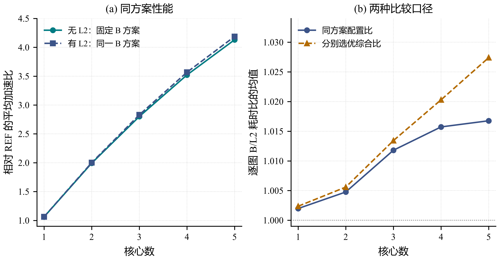

# 问题三：共享只读L2下的调度与性能影响

## 1. 问题分析与缓存模型

在固定1 MiB只读L2、250 bytes/cycle独立读带宽下，R12得到全部100图、1至5核的L2方案，并补齐同一B方案开启/关闭L2的500组控制。五核固定方案的平均配置比为1.016766，而两配置分别选优的平均综合比为1.027400。后者含方案变化，不能称纯硬件收益。L2独立选优方案相对整图单核的平均加速比为4.2190。

方案$P=(g,a,\pi)$由操作划分$g$、子图核心归属$a$和核上顺序$\pi$组成。每核全部子图合成一个Task；L1/UB容量分别为524288/131072 bytes，驻留、Spill、依赖、Pipe FIFO及跨核OUT完成后500周期的同步规则沿用B。记同一方案在无L2、有L2配置下的官方Makespan为$T_B(P)$和$T_L(P)$。主目标是最小化$T_L$，主指标相同时比较新增COPY。方案不增加额外计算、复制、预热或任意等待指令，也不改变FIFO策略。

令Q(t)为按插入先后排列的逻辑张量FIFO，H(t)为其字节占用。正字节且键有效的COPY_IN在发射时查询缓存，命中进入独立L2读池，未命中进入DDR池；COPY_OUT仍走DDR。Cache命中不刷新已有键的FIFO次序。在实际官方代码中，每个COPY_IN完成都会尝试插入：无键、超容量或键仍存在则不插入，否则逐出最早键直至能容纳后插入。命中读取在途时若该键被逐出，完成时仍可能重新插入。零字节不进入正字节命中统计，但有有效键时不能据此断言没有FIFO事件。

$$
H(t)=\sum_{\tau\in Q(t)}b_\tau\le 1048576.
$$
- $b_\tau$为逻辑张量$\tau$的字节数，$Q(t)$为当时FIFO中的张量序列。

$$
h_i=\frac{B_{\mathrm{hit},i}}{B_{\mathrm{hit},i}+B_{\mathrm{miss},i}},\qquad B_{\mathrm{hit},i}+B_{\mathrm{miss},i}>0.
$$
- $h_i$为图$i$的按字节命中率；分母为零时沿原版约定令$h_i=0$。无L2配置的Cache字段不可适用。

$$
\sum_{j\in\mathcal A_p(t)}v_j(t)\le B_p.
$$
- $\mathcal A_p(t)$为带宽池$p$中的在途传输，$v_j(t)$为其速率。DDR与L2读池的$B_p$分别为60和250 bytes/cycle；每个池由全部核心共享，两个池互不占用。

容量决定哪些已完成读取的数据能保留到下一次发射：单条数据超过容量不能缓存，FIFO驻留还取决于其间插入的不同张量。容量不是唯一未命中原因；若多个核心在首次读取尚未完成时发射同一输入，它们可能全部未命中。因此不能只凭未命中率推断容量不足，也不能把同大小的张量当作同一逻辑对象。

$$
d_{\mathrm{DDR}}^{\mathrm{isolated}}=b/60,\qquad d_{\mathrm{L2}}^{\mathrm{isolated}}=b/250.
$$
- 这里只是忽略取整与并发的单次搬运理想参考时间，用于解释独立读池，不替代原版事件模拟。
- 局部传输时间缩短不等于整图同比加速：关键计算、Pipe占用、跨核释放与其他搬运仍可成为瓶颈。

本轮所有正式结果固定容量与带宽，没有改config追求分数，也没有把参数扫描混入主曲线。实验识别的是该指定L2配置的联合净效应，不能分别给容量增加或带宽增加分配独立因果贡献。上面的状态模型提供机制解释，不冒充已经完成容量和带宽的分别消融。

## 2. 求解路径与同方案对照设计

L2求解从原图生成基础可行解，并尝试不同活动核心数和驻留组织。预算允许时，再独立生成B场景候选，按L2配置重新评价；这一成本计入同一请求，不免费读取另一批次已经选出的B方案。随后尝试快速插入和实际Spill触发的至多两个局部微批，按官方Makespan与新增COPY的字典序保留成功结果。

微批是减少局部重复换入的一般B/L2策略，不是已证明最优的FIFO调度器。它可能改变实际COPY_IN发射次序及两带宽池的竞争，从而影响命中；也可能延迟关键操作。亲和度、命中率或Spill单项改善都不能替代完整Makespan。当前不把一般驻留优化包装为已证明的L2专属原创算法。

记$P_{B,i,k}$和$P_{L,i,k}$为图$i$在$k$核下选定的B方案和L2方案。同方案配置效应与分别选优效应定义如下：

$$
R_{\mathrm{hw},i,k}=\frac{T_B(P_{B,i,k})}{T_L(P_{B,i,k})}.
$$

$$
R_{\mathrm{select},i,k}=\frac{T_B(P_{B,i,k})}{T_L(P_{L,i,k})}.
$$

$$
R_{\mathrm{select},i,k}=R_{\mathrm{hw},i,k}\,\frac{T_L(P_{B,i,k})}{T_L(P_{L,i,k})}.
$$
- 分解等式逐例成立，不意味着三个算术均值可以直接相乘。

$$
\overline R_{\mathrm{hw},k}=\frac1{100}\sum_{i=1}^{100}R_{\mathrm{hw},i,k}.
$$
- 两条主性能曲线分别用同一个整图REF归一化；配置比另行对100个逐图比值取平均，不能用两条曲线均值相除。

固定方案对照通过图、核数、配置、评估器和方案哈希匹配。500对中430对B/L2最终方案本来相同，62对复用同哈希既有候选评分，8对只补官方L2评分，不重跑求解器；总计70对B/L2最终方案不同。对照补评分不反向参与既有主方案选型。两配置下固定P_B的partition和Spill新增COPY字节均一致，这与官方在事件模拟前计账的实现相符。

R12主实验的原图、配置及代码版本固定；同次请求择优不变差不保证两个独立请求的最终计划必然优于对方的计划。尤其不能在观察500组对照后，把每格更好的结果再次拼进“统一R12主算法”。本稿保持冻结选解来源，只新增读表分析。

## 3. 实验结果与分析

[矢量PDF](../figures/q3_configuration.pdf)。左图是同一P_B在两配置下相对REF的平均性能；右图区分同方案配置比与分别选优综合比，纵轴围绕1放大显示，不是从0起点的柱状比较。一核配置比是实测值，不能强设为1。

**同核数L2配置比与方案选优比（每行100图）**

| 核数 | 同方案配置比均值 | 分别选优比均值 | 同方案改善／相同／退化 |
|---|---|---|---|
| 1 | 1.001978 | 1.002364 | 31／69／0 |
| 2 | 1.004765 | 1.005591 | 57／39／4 |
| 3 | 1.011799 | 1.013423 | 55／43／2 |
| 4 | 1.015729 | 1.020292 | 55／45／0 |
| 5 | 1.016766 | 1.027400 | 61／37／2 |

五核同方案配置比均值为1.016766，中位数只有1.000546，说明收益在用例间不均匀，不能说每张图都有相同幅度改善。五核有28对最终方案不同；把1.027400全部归因于L2会混入这部分选解变化。固定P_B时L2相对REF均值为4.187457，独立选优则为4.2190。

**五核案例：开发机制案例与最差固定方案配置比**

| 用例 | 无L2 P_B／cycles | 有L2同一P_B／cycles | L2独立选优／cycles |
|---|---|---|---|
| case_073（已曝光开发例） | 2034983 | 1806253 | 1805392 |
| case_026（五核配置比最小） | 33518 | 33721 | 33721 |
*注：案例用于展示异质性，不以两个实例代替全100图。全部8条跨核数退化记录另列Q3_degraded.csv。*

五核固定方案的逐图命中字节率均值为23.4614%，它不是把100图命中字节池化后计算的命中率，也不是Makespan下降比例。更早完成的COPY会改变后续发射与FIFO状态，因此总体收益需要完整事件轴来判断；仅从终点统计无法给case_026的退化指定唯一原因。本稿保留该负结果，不擅自把它归因于容量、带宽或数值误差。

**五核L2独立选优的COPY与请求成本**

| 量 | 结果 |
|---|---|
| 平均新增COPY／MiB | 9.4032 |
| 平均partition新增／MiB | 5.8467 |
| 平均Spill新增／MiB | 3.5565 |
| 请求墙钟中位数／s | 20.7454 |
| 请求墙钟P95／s | 197.7045 |
| 请求墙钟最大值／s | 423.6723 |

无L2独立选优的B五核平均新增COPY为8.2173 MiB，L2独立选优为9.4032 MiB；后者更高，不能说开L2就减少了计划中的COPY。官方在模拟前计算added_copy_bytes，不因之后的缓存命中回减，所以该量不等于物理DDR净流量。相对C3，L2最终方案的五核逐图耗时降幅平均为31.4081%，但其中7个更快实例的COPY更高，再次表明主次目标存在权衡。

全量结果与同方案对照保留图、方案、官方结果及哈希绑定；三问选解和不同控制共检查1470组输出。核查覆盖执行计数、周期、原依赖、核归属、Pipe、COPY分解等，不冒称另写完整独立缓存/带宽模拟器。所有L2最终请求均在600秒软预算配置下形成结果。文稿数值、图表和来源一致性检查属于作者自检，不代替队员科学审阅。

给定配置下，L2总体带来正向收益，但幅度和受益范围依方案而变。容量保留、首次读取重叠、带宽竞争与关键路径共同影响最终时间，命中率不能代替Makespan。完整两配置指标见[Q3逐例附录](../tables/Q3_per_case.csv)，负例见[退化表](../tables/Q3_degraded.csv)，版本和复现口径见[阅读说明](../阅读说明.md)。
