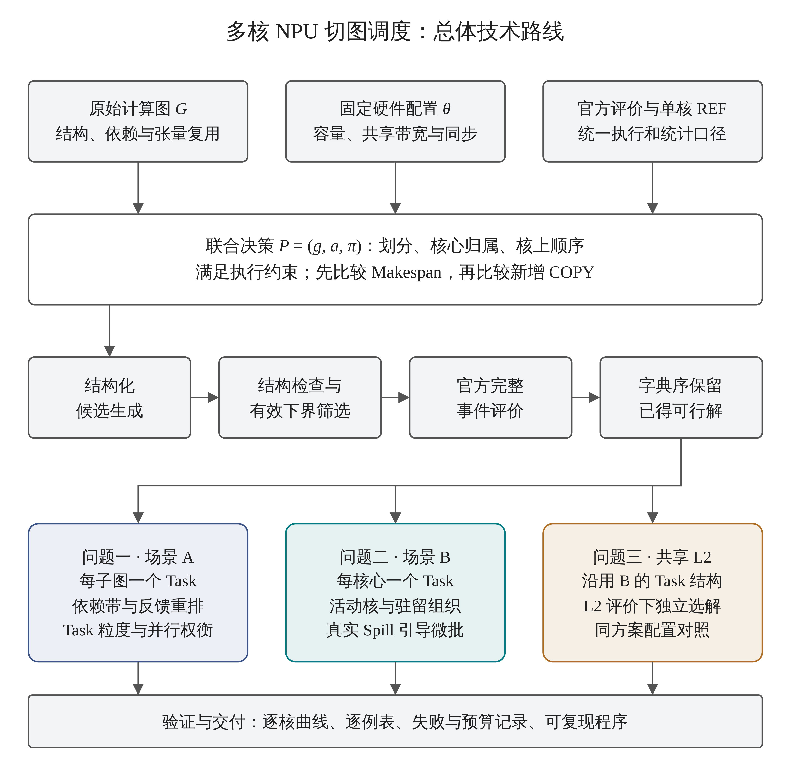
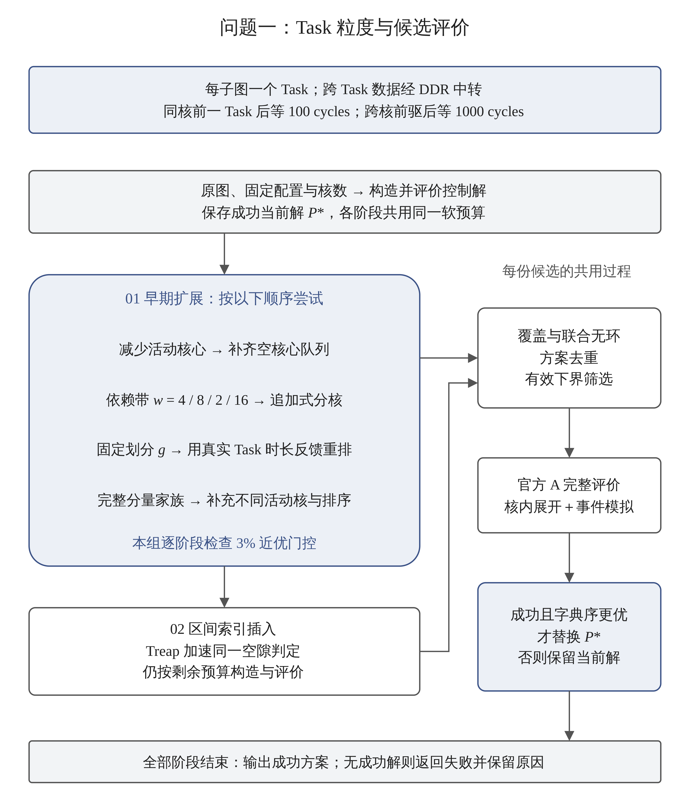
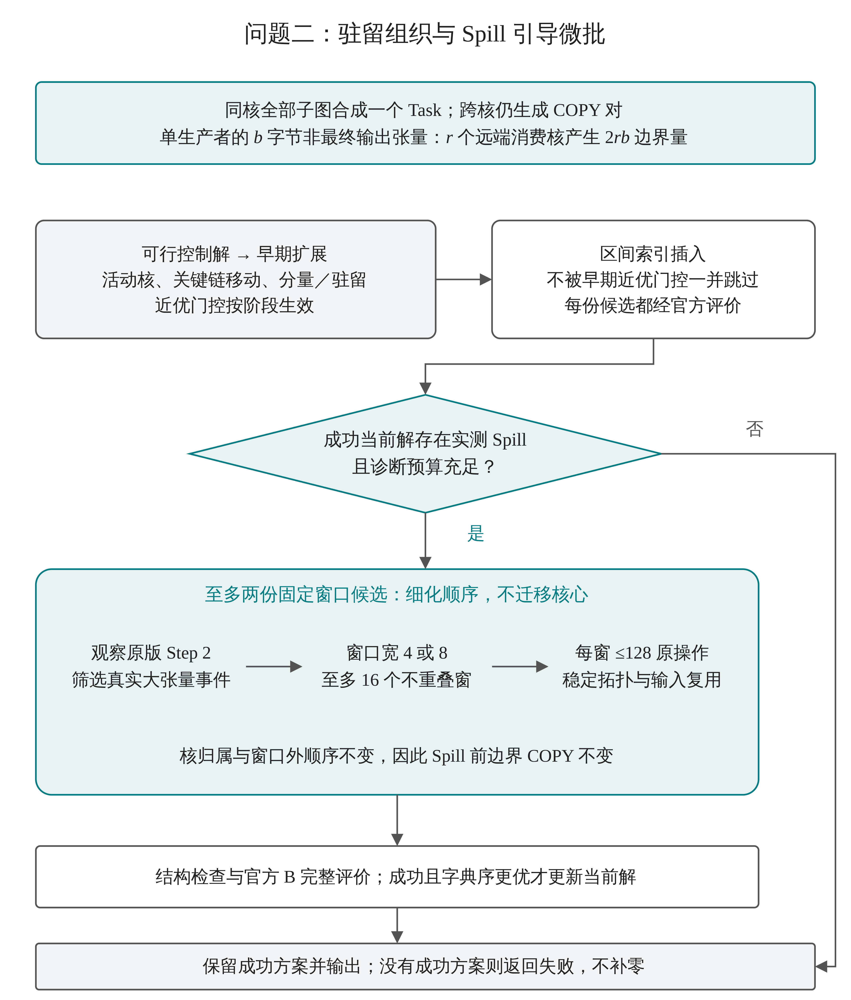
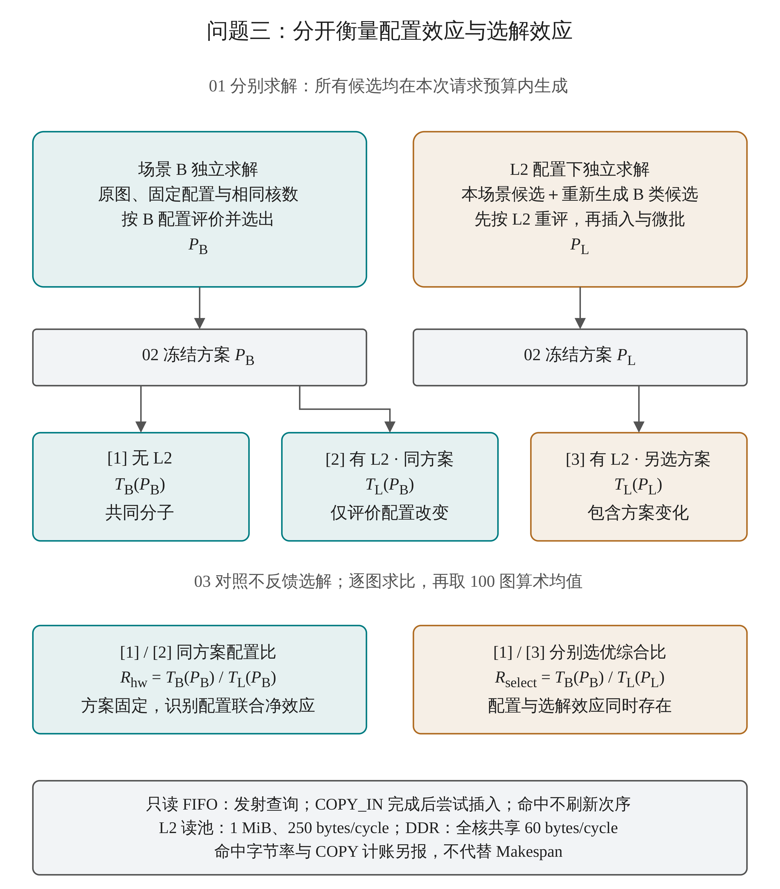

# 四张流程图预览

这四张为独立候选图，没有插入或改动论文。下方显示600dpi预览；正式排版优先使用PDF或SVG。[设计与调研说明](README.md) · [格式自查清单](格式自查清单.md) · [四页A4矢量校样](qa/打印校样_A4_166mm.pdf)

## 00 总体技术路线

[可编辑drawio](drawio/00_R12_总体技术路线.drawio) · [PDF](exports/00_R12_总体技术路线.pdf) · [SVG](exports/00_R12_总体技术路线.svg) · [PNG](exports/00_R12_总体技术路线.png)

## 01 问题一：Task粒度与候选评价

[可编辑drawio](drawio/01_R12_问题一_候选与评价.drawio) · [PDF](exports/01_R12_问题一_候选与评价.pdf) · [SVG](exports/01_R12_问题一_候选与评价.svg) · [PNG](exports/01_R12_问题一_候选与评价.png)

## 02 问题二：驻留组织与Spill引导微批

[可编辑drawio](drawio/02_R12_问题二_Spill微批.drawio) · [PDF](exports/02_R12_问题二_Spill微批.pdf) · [SVG](exports/02_R12_问题二_Spill微批.svg) · [PNG](exports/02_R12_问题二_Spill微批.png)

## 03 问题三：配置效应与选解效应

[可编辑drawio](drawio/03_R12_问题三_配置与选解.drawio) · [PDF](exports/03_R12_问题三_配置与选解.pdf) · [SVG](exports/03_R12_问题三_配置与选解.svg) · [PNG](exports/03_R12_问题三_配置与选解.png)

